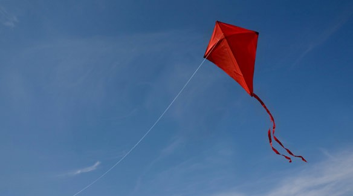

Research shows that musculoskeletal pain, urinary incontinence, abdominal separation (Blyholder et al., 2016) and pelvic organ prolapse are as a matter of fact common amongst postnatal runners. But *just because something is common, it doesn’t mean that it’s normal* — writes Emma Brockwell, a Women’s Health Physiotherapist. This March, Emma teamed with two more UK based physios to publish [Returning to Running Postnatal — Guidelines for medical, health and fitness professionals](https://www.researchgate.net/publication/335928424_Returning_to_running_postnatal_-_guidelines_for_medical_health_and_fitness_professionals_managing_this_population#fullTextFileContent) who support running mums.

> So, what is that we need to know about running?

### Subtitle

Using the learning from clinical practice and research in the field of women's health, Brockwell's team is challenging the currently accepted 6/8 weeks timeframe for going back to vigorous exercise after the baby. Instead, they suggest a gradual return to physical activity, increasing impact and intensity with time. Running is a high impact activity, so it would be resumed 3–6 months following the childbirth.

References:

- Alan F. Dixson, Barnaby J. Dixson, “Venus Figurines of the European Paleolithic: Symbols of Fertility or Attractiveness?”, Journal of Anthropology, vol. 2011, Article ID 569120, 11 pages, 2011. https://doi.org/10.1155/2011/569120
- A. M. Zöllnera, J. M. Poka, E. J. McWalterb, G. E. Goldb, E. Kuhl — On high heels and short muscles: A multiscale model for sarcomere loss in the gastrocnemius muscle, Journal of Theoretical Biology, Vol 365, 21 January 2015, Pages 301–310
- S. L. Hame, A. Alexander — Knee osteoarthritis in women Curr Rev Musculoskelet Med. 2013 Jun; 6(2): 182–187.
- Berg, Eugene E.. Chinese Foot Binding. Orthopaedic Nursing 14(5):p 66–69, September 1995.
- S. R. Cummings, X. Ling, K. Stone — Consequences of foot binding among older women in Beijing, China, American Journal of Public Health (AJPH), October 1997