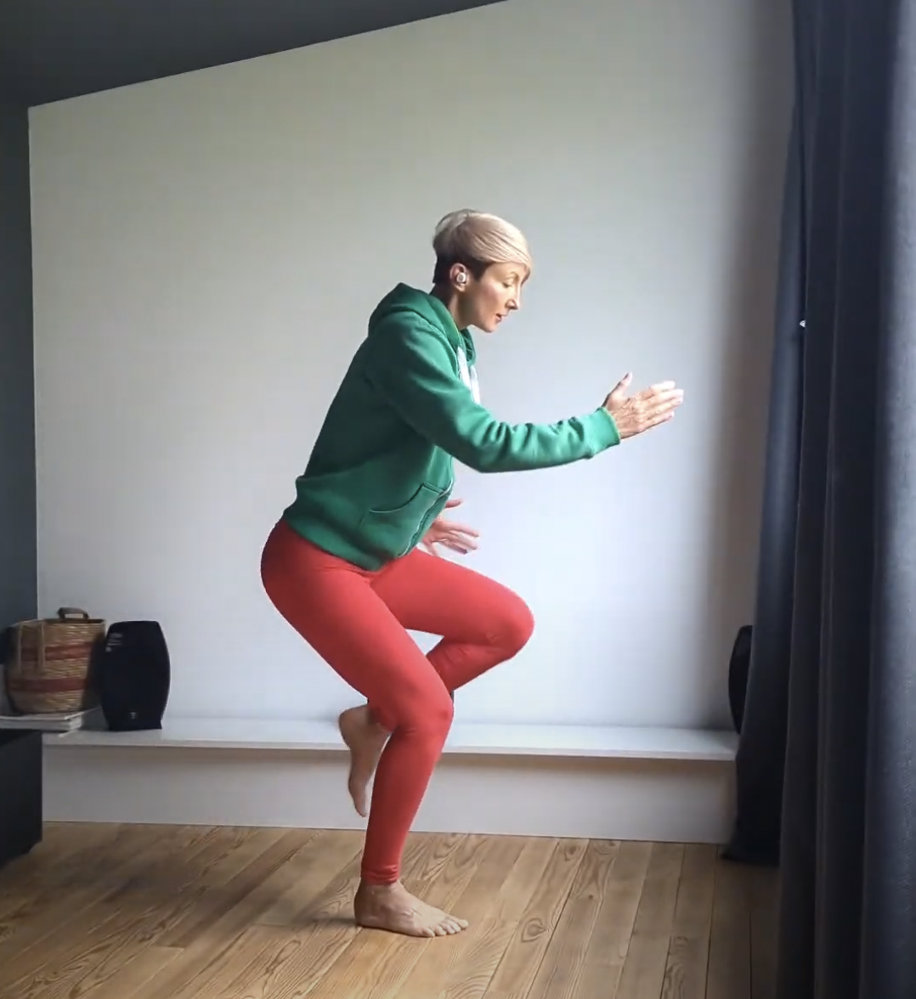

For most of my exercise life, impact and intensity weren’t really my kind of thing. I was into gentle, low-impact exercise, things like yoga and Pilates. I guess it was a combination of a personal preference for slow and mellow activities and feeling alien to the gym culture – its rough rules and the competitiveness. What attracted me to yoga was that it was gentle and uncompetitive – it wasn’t really exercise. 

Even now, after getting a Masters in Sports Science and dedicating my career to exercise, I still don’t feel at home within the no-pain-no-gain culture. In some way, I am still a yoga practitioner, but with expanded tools - such as weightlifting, cardio, HIIT and plyometrics.

I always remember my asana yoga teacher Myra, a tough 50-year-old who incorporated karate and kickboxing moves into her classes. But is it really yoga? - students kept whispering. Of course, it is! - Myra shouts back. It’s the depth of focus and non-violent intention that make it ‘yoga’.

So, one of the tools I added to my non-violent toolset is high impact.

### So, why do we need impact?

1. To help us build and maintain muscle capacity to handle gravity and forces created by movement.

2. To help our bones become denser and stronger, so they can handle the physical demands of our surroundings.

### Let’s keep the muscles supple!

When we run or jump the lower body, and the pelvic floor, as a part of it, need to handle the impact.

Even before hitting the ground, the leg and the pelvic floor muscles lengthen as they generate force to help slow down the body weight and absorb the impact at ground contact.

Luckily, we don't need to do anything about it. The muscles just fire reflexively. 

But what if they don't? 

We need to look at the deep core system as a whole and train the pelvic floor to respond reflexively to support the organs at ground contact. 

### To train for impact, we need impact.

This is especially important if you are in perimenopause or postpartum period or occasionally leak at impact. You want a resilient pelvic floor that will be able to support you for years to come.

There is evidence that impact training, such as mini trampoline jumping (see Fricke, 2023) can be used to train the pelvic floor effectively, even in postmenopausal population with stress incontinence.

So, feel free to start adding a bit of bounce and eventually jumping/skipping to your training.

### Here are two workouts you can use as an inspiration:

<iframe width="473" height="841" src="https://www.youtube.com/embed/mS4NpyldehQ" title="To train for impact we need impact" frameborder="0" allow="accelerometer; autoplay; clipboard-write; encrypted-media; gyroscope; picture-in-picture; web-share" allowfullscreen></iframe>

Or

<iframe width="473" height="841" src="https://www.youtube.com/embed/7euUK8HsA0I" title="Progressive Whole-Body Core Workout" frameborder="0" allow="accelerometer; autoplay; clipboard-write; encrypted-media; gyroscope; picture-in-picture; web-share" allowfullscreen></iframe>

You can start by coming up on your toes only and when you feel comfortable add jumping. 

If you have diastasis recti or prolapse, you can add impact too, just make sure to stay within the symptom-free number of repetitions. 

### Oh, yes, the Bones!

One more reason to add impact to our training, especially from the age 40 onwards, when we start loosing bone density at a higher rate.

Our bones keep rebuilding themselves in response to the environment and how we use them. Vertical loading gives input to our bones to toughen up to bear that impact. 

So, weight-bearing exercises that place direct stress on the legs and hips can lead to greater bone mineral density gain than low-impact activities, like cycling or swimming.

Bones respond to stress by reforming to better handle that stress, which means that the weight-bearing bones of the legs, pelvis, and spine tend to be stronger in runners than in inactive people. 

Let’s keep those bones strong!

Try the sequences above, save them for later and make them yours.

And feel free to get in touch if you need help adding impact to your training. 

❤️💪

Ivana xx 

### Check out: 

Fricke, Anja MSc1; Fink, Philip W. PhD2; Rowlands, David PhD3; Lark, Sally D. PhD1; Mundel, Toby PhD2; Shultz, Sarah P. PhD1,4. Mini-Trampoline Jumping as an Exercise Intervention for Postmenopausal Women. Journal of Women's & Pelvic Health Physical Therapy 47(1):p 19-25, January/March 2023. | DOI: 10.1097/JWH.0000000000000257