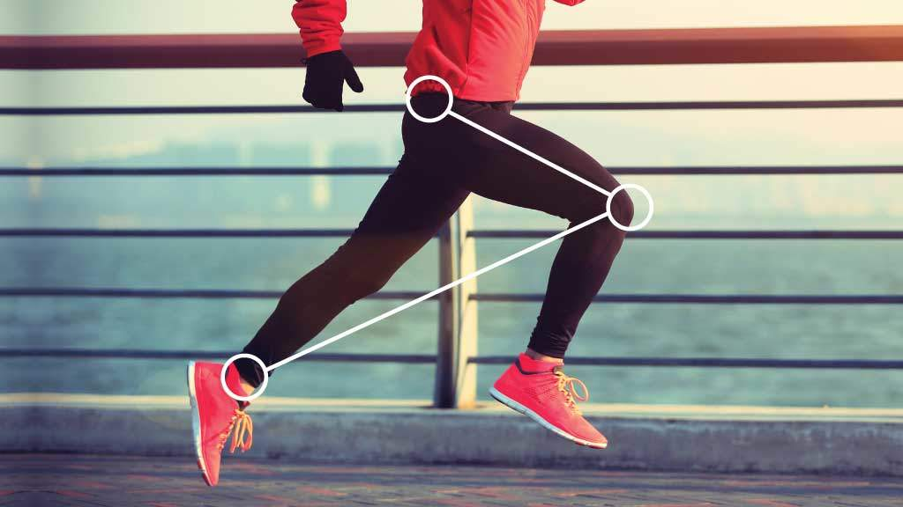

During my MSc in Biomechanics, I got fascinated by ageing and ended up writing my dissertation in this field, looking at the way people walk and run as they are getting older. 

It is interesting how much of what we see as ageing is a consequence of moving less and de-training and how moving “like an old person” is something that comes about gradually through decades of de-conditioning and getting less confident about movement, so the brain gets to gradually optimise more and more for safety instead of performance. To put it very simply: *as we age, we move into the domain of movement driven by fear, rather than challenge*. 

Looking at the joint level, as we age, *we gradually switch from powering the movements from the ankle*, as young humans do by default (see DeVita, 2000 for walking, Kulmala, 2014 for running) *to powering movements from the hip*. This is a less energy-efficient pattern that makes people move slower and clumsier, which then makes them anxious about falls, so their movements gradually become even more rigid and ineffective. 

Yes, a part of the reason for this power shift is that the ankle joint declines quickest with ageing (the decades of sitting included), but another major part is the choice of the nervous system - prioritising different goals, as we saw earlier.

Accepting the "ageing" power shift starts a gradual downward spiral. So, can we avoid it? Or can we at least slow it down? 

Maybe. Ageing seems to be relative. The elite master runners in my dissertation study showed a pattern characteristic of improved performance after 7 years of ageing with high levels of training, even in their early 60-es (Diss, Green, Demmel, 2022). Similarly, in walking, it is possible to slow down the age-related changes and prevent some of the losses at the ankle joint with ankle strength and power training (Browne and Franz, 2018, 2019). 

Now, here is a video example of the two patterns.

<iframe width="473" height="841" src="https://www.youtube.com/embed/za_jGzypcsU" title="Can We Choose to Move in a Youthful instead of an Ageing Pattern?" frameborder="0" allow="accelerometer; autoplay; clipboard-write; encrypted-media; gyroscope; picture-in-picture; web-share" allowfullscreen></iframe>  

I'm 44 years old and I don't think of myself as an old person. But interestingly, as I tried to perform a new lower body exercise the other day, without being told how to do it and what to focus on, I used the hip-powered pattern at first. Already?! 😄

Well, as I said it's a lot about choice. So I added a different clue: "Push the foot powerfully into the band". If you are familiar with my work, you will probably recognise my "jumping feet" concept here. Yes, it's the jumping feet - just pushing into the band rather than the ground!

You can see the difference this hint made for the smoothness and ease of movement, literally moment to moment, even without having the time to practise.

Let's keep those ankles strong and keep focusing on the feet to power the movements from the ground up! We are as young as how we move! 

### To dig deeper into this, check out:

1. DeVita, P., & Hortobagyi, T. (2000). Age causes a redistribution of joint torques and powers during gait. Journal of applied physiology (Bethesda, Md. : 1985), 88(5), 1804–1811. https://doi.org/10.1152/jappl.2000.88.5.1804

2. Kulmala, J.-P., Korhonen, M.T., Kuitunen, S., Suominen, H., Heinonen, A., Mikkola, A. and Avela, J. (2014). Which muscles compromise human locomotor performance with age? Journal of The Royal Society Interface, 11(100), p.20140858. https://doi.org/10.1098/rsif.2014.0858

3. Diss, Ceri Elen Dr; Green, Andrew Dr; and Demmel, Ivana M. Mrs (2022) "HIGH LEVELS OF ENDURANCE TRAINING MITIGATE AGE-RELATED CHANGES IN RUNNING BIOMECHANICS – A LONGITUDINAL STUDY," ISBS Proceedings Archive: Vol. 40: Iss. 1, Article 36.
Available at: https://commons.nmu.edu/isbs/vol40/iss1/36

4. Browne, M. G., & Franz, J. R. (2018). More push from your push-off: Joint-level modifications to modulate propulsive forces in old age. PloS one, 13(8), e0201407. https://doi.org/10.1371/journal.pone.0201407

5. Browne, M. G., & Franz, J. R. (2019). Ankle power biofeedback attenuates the distal- to-proximal redistribution in older adults. Gait & posture, 71, 44–49. https://doi.org/10.1016/j.gaitpost.2019.04.011