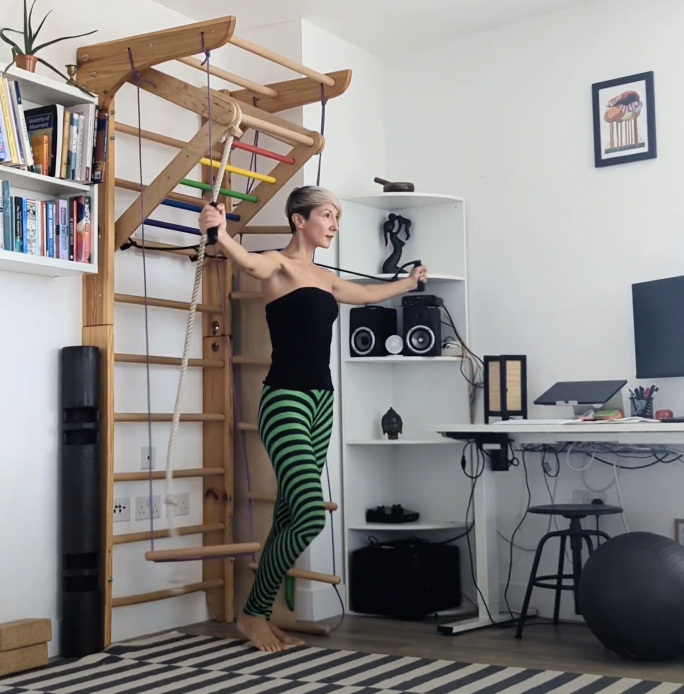
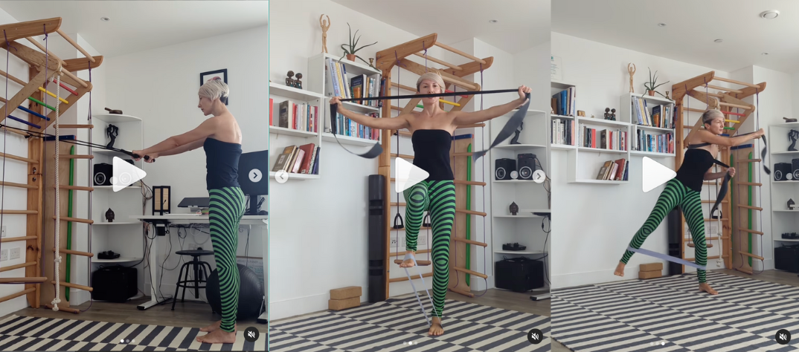

After having 2 babies straight after each other and a 6-finger-width abdominal separation, I thought I would never wear crop tops again. My belly was weak, stretched and I had a fist-width hole in my connective tissue a couple of fingers up from the navel - if you look carefully, you can still see a trace of it.

I was stuck into looking pregnant for years. This is why after being complimented a couple of times on my "new pregnancy" by our local Turkish grocery shopkeeper lady and various acquaintances, I switched all my tops to largely oversized ones. I was size S, UK 8/10, but would need to buy tops size L, UK 16/18. Pretty depressing!

Looking pregnant forever was just a small part of my suffering. I felt disabled, physically limited. There were so many things I just couldn't do any more. If I tried to lift my wriggling toddlers out of the bath or balance my bike with a toddler on the back seat while opening a heavy gate, my lower back and the left side of the waist would be in spasm for days.

After spending at least 5 years stuck in restorative exercise and accepting that my belly could just not handle pressure and intense training any more, I understood that if you want to get your core stronger, you need to load it!

The principle of progressive overload applies to not just muscles but tendons too - the tissue across the front of our bellies is made of crisscrossed tendons. It takes longer to heal but once you figure out how to stop re-injuring your belly over and over again, by learning how to manage the pressure inside it and load your core progressively and in different planes, your abdominals will get stronger, maybe even stronger than before the injury. 

Click below for an example of a weighted, more advanced core workout.  

<iframe width="473" height="841" src="https://www.youtube.com/embed/ZMmPi_mkJrk" title="The Dynamic Curtsies Workout" frameborder="0" allow="accelerometer; autoplay; clipboard-write; encrypted-media; gyroscope; picture-in-picture; web-share" allowfullscreen></iframe>  

### But where do we start?

Here are three things I use to help people reconnect with their abdominal muscles – so we can start strengthening them.

1. *Breath* - especially voiced exhalation, such as humming or hissing (there is evidence that restricted exhalation helps engage the deep abdominal muscles)
2. *Feet* pressing into the ground (I wrote about the “jumping feet” here a couple of weeks ago)
3. *Arms* pressing into an object. 

With the arms and the legs, the principle is the same – the action of pressing into an object helps reflexively activate the postural muscles. 

Luckily, a good part how our deep core works is about *reflexes*, we don’t need to worry about squeezing our abdominal muscles all day to make them fire, they just do. Except when they don’t (for example, after injuries or childbirth) - and then it’s about *reconnecting the muscles to the brain and training them to work again*, so you don’t have to always remember to activate the core when sneezing violently or heaving a massive ceramic garden pot. Your body just does its own thing.

___________________________________________________________  

### So, today I wanted to talk about the arms. 

This is a trick I use working with people whose lower belly feels disconnected and slow to respond to training. Pressing through the arms when combined with exhalation helps activate the deep abdominal muscles reflexively. 

Here are 3 exercises we use to help fire up the deep core via arms in

- back to front,
- side to side and
- rotational movements.

 

1️⃣ Resisted arm pull downs  
2️⃣ Resisted arm spreading + marching  
3️⃣ Resisted diagonal reaching  

If you click on the image above, you’ll see a carousel of video snippets of each of the three exercises.

Grab a resistance band and an optional resistance loop around feet/lower leg for an extra challenge and join me. For the first exercise, hook the band around a bunk bed, a staircase railing or a garden fence.

Exhale and press powerfully through the feet + press the arms into the band.

Can you feel how this action creates a lift from the base of the torso and tones up your lower belly?

Try the exercises, save them for later and let me know if you need help.

❤️💪

Ivana xx