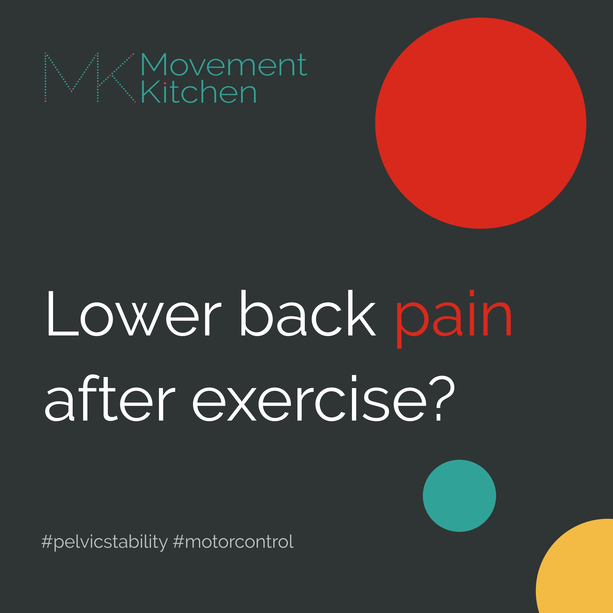

After I had my two children, around 1.5 year apart, my lower back and the left hip would hurt after most exercises. I couldn’t do lunges, or yoga warriors or sun salutations. Hardly anything in a pilates class either. For years after my babies were born, I practised only pregnancy and postpartum exercise scared to try anything more challenging. 

And then, during my Master’s programme, I had a chance to measure my joint angles and muscular forces in the lab with a 12-infrared-camera motion capture system and discovered that my body didn’t know how to stabilise my pelvis.  

<video muted loop="true" autoplay="autoplay" width="100%">
    <source src="vicon-ivana.mp4" type="video/mp4">
</video>  

My torso was stiff and uncoordinated. If I’d jump, my pelvis and the whole torso would rotate and pull the hips along. I relied mostly on my hip and knee ligaments for support - ouch! Can you see me struggling to regain balance?

<video muted loop="true" autoplay="autoplay" width="100%">
    <source src="ivana-jump.mp4" type="video/mp4">
</video>  

In biomechanics, we talk a lot about movement variability. This practically means, being able to do a movement using your joints in a variety of combinations, each time slightly different.

So, let’s say, I need to reach a glass of water from the table. If I repeat this task a number of times, it will always be a tiny bit different. My brain will choose to move my shoulder, elbow, wrist and the joints of the fingers more or less and use the muscles around them differently.

Variability is healthy and we need it. Too little variability means stiff, robotic movements and possibly overuse injuries. But then, too much variability means chaos - the body falling all over the place and relying on ligaments to not fall apart.

And this is exactly what you can see here: the joint angles and forces rapidly changing. Asymmetry and chaos. Basically, my movements show a lack of training,

> My muscles seemed not being strong enough to stabilise the pelvis. So, I was overloading my ligaments. 

Now, the movement which we tested in the lab was drop jumping, not the lunges I was trying at home. Not having motor control to stabilise my pelvis in lunges meant pulling on the ligaments in the back, especially the sacroiliac joint.

So, I geared up my training towards pelvic stability. Added resistance, and weights and progressive overload and finally built some glutes. And eventually, I could do the lunges and other previously challenging moves without back pain. 

* * *  

> Do you tend to have lower back pain after running, lunges or other single-leg movements?

If the muscles around the pelvis (especially the side hip muscles) are not strong enough, your pelvis might be dropping sideways each time you land, pulling on the sacroiliac joint.

Let's check how you'd do a single leg squat and make sure we protect that lower back by switching on the glutes.  

 

In the first version, as I hold my weight on one leg, my pelvis is dropping and moving all over the place. The weight of the leg is pulling the side of my waist and I'm hiking the hip, using the waist again. The glutes don't do much.  

In the second version, my pelvis is level, the glutes are switched on and working hard to prevent my pelvis from dropping or rotating 🔥  

If you find it challenging to stabilise your pelvis while on one leg, here are a couple of tips:  

✅ Press actively down through the standing foot  
✅ The shin vertical like a pillar holding a building upright  
✅ Make sure the lower back is not rounding - keep that lower back curve.  

* * *  

Similarly, in glute kickbacks, you could let the movements of your legs pull and yank onto your lower back. Or stabilise the pelvis and just move the leg.

 

Your glutes und deeper abs will need to work hard to prevent your pelvis from lifting and rotating 🔥

* * *

>So, where do we start with pelvic stability training?

Here is a move to start strengthening those side hip muscles.

 

Stand on a block/stair and let your free leg relax.

🦶Press the standing foot down to lift up the opposite side of the pelvis.

‼️Can you keep the waist relaxed? - Let's try and use the side hip muscles here, instead of hiking the hip.

Once the side hip muscles fire, we can train them to stabilise the pelvis in dynamic single-leg movements (like the squats and kickbacks above), add impact and gradually translate the new motor skills to running.

Do you feel stuck dealing with recurring back pain? We have Core RePower Back Pain starting from 19 February. Drop me an email with the word "rePower" to find out more.

❤️💪

Ivana xx

* * *   

> References:

1. Hamill, J., Palmer, C., & Van Emmerik, R. E. (2012). Coordinative variability and overuse injury. Sports medicine, arthroscopy, rehabilitation, therapy & technology : SMARTT, 4(1), 45. https://doi.org/10.1186/1758-2555-4-45  
2. Stergiou, N., & Decker, L. M. (2011). Human movement variability, nonlinear dynamics, and pathology: is there a connection?. Human movement science, 30(5), 869–888. https://doi.org/10.1016/j.humov.2011.06.002

