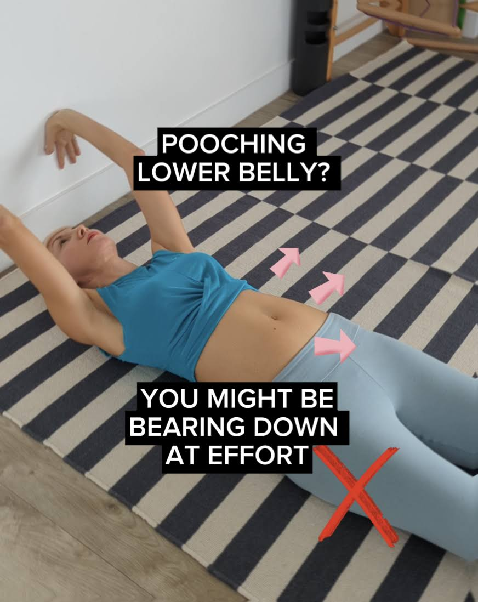

Does your lower belly stick out and feel weaker than the rest of your abdominals?

It might be a habit of bearing down at effort. 

You can see below the belly pushing out and down as I press into the wall. This often comes together with straining and holding the breath.

This is a strategy I see often in people with chronic low back pain, abdominal bloating or new mums.

It's not a great one if you have diastasis recti or prolapse, as it creates outward and downward pressure on the organs.

Now, here is a different option:
zipping up from the base of the torso at exhalation and creating upwards support for the organs.

* * *

Test if you tend to bear down:

👇 Roll up your top, so you can observe how your belly moves.

👇 Lie on the ground next to a mirror. You can also ask your family member to record a video of you, so you can see what strategy your body will use.

👇 Press your hands into the wall behind you.

❓Did you belly push out? Or maybe even the navel moved down?

If the answer is 'yes', you can:

✅ Exhale slowly and press - use voiced exhalation - humming, hissing, blowing birthday candles or Ujjayi breath from yoga for extra core support.

✅ Imagine zipping up your torso from the bottom up as you exhale - let's say you have a zipper going all the way from your pubis to above the navel.

✅ You can also place a soft ball in between your thighs and gently squeeze your inner thighs into the ball to help initiate this zipping up from the base of the torso.

✅ Work on strengthening your deep abs (scroll down my page for a plenty of ideas).

Try this, save it for later and [get in touch](mailto:ivana@movementkitchen.co.uk?subject=Inquiry) if you need help.

As someone who had a habit of bearing down for years, I'm really passionate about helping people to overcome this bad habit and improve their pressure management for longterm low back and pelvic health.