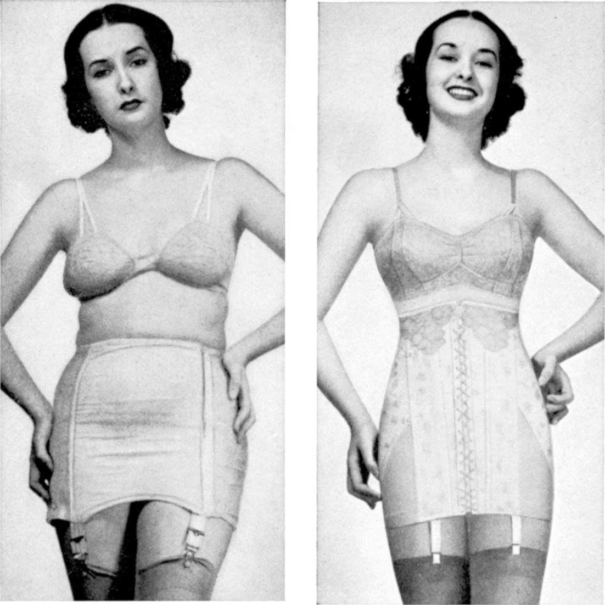
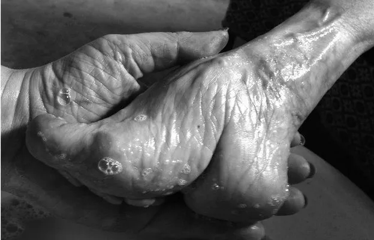
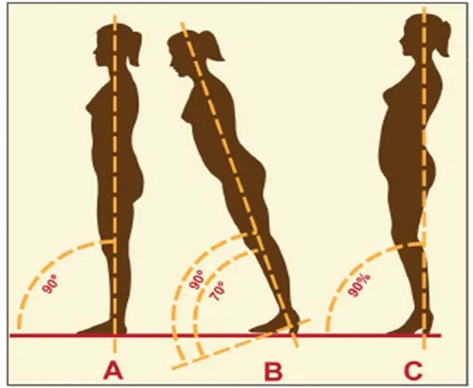

Which of the two photos do you prefer? 

In the early 1940-es when this ad campaign was created, it was probably a no-brainer to choose the picture on the right - a smiling women, made to please, moulded into a shape the current fashion required - which was already incomparably better than the cruel tight-laced corsets that women wore from the 14th century until the 1920-es, when the physical corsets were replaced by an invention of dieting, as a psychological corset. 

Now, in 2023, as the body positivity movement slowly reaches into the mainstream, the message of this 1940-es ad is not that strong. Yet, many physical and, even more, psychological corsets remain a part of the 21st-century woman's image.

The consumer society, as a culture of abundance and overeating, favours slim, narrow-waisted female silhouettes. The ideals of women’s beauty are always something difficult to reach — the prehistoric civilisations with their lack of reliable food sources idealised a female figure with folding layers of fat. Remember the Palaeolithic fertility goddess sculpture Venus of Willendorf? She would have probably looked very different had they had a McDonald’s just around the corner from the cave.

<small>The changing ideal of the female body — from Dixson, 2011, https://doi.org/10.1155/2011/569120</small>

It's striking how much of women's clothing you can find in shops today, doesn't leave space for the body's biological processes - like digestion, ovulation and periods, lymph and blood flow and sometimes even breathing. I wear a UK size 10 and even if I buy jeans or dresses in my size, I would need to unbutton or unzip them after a big meal.

> Standard clothing sizes don’t take into account a change in volumes of your stomach and bladder with liquid and food intake nor the change in the ovarian and uterine size through the menstrual cycle.

And Marilyn Monroe would wear her clothes even a size smaller. Or two. Oh la la!

Body shapers and push-up leggings that make you look slimmer mould the body into a shape, but not without a price tag. They limit the range of motion of the ribcage and the pelvis, restrict circulation, increase the intra-abdominal pressure and interfere with the ability of your muscles to generate force.

Another culturally imposed ideal is that of firm, high breasts. Looking at shop windows the other day I noticed that most feminine tops and dresses seemed to show the breasts as higher than what they anatomically are — so the women would need to shape themselves after the clothes instead the other way around.

The aesthetics of sky-high breasts and push-up bras encourages lifting the ribcage out of its alignment with the pelvis and the rest of the body. This changes the length of your abdominal and back muscles and makes them less effective at stabilizing the spine.

And what about long-legged, models in beauty magazines in high-heeled shoes? Where do the high heels come from? How did we get to find them attractive?

There seem to be some parallels between high heels and the ancient Chinese practice of foot binding.

<small>This image is part of the photo series [Living History by Jo Farrell](http://www.livinghistory.photography/images.html)</small>

The custom of foot binding was widely spread in China from around the 10th century until the beginning of the 20th century, especially amongst wealthy families. Starting from a very early age (3–4 years old) feet of young girls would be gradually deformed into a shape of a pointed lotus flower. Having bound feet was considered very attractive at the time and a prerequisite to a good marriage.

Foot binding made walking extremely painful and women were physically impeded from moving about freely, which is in many ways similar to walking in extremely high heels.

> Similarly to foot binding, high heels change how gravity affects your body and your muscles’ response to gravity.

A study published in the Journal of Theoretical Biology in 2015 found that increasing heel height from none to 13 cm, in healthy females, shortened their calf muscles (gastrocnemius) by min of 5% (Zöllnera, 2015). Interestingly, rather than decreasing the length of the muscle fibres, the body adapted by removing some sarcomeres — the basic contractile units within the fibres.

Shortened calf muscles would change how the ankle, knee and hip joints work together and require the joints across the body to compensate. This is why wearing high heels has been linked with foot pain (bunions, metatarsalgia), back pain and decreased bone density.

<small>Image courtesy of erikdalton.com</small>

You can see on the graphic above how an elevated heel decreases the angle between the lower leg and the ground, making your whole body lean forward. You need to tighten the muscles across the front of the body to stay upright. The higher the heel, the more extreme the compensations.

Did you know that women lose bone density more drastically with ageing and are much more likely to develop knee osteoarthritis than men? The reasons may be related to mechanical alignment, gender and social factors (S. L. Hame, A. Alexander, 2013).

So, after scaring you with all these, let me try and come up with something constructive.

> Here is a checklist for choosing clothes, for flesh-and-blood women whatever their shape and size:

1. *Can I move in this?* — Try taking a deep breath and expanding your ribcage. Stretch your arms over the head. Fold forward. Squat. Did the fabric cut into your skin or restrict the movement?
2. *Would this still fit me after a big meal or during my period?* — Count for the natural changes in the volume of your organs as you eat and drink and around menstruation. Women are not made of plastic, honour your body and all the physiological processes happening inside your belly.
3. *Do I feel good wearing this?* — Is the fabric pleasant on your skin? Does the cut make you feel insecure or awkward? Do you feel you can be yourself, at ease and relaxed wearing it?

> We want clothes to fit us, not having to mould our bodies to their shape.

What if a piece of clothing does not meet the three criteria above? Yes, of course, you can still wear it, but be aware that it is your choice and not anyone’s else. Wearing high heels sometimes and for a limited amount of time is OK. It’s a lifetime that matters.

Always remember, your body is only yours and you are the one who is in charge. The clothes we wear are, in some way, an extension of our bodies and our sense of self — the way we create and recreate ourselves in our own eyes and the eyes of others. Let’s make them empowering, rather than disempowering.

The more women make conscious choices about what they wear and prioritise both esthetics and comfort, the more clothing trends will change to follow their tastes. Long live dresses with pockets!

References:

- Alan F. Dixson, Barnaby J. Dixson, “Venus Figurines of the European Paleolithic: Symbols of Fertility or Attractiveness?”, Journal of Anthropology, vol. 2011, Article ID 569120, 11 pages, 2011. https://doi.org/10.1155/2011/569120
- A. M. Zöllnera, J. M. Poka, E. J. McWalterb, G. E. Goldb, E. Kuhl — On high heels and short muscles: A multiscale model for sarcomere loss in the gastrocnemius muscle, Journal of Theoretical Biology, Vol 365, 21 January 2015, Pages 301–310
- S. L. Hame, A. Alexander — Knee osteoarthritis in women Curr Rev Musculoskelet Med. 2013 Jun; 6(2): 182–187.
- Berg, Eugene E.. Chinese Foot Binding. Orthopaedic Nursing 14(5):p 66–69, September 1995.
- S. R. Cummings, X. Ling, K. Stone — Consequences of foot binding among older women in Beijing, China, American Journal of Public Health (AJPH), October 1997