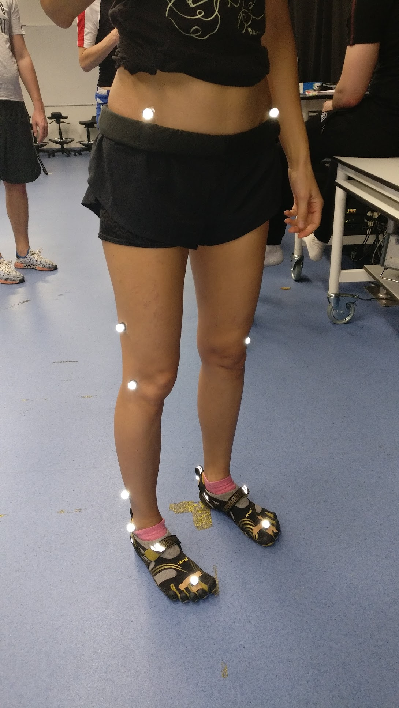
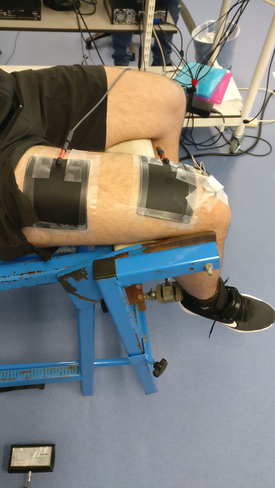
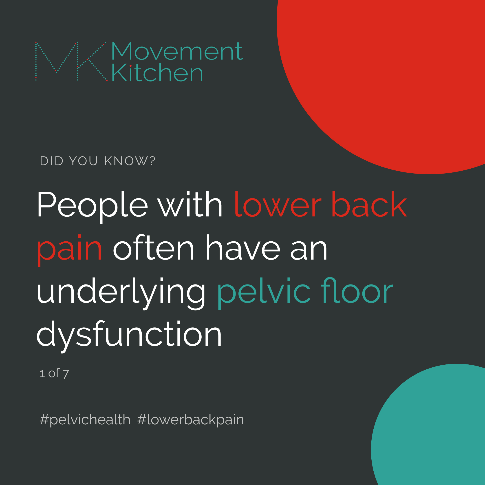
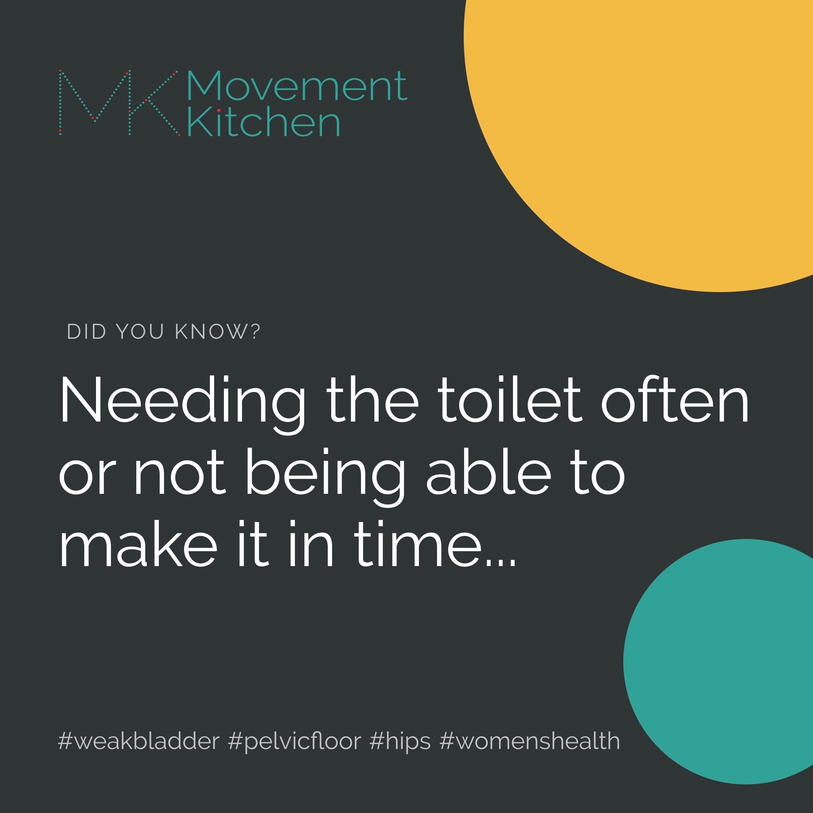

I often get asked what a biomechanist is and how is what I do different from physiotherapy. 

Biomechanics is a discipline on the overlap of sports science, medicine and engineering, that looks into how and why bodies move and what happens when they do. So, in sports science, biomechanists are those geeky people who enjoy digging into how things work. We study forces of physics that create or affect movement, how bodies deform under load, how their different parts work together, which joints might wear out sooner than others and why and how to tweak things to improve performance and avoid injuries. 

Things like:  
❓Why some football players might tear their knee ligaments and some not?  
❓Why we walk differently with advancing age?  
❓How much your breasts bounce when you run and how that affects your knee joint?(Oh yes, some people choose exciting research questions 😄)  

And generally, how to help people run faster, jump higher, spot injuries before they happen and prevent them. 🏃🏋️⛹️🤸🚴  

  

Not every biomechanist is a therapist, actually, most aren't. We usually just end up stuck in labs measuring movements, collecting and analysing data while the rest of sports scientists have all the fun outside, being able to do a good part of their research on field. But luckily, biomechanists who are also trained as physios or coaches (like me) get to investigate movement in a more practical context.

The biomechanics perspective = looking at a bigger picture, how different parts of the body function together and how we can make them work smoother. Nowadays, more and more physiotherapy programmes include some biomechanics, but many physios still look at body parts in isolation. So, if your hip hurts, they give you hip exercises without looking into how that hip works together with the foot, ankle, knee, pelvic floor and so on. 

Unlike physios, biomechanists don't diagnose illnesses but look at the mechanics and quality of movement. We do a lot of detective work 🕵️ digging into the movement history of our clients, and strategic thinking for the future. How can we move smoother? Or maybe harder, faster, stronger? 🙂 For longer into the old age?  

So, as a biomechanist, I'm always excited about the larger-picture perspective getting into mainstream training and rehabilitation. Here are a couple of cool studies I came upon lately looking into hip and back pain and pelvic floors.   

  

### Backs and pelvic floors  

Did you know that lower back pain could be a sign that your pelvic floor might need some extra love? 

Two studies of around 200 women each - with either lower back or pelvic girdle pain, found that 78-96% of them also had pelvic floor pain or some type of urinary incontinence (Eliason, 2008; Dufour, 2018). Another study of men with lumbar and pelvic pain found that 36% of the participants had pelvic floor symptoms (Van Wingerden, 2013). 

Read more about the low-back-pelvic-floor connection in this Movement Kitchen [blog post](https://www.movementkitchen.co.uk/blog/low-back-pelvic-floor/).  

### Hips and pelvic floors

Do you need to make sure there is a toilet wherever you go? Or often can't make it in time to one? Urinary symptoms could be a sign that your hip muscles need some strengthening.

[A study by Foster et al from 2021](https://journals.lww.com/jwphpt/abstract/2021/07000/hip_and_pelvic_floor_muscle_strength_in_women_with.5.aspx) compared hip and pelvic floor muscle strength in women with urinary frequency (needing to wee more often) and urgency (needing to wee suddenly and finding it hard to control the urge) and healthy, age-matched controls. And surprisingly, there was no difference in their pelvic floor strength! 😯 But women with overactive/sensitive bladder symptoms had significantly weaker hip rotators (deep hip muscles) and hip adductors (inner thigh muscles)!

### Necks and pelvic floors

So yes, pelvic health is not just about our private parts, but everything below and above too. 

This is why the pelvic floor exercises (Kegels) might be useful in the short term, but if we want to keep those pelvises, hips, backs, knees and everything else strong and healthy, we need to address them all. "You got to catch 'em all!" as the old saying of the ancient Pokemon Go people goes 😄 Oh, there was a meme a couple of years ago, with a Pokemon Go player's neck - the most forward head position you have probably ever seen. Makes me want to do [this neck exercise](https://www.youtube.com/shorts/XKIrxEEJmg4) as I'm thinking about it. Try it, it feels delicious!

  
<small> Illustration by [@pawel_kuczynski1](https://www.instagram.com/pawel_kuczynski1/) </small>

Did you know that the forward head position could affect your pelvic health too?

The more forward the head, the heavier it feels for the torso to carry its weight. The upper back rounds and the pelvis tips forward to compensate. There is much less space for the diaphragm and the organs inside the belly and the pelvis. So, the pressure inside the belly increases, which could make prolapse and incontinence worse.

Also, as we slouch our abdominal and the pelvic floor muscles don't work as well. One study on healthy parous women (mums) found that pelvic floor muscles work much less effectively in a slumped vs. upright sitting position (Sapsford, 2006). So, one more piece to add to the pelvic health tapestry! 

This was all from me this time. Check out [Movement Kitchen on Instagram](https://www.instagram.com/movementkitchen/) for plenty of gentle or more or less challenging workouts strengthening each of the pieces of the body puzzle and connecting them.   

Do you struggle with weak abs that don't seem to be getting better with exercise? Or a back pain that keeps bothering you after workouts? Always happy to lend you my brain and help figure things out! ❤️💪

Ivana xx

### References:

1. Dufour, S., Vandyken, B., Forget, M. J., & Vandyken, C. (2018). Association between lumbopelvic pain and pelvic floor dysfunction in women: A cross sectional study. Musculoskeletal science & practice, 34, 47–53. https://doi.org/10.1016/j.msksp.2017.12.001
2. Eliasson, K., Elfving, B., Nordgren, B., & Mattsson, E. (2008). Urinary incontinence in women with low back pain. Manual therapy, 13(3), 206–212. https://doi.org/10.1016/j.math.2006.12.006
3. Foster, S. N., Spitznagle, T. M., Tuttle, L. J., Sutcliffe, S., Steger-May, K., Lowder, J. L., Meister, M. R., Ghetti, C., Wang, J., Mueller, M. J., & Harris-Hayes, M. (2021). Hip and Pelvic Floor Muscle Strength in Women with and without Urgency and Frequency Predominant Lower Urinary Tract Symptoms. Journal of women's health physical therapy, 45(3), 126–134. https://doi.org/10.1097/jwh.0000000000000209 
4. Sapsford, R. R., Richardson, C. A., & Stanton, W. R. (2006). Sitting posture affects pelvic floor muscle activity in parous women: an observational study. The Australian journal of physiotherapy, 52(3), 219–222. https://doi.org/10.1016/s0004-9514(06)70031-9
5. Van Wingerden Pelvic Floor Complaints, Gynaecologic Problem, Orthopaedic Problem or Both? Presentation. (2013). Spine & Joint Centre, The Netherlands

