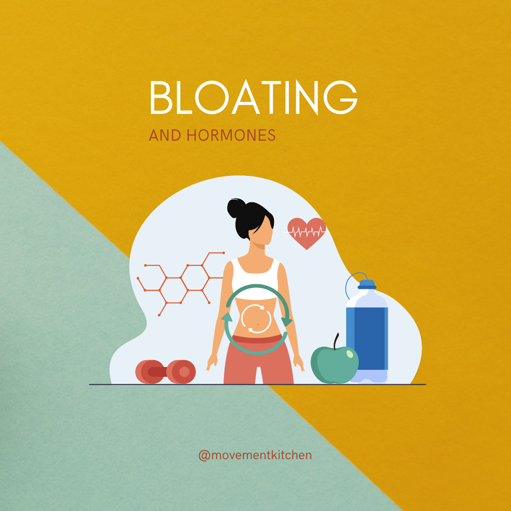
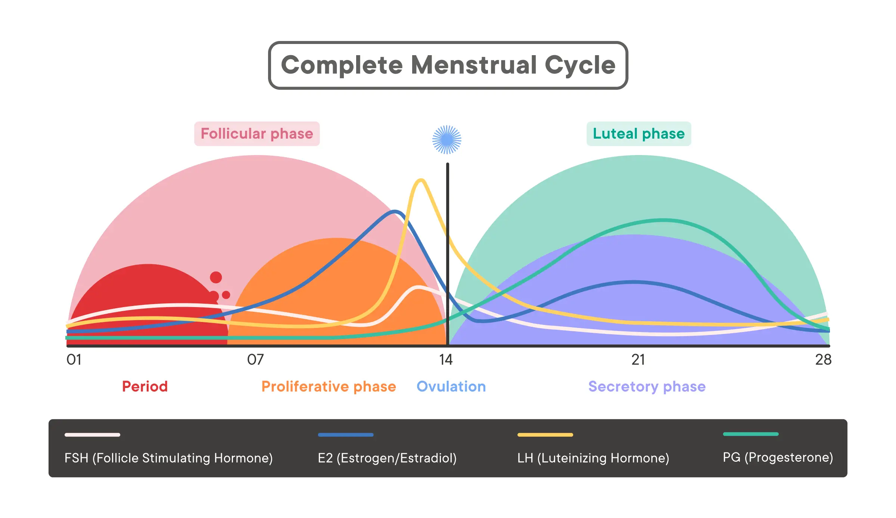

It turns out, my friend and I are not alone in being bothered by bloating. In a recent [survey on perimenopause](https://www.forthwithlife.co.uk/blog/perimenopause-symptoms-statistics-2023/) by the British startup Forth, focusing on 6,806 UK women, most of them between the ages of 30 and 49, 78% of the participants reported bloating and digestive complaints. This is the age range when most women start to feel the symptoms of perimenopause – the gradual transition between the reproductive and postreproductive stage in a woman’s life, with sometimes erratic hormonal fluctuations. 

> So, how do hormones affect bloating?

Looking at research, there is evidence that premenopausal women tend to show irritable bowel syndrome (IBS) symptoms more frequently than men, and their digestive problems, including bloating, vary throughout the menstrual cycle with changing hormone levels (Hogan, 2009).

Oestrogen plays a role in *water retention*. When its levels are high, the body accumulates fluid and you might feel bloated and puffy. Since 1930-es studies reported increased weight and swelling in women in the days leading up to the period (for example, Dignam, 1956). 

The water retention peaks at the onset of menstrual bleeding, and then, the feeling of puffiness and bloating gradually decreases during the follicular phase and starts increasing again after ovulation (White, 2011). 

It is not clear what role progesterone plays in bloating. Some studies find that it might act as a diuretic (help release water). However, it's a balance between the two hormones that matters. 

If you suspect your bloating could be related to hormones, it might be a good idea to *track your periods* and notice when the symptoms appear. Generally, estrogen levels are higher in the first half of your cycle, and progesterone in the second half. So, this might help you get an idea of where your hormone levels are. 

> Perimenopause and The Gut

During the *menopausal transition*, as the levels of oestrogen drop, the metabolism slows down, the production of bile decreases and the body gets less efficient at digesting fats. Many women develop food sensitivities to foods that they could eat just fine before their forties. This is where a food diary could be helpful. 

The composition of bacteria in the gut gradually changes. Dropping levels of oestrogen lead to a loss of lactobacillus strains and decreased diversity in the gut (Shin, 2019). Having a less diverse gut microbiome could lead to microbial imbalance, aka gut dysbiosis, which creates systemic inflammation and weakens the immune system. This is why probiotics targeted specifically at women contain various Lactobacillus species.

At the same time, our gut bacteria is capable of producing oestrogen. The genetic material of various bacteria, also known as the [*estrobolome*](https://www.maturitas.org/article/S0378-5122(17)30650-3/fulltext), merges to metabolise estrogen in the gut, which then enters the blood stream and spreads accross the body (Baker, 2017). 

This was a breakthrough finding that changed the way we see the connection between the gut and hormones. Crazily enough, it might be possible to manipulate the gut microbiome with things like faecal transplant (Yes, it is what it sounds, lol!) and increase the estrogen levels in the rest of the body through the gut.

In the meantime, *HRT* could help smoothen out the menopause transition and ease the symptoms, amongst other bloating. New generation of HRT, with body identical transdermal oestrogen derived from yam plants and micronised progesterone, has minimum side effects and is well tolerable by most women. I've been on HRT since May 2022 and I'm so grateful it exists! You can discuss different options with your GP or a fertility/menopause specialist. 

### Resources:

1. Baker, J. M., Al-Nakkash, L., & Herbst-Kralovetz, M. M. (2017). Estrogen-gut microbiome axis: Physiological and clinical implications. Maturitas, 103, 45–53. https://doi.org/10.1016/j.maturitas.2017.06.025
2. Dignam, W.S., J. Voskian, N.S. Assali and Rose, M. (1956). EFFECTS OF ESTROGENS ON RENAL HEMODYNAMICS AND EXCRETION OF ELECTROLYTES IN HUMAN SUBJECTS*. The Journal of Clinical Endocrinology and Metabolism, 16(8), pp.1032–1042. doi:https://doi.org/10.1210/jcem-16-8-1032.
3. Hogan, A. M., Collins, D., Baird, A. W., & Winter, D. C. (2009). Estrogen and its role in gastrointestinal health and disease. International journal of colorectal disease, 24(12), 1367–1375. https://doi.org/10.1007/s00384-009-0785-0
4. Shin, J. H., Park, Y. H., Sim, M., Kim, S. A., Joung, H., & Shin, D. M. (2019). Serum level of sex steroid hormone is associated with diversity and profiles of human gut microbiome. Research in microbiology, 170(4-5), 192–201. https://doi.org/10.1016/j.resmic.2019.03.003
5. White, C.P., Hitchcock, C.L., Vigna, Y.M. and Prior, J.C. (2011). Fluid Retention over the Menstrual Cycle: 1-Year Data from the Prospective Ovulation Cohort. Obstetrics and Gynecology International, [online] 2011, pp.1–7. doi:https://doi.org/10.1155/2011/138451.

Some good resources on perimenopause and menopause include: 
* [The British Menopause Society (BMS)](https://thebms.org.uk/) 
* [@balancemenopause](https://www.instagram.com/balancemenopause/)
* [@themenocharity](https://www.instagram.com/themenocharity/).