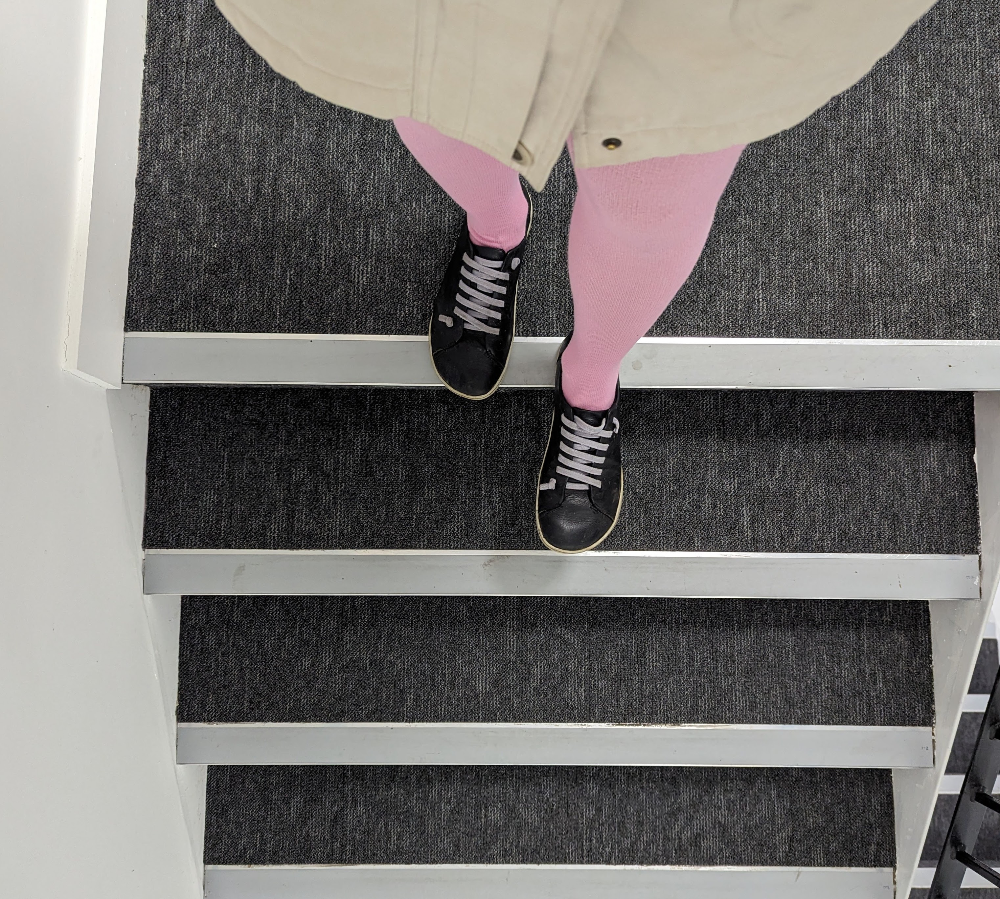
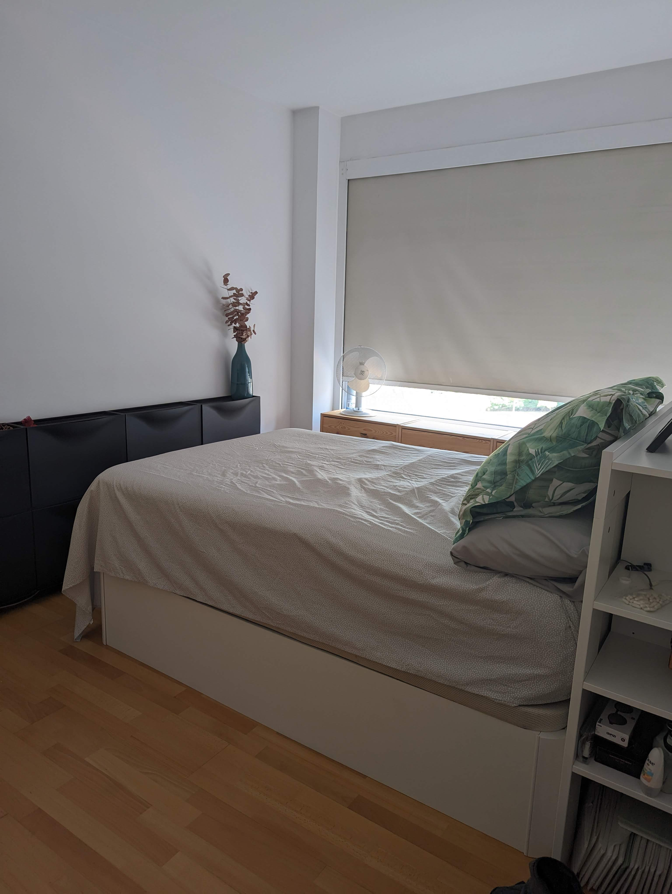
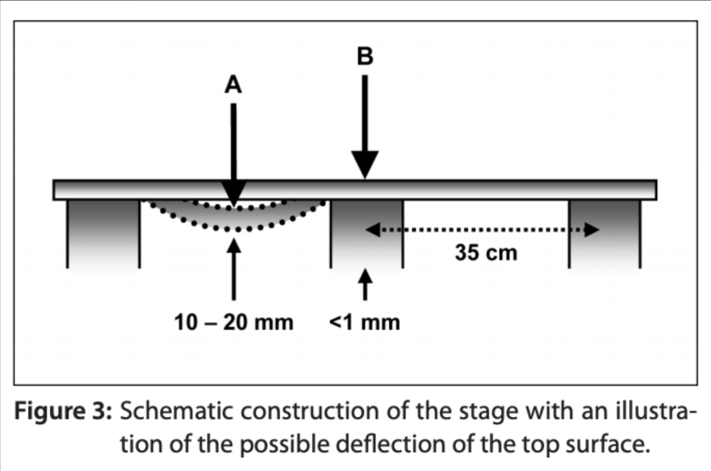
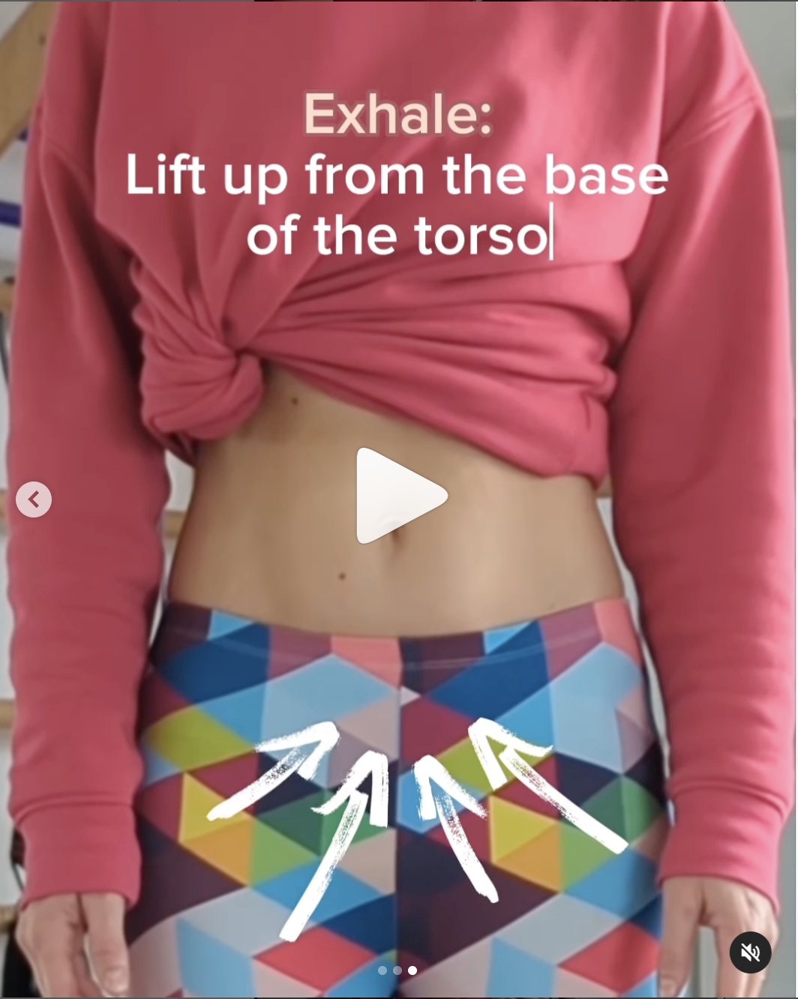

Do you know that feeling of missing a step at the bottom of a staircase? Your brain expected the step to be there, but instead, your foot just fell through. 

Or think of attempting to sit on a soft-looking armchair in a waiting room, just to hit your bottom and back against unpadded wood, covered by convincingly draped fabric.

Many injuries happen because of this discrepancy between our brains’ estimation of the demands of the movement and what really happens. So, this is what I wanted to talk about today. The brain’s role in movement and injuries and why nearly half of the work we do in Core rePower is about training the brain.

> Let me tell you a story of my bad bed injury - probably my most ridiculous injury ever.

Last summer, we were swapping our home with a family in Barcelona. I’ve probably mentioned that I am mildly addicted to home-swapping, and this is how I’ve been travelling almost exclusively for over seven years. Exchanging homes means sleeping in many different beds, with all sorts of mattress softness and pillow heights, many of which I wouldn’t have chosen myself. But I really like the sense of adventure that sampling someone else’s life involves, and taking myself out of my comfort zone every once in a while. 

The Barcelonian family’s bed was exceptionally soft and high, with not just one, but two mattress toppers. On the first night, still half-asleep, I reached out from the bed to grab my water bottle from the floor, and the floor seemed to be much further than where I remembered. I reached further, twisting, and sprained my intercostal muscles on the left side of the ribcage (the muscles in between the ribs). 

In the morning, I had a sharp pain in the ribcage and couldn’t quite bend or twist to my left side, but had no idea why. It took me a while to figure out that the bottle-reaching injured me, the gap between my brain’s estimation of the movement and the one I needed to get that 0.5-litre bottle up to my mouth.

Luckily, the strain was mild and went away after a couple of days.

* * *  

> Another story about the brain and movement anticipation, from my dissertation research

A couple of years ago, one of the troupes of Cirque du Soleil had a problem with a high rate of injuries among their performers. At most times, a quarter of their acrobats were injured and unable to perform. All of the injured performers had roles that included a lot of jumping and the typical injuries were tendon insertion injuries - where the Achilles tendon inserts into the heel bone. 

They hired a biomechanist to investigate. And it turns out, the rate of injuries skyrocketed after a recent stage redesign. The stage surface was soft and bouncy but held by thick concrete beams which you couldn’t see from above. So, the surface would either be very bouncy or not bouncy at all and there was no way for the performer to tell the difference. 

As they were jumping, the artists pre-activated the muscles of their calves, quads and hamstrings expecting to land on the springy floor. And occasionally, hit the thick beam instead. Ouch! Or the other way around. It would be equally bad to expect a hard surface and land on a soft one. 

  
<small> The image shows the stage surface - from Tilp, M. (2019). New paradigms in running injury prevention - Benno M. Nigg on target. Current Issues in Sport Science (CISS). 10.15203/CISS_2019.100. </small>

The biomechanist team suggested replacing the beam structure with a bit harder surface of uniform stiffness and the injury rate quickly returned to normal – 2-3% (Tilp, 2019).

* * * 

Before landing on a surface, our brain pre-activates muscles in anticipation of the landing and adjusts the stiffness of the leg to match the stiffness of the surface. This way, the leg behaves like a spring, using elastic energy to make the movement more energy efficient. 

Here “stiffness” is not a bad thing - it’s about keeping the leg together, so it doesn’t fall apart as it hits the ground at landing. 

If you expect a soft surface, your brain will stiffen the leg more so the soft tissues vibrate less, for more economical movement. On a hard surface, the brain tunes the leg muscles differently and makes the leg (tendons, ligaments and muscles) less stiff for a softer landing.

> So, the softer the surface, the stiffer the leg. 
> The harder the surface, the softer the leg. 

Now, neither a softer nor harder surface is better or worse. Our brains are good at adjusting the response of the body to any surface - optimising for movement efficiency and avoiding tissue damage, as long as they know what to expect.

* * * 

> But sometimes, the connection between the brain and the muscles is not fully working. 

I see this often after pregnancy and childbirth, or post-abdominal surgeries. This is why nearly a half of our work in Core rePower is about training the brain and restoring the neuromuscular connections. 

Many people I work with, have started from a place where their lower belly and the pelvic floor felt disconnected - they couldn't access or activate them at will. So, we needed to reconnect the muscles to the brain and restore the breath-core connection.

Here is a breathing exercise we use in the early stages of rebuilding core muscles after injuries/pregnancy or in people with back pain.  

   

Take off your socks and try the exercise - it might help to press the feet actively into the floor to support you.

1. Inhale softly into the side ribs - the ribcage expands in all directions, the belly and the pelvic floor relax fully.
2. Exhale: lift up from the base of the torso, the pelvic floor lifts gently (effort 2/10) and the lower belly draws upwards and into the body
3. For best results, use voiced exhalation, something like 'shhhh' 'sssss' or 'hmmm', to help you access the deep abdominal muscles.

Inhale: allow the belly and the pelvic floor to fully relax.  
Exhale: shhhhh + create an upward lift.  

That was all from me for this time.

Happy New Year!

Ivana xx 

* * * 

References:

- Ferris, D. P., Louie, M., & Farley, C. T. (1998). Running in the real world: adjusting leg stiffness for different surfaces. Proceedings. Biological sciences, 265(1400), 989–994. https://doi.org/10.1098/rspb.1998.0388  
- Tilp, M. (2019). New paradigms in running injury prevention - Benno M. Nigg on target. Current Issues in Sport Science (CISS). 10.15203/CISS_2019.100. 