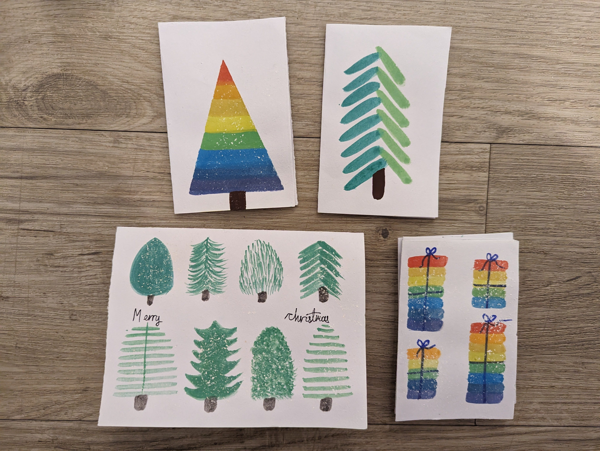
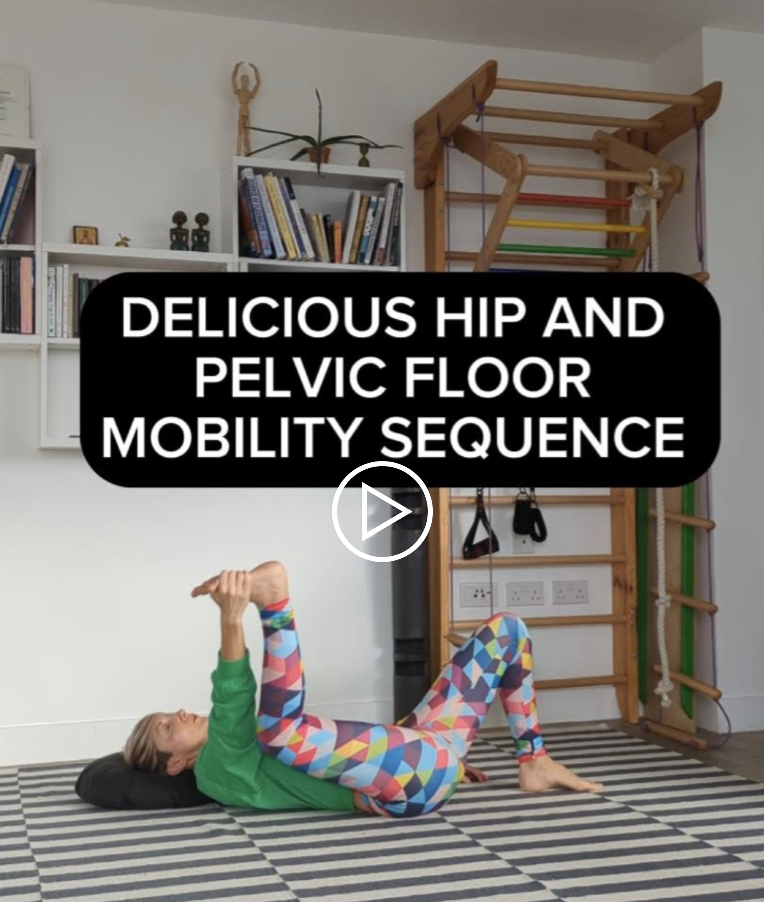
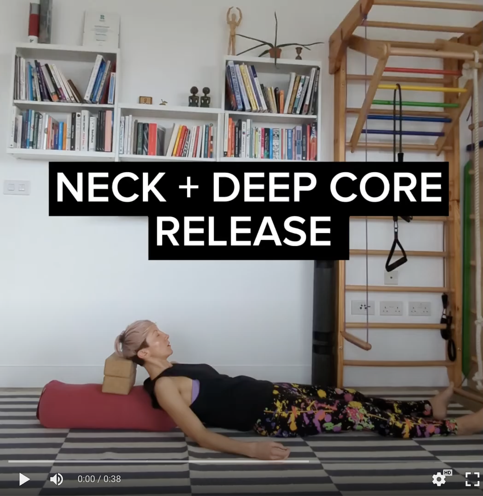

Merry Christmas! With the celebrations in full gear, the schools closed and so many things to prepare and finish in time, self-care is probably the last thing you could think of right now. Especially if you are a mum, you might be used to looking after everyone else but yourself. But self-care is not selfish - it’s self-preservation, a precondition for looking after everyone else.

I had an interesting conversation with a client of mine the other day. She is just entering her forties and was complaining how her body became much less forgiving. It needs longer recovery from training and can’t tolerate some foods that used to be just fine. 

Yes, our bodies are changing, so it takes some tweaks to adapt what we eat to what we need in our 40s. But is that necessarily a bad thing? Being in your 40s is like becoming a luxurious, high-maintenance cat, instead of being a stray cat who could eat anything. We could use it as an opportunity to prioritise self-care and look after our physical and mental health better.

In my forties – my lovely client says – I aim to look after my body so well that it can be seen from the outside. I love this idea! Physical fitness not as a shape we need to forcefully mould our bodies into, but as self-care made visible.

So, I thought, why don’t I gift you a little self-care toolkit as a Christmas present.  

  

### Looking after your sleep and mental health

Here is a [23-minute guided relaxation](https://www.dropbox.com/scl/fi/i8no3sa2xlt2zcnhpihot/The-City-Yoga-Nidra-Loving-Kindness-Practice.mp3?rlkey=sygzimddtfu6z87m9o86cfnvk&dl=0) I recorded as a present for you. It is a blend of two meditation practices I love, [yoga nidra](https://www.ncbi.nlm.nih.gov/pmc/articles/PMC9033521/) (or yogic sleep) and [loving kindness](https://ggia.berkeley.edu/practice/loving_kindness_meditation). I hope you will enjoy it. 

You don’t need to log in to access the recording. Just close the pop-up windows and click on the download button, so you can download this relaxation to your phone and listen to it any time you can’t sleep of feel like you need a 20-ish minute retreat.

* * * 

### Where in your body do you tend to hold tension? 

The stomach? The pelvic floor? The shoulders? Or it might be a combination of all these? Here are a couple of practices you might find useful.

  

A protruding belly is often a tense belly. Here is a [massage](https://youtu.be/kdT6va12YyQ?si=rK_HjND7uUxS_yUt) I use with my clients to release tension in the abdominal muscles, and restore movement. If you do it regularly, you might notice being able to take deeper breaths and your belly appearing flatter[…](https://www.instagram.com/p/C1MCVpgIyIR/)

* * * 

Here is a 5-min audio guided [hip and pelvic floor mobility sequence](https://youtu.be/TaK1gh19l6E?si=iAcEoLnnn2tJLSGT) you can sneak into your day, do it before sleep or after your exercise practice. It’s great for people with pelvic pain, painful periods, pelvic organ prolapse or anyone who tends to hold tension around their pelvis.

* * *

 

Do you tend to hold your tension in your neck and shoulders? Here is [a version of the deep torso release](https://youtube.com/shorts/JDjUwOWHeoo?si=DrMlZw6plx7EtTVL), where we target both the deep postural muscles (psoas, diaphragm) and the neck muscles, using the pull of gravity to passively release the tissues. You can read more about this release and find the full instructions [here](https://www.instagram.com/p/C06SUz3oBYD/).

* * *

That was all from me for this time. Hope you will find the practices above useful. Feel free to save them for later and share them with anyone you know who might need some more self-care during the festive season.

Have a lovely, cosy Christmas and happy holidays!

❤️💪

Ivana xx 