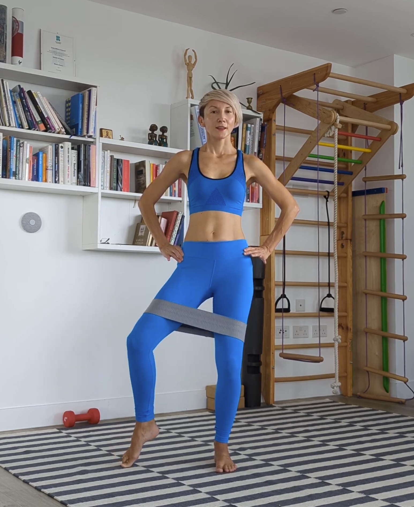

  

After 12 years of working with movement and rehabilitation, I finally got to the point where I felt ready to create my signature method. Well, I always wanted to create my own system but I didn’t dare. Over the years, as I educated myself ferociously in everything related to biomechanics, ageing and women’s health, this tapestry of approaches started to merge and transform into something new. But I wasn’t sure I had the courage to name it.

Then, maybe a year ago, I found myself in a place where I was considering closing down my coaching business and starting a career in science writing. I felt isolated as a small business owner and unsure if it made sense to keep going. I nearly left everything and started anew. But then, I decided to stay and look at my business anew. 

I began working with a business coach. This was something I didn’t even know I needed, but it ended up transforming the way I saw and talked about my work. I connected with my peers and took time to sit down and look at a larger picture. I realised that there was so much I had learnt in over a decade of my work with movement, especially working with people with weakened core and though my own journey of rebuilding my body after the babies. There was so much I could and had to share.

And this is how Core rePower was born. 

* * * 

The Core rePower method is a 5-stage system enabling people with a weakened core to seamlessly transition from rehab to athleticism. 

Core rePower is about making the core recovery fun, empowering and sexy.

It's about self-care and working with your body rather than against it. One step at a time.

And yes, we do challenge the body, but with kindness, always!

In the next two posts, I’ll explain each of the 5 phases in detail and how they work in practice.

Love and muscles,

Ivana xx