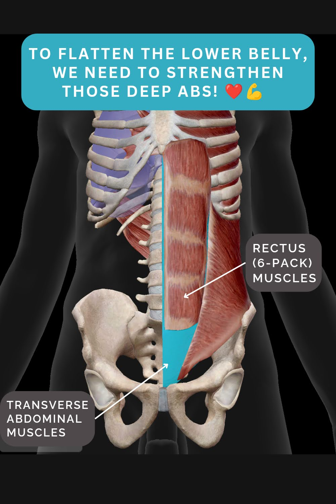

Interestingly, the deep core muscles are not just deep in the torso.

Your lower belly is the area where the deep abdominal muscles are not covered by the 6-pack muscles (take a look at the first picture on the left).

So, having weaker deep abdominal muscles looks like a less toned lower belly.

Protruding lower belly tells us that we need to train that deep core! 💪

Most traditional core exercises, like crunches or sit-ups, focus on the outer core muscles only - working on the 6-pack muscles and obliques on the sides.

And then you get a core that looks strong from the outside, but maybe not all of its parts are working well.

* * *

Looking at the torso muscles that support, move and protect the spine, and prevent the body from falling apart (in other words, our core), we have two types of muscles:

1️⃣ Torso movers  
2️⃣ Torso stabilisers

The movers are your 6-pack muscles and other muscles that twist and bend the torso.

So, we train them by crunching, bending and twisting.

The stabilisers are the deep abdominal muscles (the transverse abs - that wrap around the torso like a corset), deep back muscles (multifidi), the diaphragm and the pelvic floor that support the torso from all sides and keep it together as we move.

‼️To train them, we don't crunch. We challenge them to stabilise us - in various positions and movements.

Scroll to the left for 3 deep core exercise ideas.

For more deep core training and inside-out core rebuilding, follow @movementkitchen and subscribe to our [newsletter](https://list.movementkitchen.co.uk).

❤️💪

Ivana xx