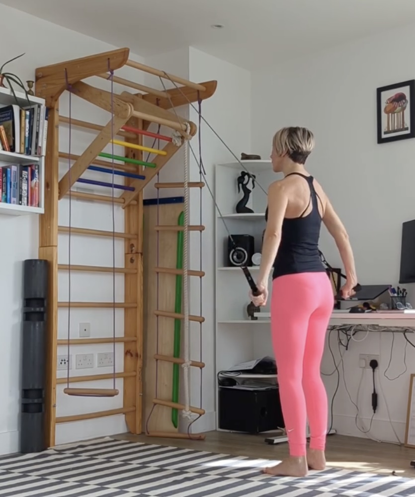

Every exercise becomes a pelvic floor exercise if we add these secret ingredients:

✔️ Strong feet - think of making deeper footprints on the floor with every exhalation 🦶⬇️

✔️ Lengthening through the back of the neck - the head sliding back and up - so we get this simultaneous lengthening upwards ⬆️ and pressing downwards that helps fire up the postural muscles - including your pelvic floor.

✔️ The ribcage and the pelvis stacked - if you think of them as two bowls of soup, the liquid inside would stay parallel at all times. This way we can make sure your diaphragm, pelvic floor and the abdominal muscles are at the lengths where they can fully fire.

✔️ Exhale at effort, as you press the feet actively into the ground and think of gently zipping upwards from the base of the torso to the navel (effort 3/10) 🌬️⬆️

✔️ For extra core support add "sshhhh" or "hhhmm" to help access the deep abdominal muscles. Think of using exhalations as fuel to power up the movements ⛽

In [this mini sequence](https://www.youtube.com/shorts/oNyaYzgsHJE), we are pressing down through the arms against resistance challenging the deep core muscles to stabilise us.

As always, diastasis recti and prolapse safe 👍

💪❤️

Ivana xx
