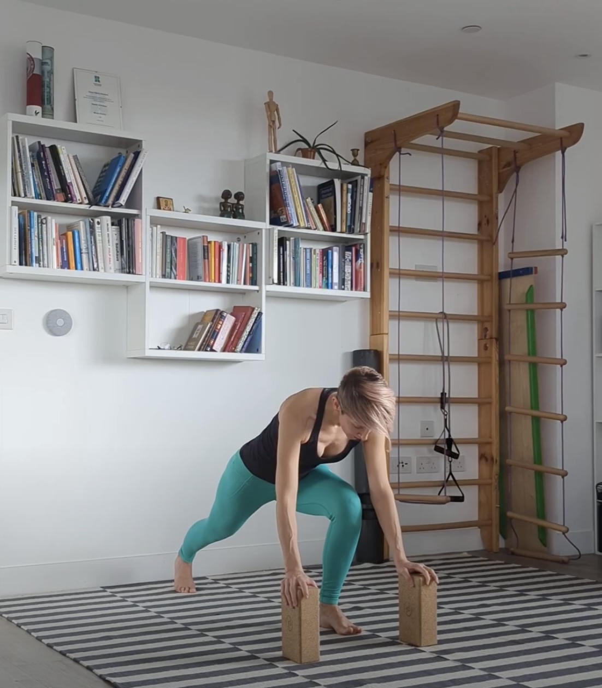

Do you really exercise every day? - a friend asked me the other day.

Yes, I dedicate around half an hour each day to looking after my body and that includes moving in the way that my body needs that day. I aim for at least 3 strength training sessions each week, some fun cardio and bodyweight flows, and active-rest-style yoga in between them, but I hardly ever skip a day, indulging in the pleasure of movement like a stretching cat 🐱 I guess I might be atypical in my love for movement. That's probably why I made it my profession. 

Many people I know, including my husband and quite a few clients, feel obliged to exercise rather than craving to do it. It doesn't help that our culture fires up external, looks-based, exercise motivation, especially in women. So, people are encouraged to exercise to "get rid of the post-baby belly", "tone up", or "fit into..." a certain clothing size. Often, exercise is seen as self-punishment for overindulgence, an expression of self-hatred rather than care for oneself. 

This is why at the beginning of coaching we always focus on establishing a daily habit of self-care and reframing exercise as a part of it. 

The idea is to dedicate some time every day to looking after your body and your mental wellbeing, and on some days, that might include strength, cardio or mobility training. 

* * *  

### Here is a cheatsheet I use with my clients to help them start or keep up their exercise practice:

🔴 Can you dedicate a *specific time in the day* to your practice? - If you want, you can tie it to some other, already established habit, e.g do it straight after brushing your teeth. Or you can set a recurring event in the calendar, 20 or 30 minutes when you are not available for anything else and no one is allowed to interrupt you. This is your me-time. *Can you treat it as a flight you don't want to miss?*

🟠 This is your *time for nourishment and self-care*. Can you see it as a fun ritual similar to going out for a dance, something to anticipate and look forward to? If you are an introvert, use it as an opportunity to recharge by spending some time alone. If you are an extrovert, you can use this time to meet up and exercise with friends, so you can motivate and support each other and share wins.

🟡 If you want, you can *prepare things in advance*, get yourself a pair of leggings/tracksuit in your favourite colour, make a playlist with your favourite songs with some fun, danceable beats. Prepare a mat, resistance band and a couple of dumbbells and create an exercise corner in your home, where they are always ready for you.

🟢 *Lock the door*, prepare your mat and props, put some good music on, make sure you are warm and comfortable and can dedicate time to moving, exploring and getting to know your body. 

🔵 Think of *exercises as cat stretches*, joyous and satisfying, almost like scratching an itch. Can you stay tuned to your body as you move and find comfort in each movement? See how your body feels that day and what it needs and choose your intensity. You decide what feels good and what not. You are in charge. Always.

🟣 If you don't feel like moving - let's say you are on your period, haven't slept well or feel ill, *you can use this time in any other way your body needs*. You can rest in a restorative position and meditate or listen to a guided relaxation. You can massage your back or shoulders on a rolled-up towel, massage your feet or belly, or simply have a long bath.

⚫ *Show up every day*. Even if you can't afford the full 30 minutes, you can do 20 or 10 minutes. What matters is to show up consistently. 

🟤 If you skip a day or two, it's OK. Just *pick up where you left off* without much fuss.

* * *  

What are your tricks for staying consistent with your exercise practice? Do you use any tools or technology to help you? Let me know!

Ivana xx