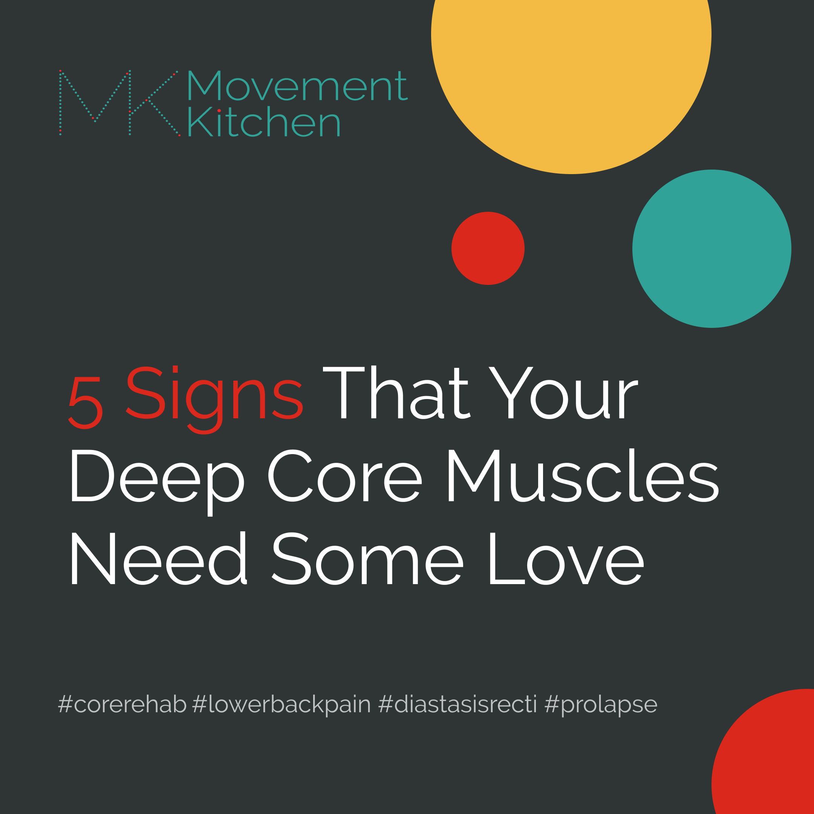
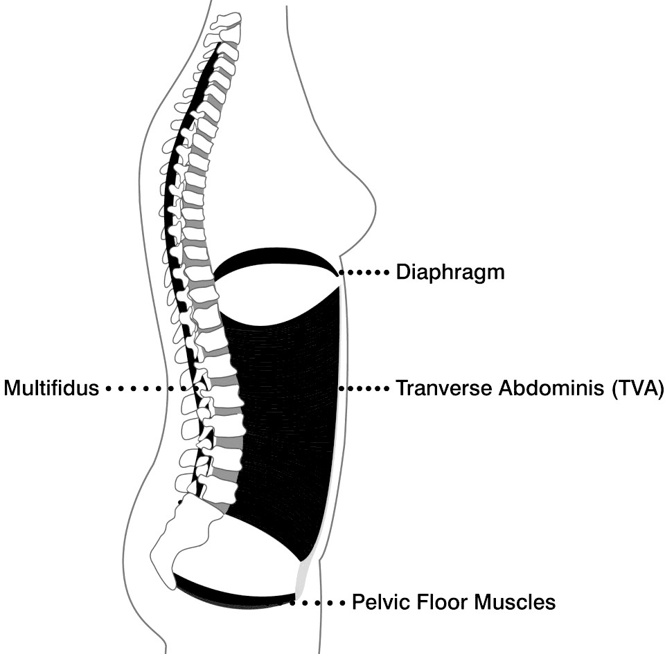
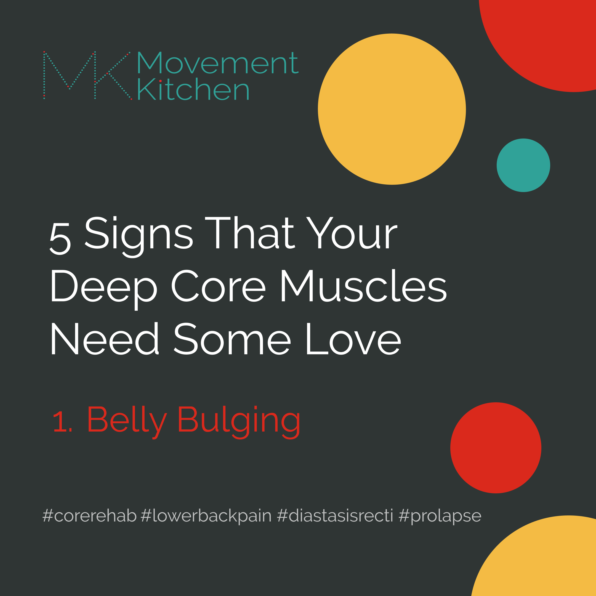
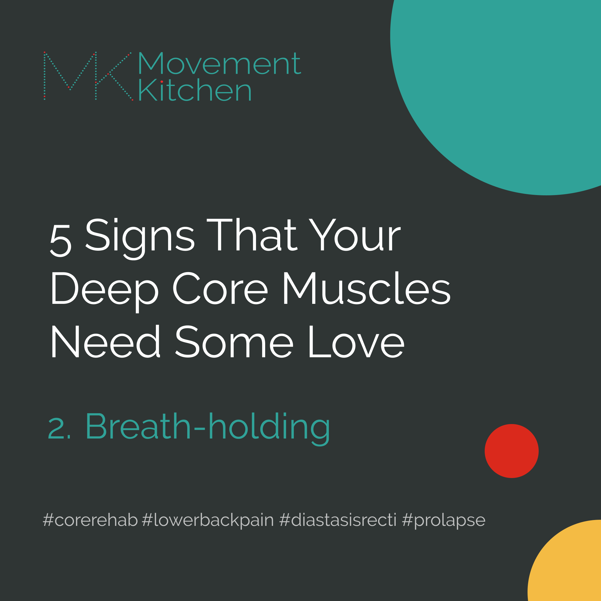
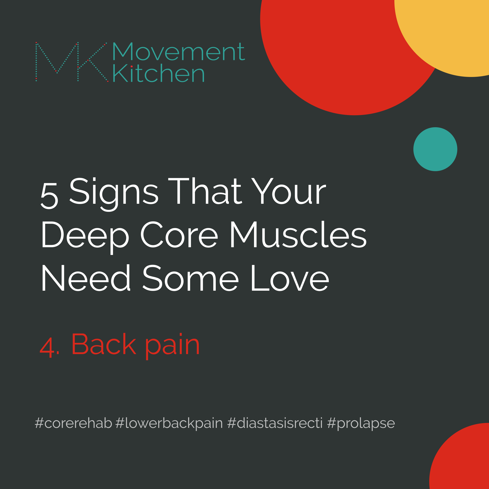
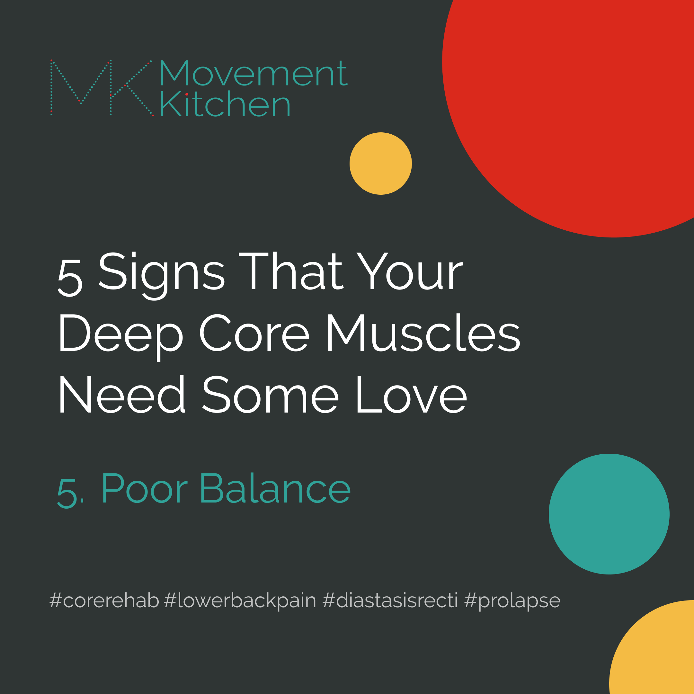

Greetings from Loire-Atlantique! We are just swapping homes here in a small village somewhere in the Loire River Valley. 

If you are a parent, you know that children holidays, as fun as they are, are also hard work. I started writing this post twice and got interrupted, and in the end, I had to write it after everyone had gone to sleep. Haha!

I wrote about the pelvic floor last week, which is one of the postural muscles making your deep core. And this time, I thought let’s widen the lens and look at the whole deep core as a system – What is it? Why does it matter? And how do you know that it needs some attention?

### What is the deep core and why do we care?

We don't have any bones in the belly to protect our spines and the organs, but we have layers of muscles wrapping around the torso – its bottom, top, front and back, to make sure our bodies can do everything we need them to do (from passing stools to running an ultra marathon) without falling apart.

The deepest muscles supporting your belly, pelvis and the lower back are usually called the deep core. They act as a scaffolding or an inner corset that keeps the torso together rather than moving it in space. 

You can also call them 'postural muscles’, as having a strong and supple deep core is important for a good posture too. 

A resilient deep core will allow your body to recover quickly from pregnancy and childbirth, but also to prevent injuries to your spine and the organs and keep you upright and mobile deep into the old age.

You can see them again here:

### So, how do I know that my deep core muscles need some attention?

1. Belly bulging 

2. Holding your breath and straining habit

3. Sneeze-pee or leaking at impact

4. Back pain that doesn’t go away

5. Poor balance  

__________________________________________________________ 
### Let’s look into each of them separately.

### 1. Belly Bulging

Does your belly stick out or strangely deform in some movements?

Let's check: 👇

✅ Lie on your back and lift one leg straight up. Is your belly coning, doming or pushing out at effort?

✅ Can you try to do the same movement exhaling slowly as you lift the leg up? Would the belly still bulge?

✅ Or maybe lifting the straight leg up feels too challenging at this point?

If you answered yes to any of the above, your deep core might need some strengthening.

<video muted loop="true" autoplay="autoplay" width="100%">
    <source src="belly-bulging.mp4" type="video/mp4">
</video>  

____________________________________________________

*The belly bulging = only the outer layer of the abs is working.* The deep abs are not fully switched on or they are too weak to help manage the pressure inside the belly, so everything is just collapsing outwards.  

The problem with most core exercises is that they focus on the outer layers of the abdominal muscles, rather than the deep core. If you train just the outer layers, you might not be used to using your deep core at all. And with time, the muscles weaken. And then you get pregnant. Or injure your back rearranging your furniture. And you deep core might be miles behind the rest in recovery.  

So, we want to reconnect and switch on those deep muscles and train them up to match the strength of all the other layers.
_________________________________________________________  

### 2. Breath-Holding

Do you sometimes catch yourself holding your breath at effort?

Try this: 👇

✅ Sit down on a sofa or a low chair. Now, try to get up without using your hands. Did you hold your breath to come up?

✅ Do you tend to hold your breath to unscrew a jar lid, open a heavy door or lift your child out of the bath?

✅ Do you catch yourself holding your breath at a challenging movement while exercising?

If you answered yes to one or more of these, *it could be that your diaphragm is doing too much postural work*, and the rest of the deep core muscles freeloading.

_________________________________________________________  

The diaphragm is an umbrella shaped muscle separating the chest from the belly. It is both the major breathing muscle and a postural muscle. 

But, its main job is breathing. If it has to pick up the slack for the rest of the deep core as, a default, it will not be able to prioritise breathing and it won't be as effective at stabilising the torso alone either. And with time, the rest of the deep core will get even weaker.

The deep core muscles need to work in synergy to protect the organs and the spine while moving. If some links in the system weaken you are at higher risk for injuring your spine or developing a prolapse.

So, we want to strengthen the weak muscles and distribute the effort of stabilising the torso.

_____________________________________________________________

### 3. Sneeze-Pee

Sneeze-pee anyone? Or laugh-hard-pee? Trampoline-jump-pee? Or lifting-heavy-pee? 

Leaking could be another sign that your deep core might need some love.

⚠️ People of any age and gender could struggle with stress incontinence.

⚠️ It could start after a pregnancy or childbirth, after an injury, surgery, or develop gradually with ageing, obesity or chronic health conditions.

❌ As we saw earlier, leaking is NOT just about a weak pelvic floor. The muscles lining the base of your torso could also be overactive and fatigued. Or maybe they just need to be coordinated better with the rest of your deep core. 

❌ Incontinence is not about one muscle, but the whole deep core system. 

### What happens if the system leaks?

You can focus on the rubber gasket at the tap only, for a quick solution (pelvic floor exercises). But if you want to solve the problem in a long term, addressing the rubber gasket alone won't cut it.

We need to make sure all the parts of the system function smoothly, alone and together.

*Why did the system leak in the first place?*

*How do we make sure it doesn't leak again?*

✅ Pelvic floor exercises could be useful in a short term, but to solve the problem in a long run, *we need to strengthen and coordinate the whole core system in dynamic whole-body movements*.  

___________________________________________________________

### 4. Recurring Back Pain

Do you have a "bad back"?

Around 60% of adults will have low back pain at some point in their lives, even more likely if they are women and 40+. Most of them get better. But in up to 7% of people, the pain becomes chronic.

So what if that's you?

You might go to the physio, feel better, and go back to the gym just to hurt your back again. Back to the physio, back to the gym, over and over again.

Sometimes, it's not just about the back itself. You might have had an x-ray that found nothing wrong with your spine, but your back still hurts.

⚠️ Evidence suggests that, *in most cases, low back pain is non-specific* - which means that it's not possible to identify a single cause of symptoms.

⚠️ Not just movement and injuries, but also, things like sleep, the general level of physical activity, diet, and mental health could all be to blame for low back pain.

⚠️ But we also know, that once the back pain sets in, people start moving differently and breathing differently, and their core as a system doesn't work as effectively.

E.g., the deep abs and back muscles are not coordinated and tend to switch on too late, the diaphragm has to do the job of the abs, the pressure inside the belly gets all over the place, etc.

If you are stuck with lower back pain - *your nervous system gets stuck in emergency mode* and forgets how to switch on and coordinate core muscles which then weaken. Especially, as being in pain is not very motivating for exercising.

So, *even if a weak core might not have been a cause of your lower back pain - it often comes as a consequence*.

___________________________________________________________

### 5. Poor Balance

Do you notice that

✅  You need to hold onto something or sit down while putting on your socks?

✅  You find it difficult to do exercises that require standing on one leg without support?

✅  You feel wobbly and lose balance in lunges and similar asymmetric movements?

Struggling with balance could be another sign that your deep core muscles need some more love.

_________________________________________________________

As we saw, our postural muscles' job is to keep the torso together - *rebounding from being pushed and pulled around* by gravity and forces created by movement.

Funnily enough, even standing still is a balancing act. Your deep abdominal, pelvic and back muscles need to work continuously to offset many tiny movements in order to balance your body and keep it upright.

So, when your core muscles don't work as effectively, let's say, after injuries, pregnancy, childbirth, or simply with de-training, balancing will be more challenging.

Here is an exercise you can use to both *test and train your balance*.

<iframe width="473" height="841" src="https://www.youtube.com/embed/27otVpcVs0o" title="Star Balance Exercise" frameborder="0" allow="accelerometer; autoplay; clipboard-write; encrypted-media; gyroscope; picture-in-picture; web-share" allowfullscreen></iframe>  

Oh, please ignore my hair in the video! It turned purple after an unlucky hair-colouring experiment 😅

Check your belly, test your balance, try the exercise and message me if you need help!

❤️💪

Ivana xx

### To dig further into this check: 

1. Bliss, L. S., & Teeple, P. (2005). Core stability: the centerpiece of any training program. Current sports medicine reports, 4(3), 179–183. https://doi.org/10.1007/s11932-005-0064-y

2. Hodges, P. W., & Richardson, C. A. (1996). Inefficient muscular stabilization of the lumbar spine associated with low back pain. A motor control evaluation of transversus abdominis. Spine, 21(22), 2640–2650. https://doi.org/10.1097/00007632-199611150-00014

3. Hodges P. W. (2000). The role of the motor system in spinal pain: implications for rehabilitation of the athlete following lower back pain. Journal of science and medicine in sport, 3(3), 243–253. https://doi.org/10.1016/s1440-2440(00)80033-

4. Roussel, N., Nijs, J., Truijen, S., Vervecken, L., Mottram, S., & Stassijns, G. (2009). Altered breathing patterns during lumbopelvic motor control tests in chronic low back pain: a case-control study. European Spine Journal: official publication of the European Spine Society, the European Spinal Deformity Society, and the European Section of the Cervical Spine Research Society, 18(7), 1066–1073. https://doi.org/10.1007/s00586-009-1020-y -  

5. Willson, J. D., Dougherty, C. P., Ireland, M. L., & Davis, I. M. (2005). Core stability and its relationship to lower extremity function and injury. The Journal of the American Academy of Orthopaedic Surgeons, 13(5), 316–325. https://doi.org/10.5435/00124635-200509000-00005

6. Vostatek, P., Novák, D., Rychnovský, T., & Rychnovská, S. (2013). Diaphragm postural function analysis using magnetic resonance imaging. PloS one, 8(3), e56724. https://doi.org/10.1371/journal.pone.0056724i