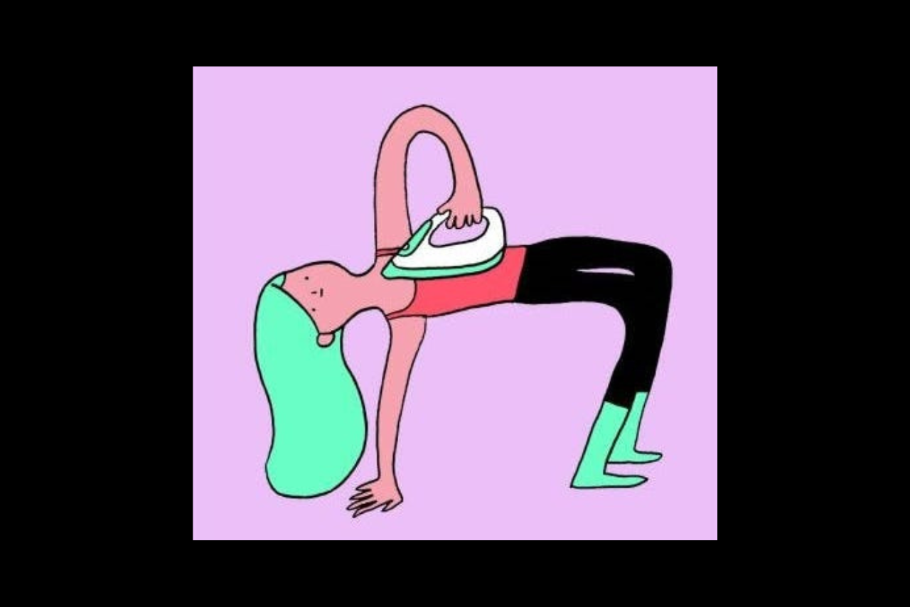
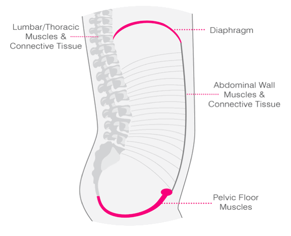

        Illustration by [Cécile Dormeau](https://cecile-dormeau.tumblr.com/)

It takes much more time and effort to unlearn than to learn something from the beginning. Back in the day, my 4-year-old tried to ride a pedal bike for the first time and it worked. We took off the support wheels so he would get a chance to balance right away. Learning to cycle with the training wheels he would later need to unlearn being supported and then eventually learn balancing.

Similarly to the support wheels, 'engaging the core', and keeping your abdominal muscles engaged as you move, might make you feel more supported, but overrides your reflexes - making it hard for the abdominal muscles to respond as and when you need them.

> Do you really need to pull the navel to the spine for your abdominal muscles to fire?

Breathing, talking, shouting, coughing, singing, jumping, using the toilet, carrying a couch or birthing babies all require your abdominal muscles, but not the same amount of force. Pulling the navel to the spine you always create the same amount of force in your abdominal muscles, which is sometimes more or less than what is needed for completing a task at hand.

Also, using the abdominal muscles always in the same way makes them adapt their length to working in a very limited range, without freely responding to the demands of movement. Over time the muscles shorten, removing unnecessary sarcomeres, and can’t effectively contract at any other lengths. Building strength within a very narrow range of muscle lengths will also create a high level of resting tension in the abdominal muscles.

> A stomach that is always flat might not be a strong stomach, but a tight stomach.

Looking from the inside, pulling the navel in decreases the space inside the abdominal cavity. Less space, higher intra-abdominal pressure (IAP) — and the viscera and the organs have to go somewhere? Pulling the navel in displaces the abdominal content into the thoracic and/or the pelvic cavity which interferes with digestion and can cause different pressure-related health issues, like haemorrhoids, diastasis recti, hernias, and pelvic floor disorders.

Decreasing the volume increases the pressure.

Carrying around high pressure inside the abdominal cavity is like having an overfilled balloon inside you waiting for an opportunity to burst. So, if you have a raised IAP to start with, and it happens that you need to help your friend move a piano — or do something else where your body will need to raise the IAP additionally. BOOM! — that’s an injury.

Learning how to release the belly takes time and sometimes happens in layers. Some habits are hard to let go of as they have sneakily become a part of who we are or how we like to see ourselves.

I remember my weakened, floppy belly after my second baby was born, the muscles that wouldn’t even talk to my brain and how desperately I was trying to keep it all in — feeling so weak and vulnerable. But once I managed to relax the belly and restore the reflexes, the muscles started firing organically, as I needed them. Through whole-body three-dimensional movements that did not focus on the abdominals in particular, my abdominal muscles gradually got toned and my belly flattened.

> For people with compromised core and chronic back pain restoring reflexive core activation is a process.

Here are the steps I go through with my clients:

### 1. Drop the pressure

First, we need to overcome any habits that increase the pressure within the abdominal cavity. You want to stop pulling the navel to the spine and make sure you don’t hold your breath or strain. Can you do the movement while maintaining an easy, flowing breath?

### 2. Restore the breath-core synergy

  
Healthy breathing mechanics — the image courtesy of [Burrell Education](https://courses.burrelleducation.com/)

There are many ways to breathe, but generally, we want to see a three-dimensional expansion of the ribcage and the abdomen with inhalation, and a retraction — a reflexive drawing in and up, at exhalation.

With inhalation, the ribcage expands and the diaphragm moves down, the belly and the lower back widen, and the pelvic floor gently swells. At exhalation, the pelvic floor lifts up, the lower belly evenly empties out, the diaphragm moves up, and the ribcage narrows to expel the breath.

> Breathing reflectively engages the abdominals and the pelvic floor. This is a three-dimensional, 360° activation — not the one-dimensional pulling the navel to the spine.

In people with chronic back pain and after pregnancy and childbirth, the synchronisation of the movements of the ribcage and the belly in breathing is sometimes off. You might even see a reverse breathing pattern where the lower belly pushes out at exhalation, instead of drawing reflexively up and in.

There is a simple visualisation I use to help my clients restore this organic *outward inward* movement at breathing.

> “Imagine a jellyfish, expanding in all directions as you inhale and retracting towards its centre as you exhale — the centre being your diaphragm. Inhale grow outwards in all directions; exhale shrink back to the centre.”

Then, we can play with adding downward — an upward movement to the jellyfish visualisation: *“inhale downwards and exhale upwards”*.

You can also add voiced exhalation — *humming, hissing or Ujjayi breath from yoga*, which will help the deeper layers of the abdominal muscles to respond at exhalation.

### 3. No belly bulging as you progress

Once the breath-core synergy is working in static positions, you can integrate it into movements/exercises.

Belly pushing out, bulging or doming is a sign that the pressure management is off and the deeper layers of your abdominal muscles don’t fire as effectively.

Belly bulging (left) — only the outer layers of the abdominal muscles firing; No bulging (right) — all layers firing

> Can you perform the same movement without the belly pushing out? If not, step back and do the version of the exercise where your belly is not yet bulging.

Step by step, the body will get used to managing pressure in more and more challenging movements and with adding weights. No need to switch the core on — it will work automatically, no thought required.

