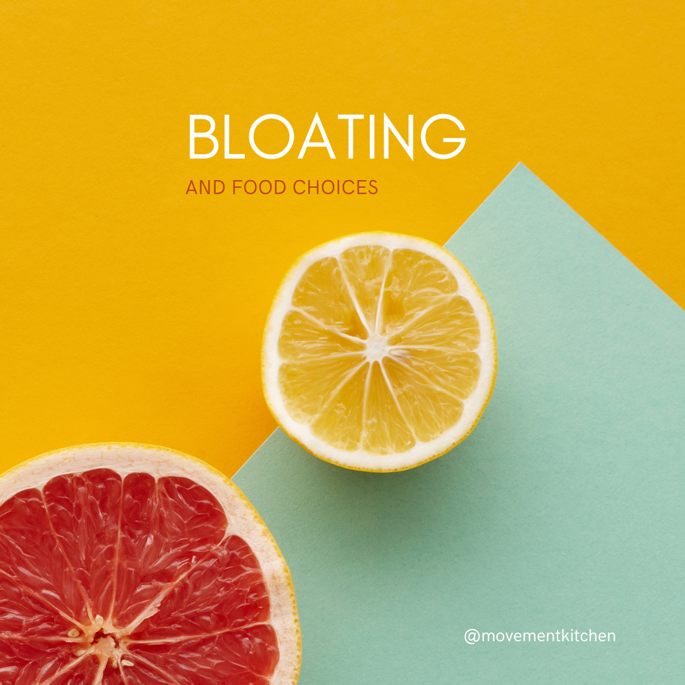

Do you ever experience this uncomfortable feeling of belly tightness, pressure and increased abdominal size? I definitely do, especially towards the end of my cycle and when I end up eating later in the evenings. Sometimes my children make fun of me or I get self-conscious and choose looser tops to hide my belly. 

I went out with a friend the other night and she complained about the same thing. So, I thought: why wouldn’t I research and write about abdominal bloating, especially its mechanical factors, e.g. how it affects breathing and torso mechanics? 

So I dug myself up into medical journals looking for answers and recorded some videos with solutions that I’ve been using personally and with my clients. But it turned out there was way too much material for one post, so I ended up creating a series exploring different aspects of bloating as a multi-factorial and so much more than an aesthetic problem.

### Let's start with food and bloating. 

If you think certain foods could be a cause of your bloating, it might be a good idea to write a *food diary* for a couple of days/weeks and see what makes your symptoms worse. 

One of the common culprits could be *artificial sweeteners*. 

In the last decade or so, researchers identified a group of poorly absorbed sugars (FODMAPs) that get fermented in the gut producing methane and carbon dioxide and wracking havoc with digestion in general. The notorious FODMAPs include fructose, lactose and artificial sweeteners (such as sorbitol, mannitol, xylitol, and glycerol). There is evidence that removing these from your diet could decrease symptoms of bloating (see Lacy, 2020). Look up the [*Low FODMAP diet*](https://www.medicalnewstoday.com/articles/319722) for ideas. 

Also, *probiotic supplements* can help reduce gas and bloating, especially bifidobacteria strains, which don't create gas with fermentation (Check Foley, 2014).

You can also try incorporating some of these foods into your diet:

1. *Probiotic-rich foods*: Yogurt, kefir, sauerkraut & kimchi contain beneficial bacteria that support a healthy gut. If you find lactose difficult to digest, go for the lactose-free of no-dairy probiotics.

2. *Peppermint*: Peppermint tea/oil can help relax the muscles of the gastrointestinal tract.

3. *Fennel*: Fennel seeds/bulbs can help with digestion and reduce gas.

4. *Ginger*: Ginger has anti-inflammatory properties and contains enzymes that help break down protein.

5. *Lemon* - Lemon juice is similar in acidity to our digestive juices and boosts digestion.

6. *Bananas*: They are gentle on the stomach and can help regulate bowel movements.

7. *Pineapple*: Contains bromelain, an enzyme that can help with digestion.

8. *Oats*: High in soluble fibre, oats can promote regular bowel movements and reduce constipation.

9. *Lean proteins*: Opt for lean sources of protein like poultry, fish, and tofu instead of fatty meats, which can be harder to digest.

10. *Herbal teas*: Chamomile and dandelion tea may help soothe the digestive system.

11. *Water-rich foods*: Cucumber, watermelon, and celery have high water content and can help flush excess sodium from the body.

Again, everyone is different, listen to your body and observe which foods work or don't work for you.

Generally, a *balanced diet*, plenty of *water* and *moderate portion sizes* will help make a difference.

Stay tuned for the next post on bloating, exploring how hormones influence digestion in women.

### Resources:

1. Foley, A., Burgell, R., Barrett, J. S., & Gibson, P. R. (2014). Management Strategies for Abdominal Bloating and Distension. Gastroenterology & hepatology, 10(9), 561–571.
2. Lacy, B.E., Cangemi, D. and Vazquez-Roque, M. (2020). Management of Chronic Abdominal Distension and Bloating. Clinical Gastroenterology and Hepatology, 19(2). doi:https://doi.org/10.1016/j.cgh.2020.03.056.
