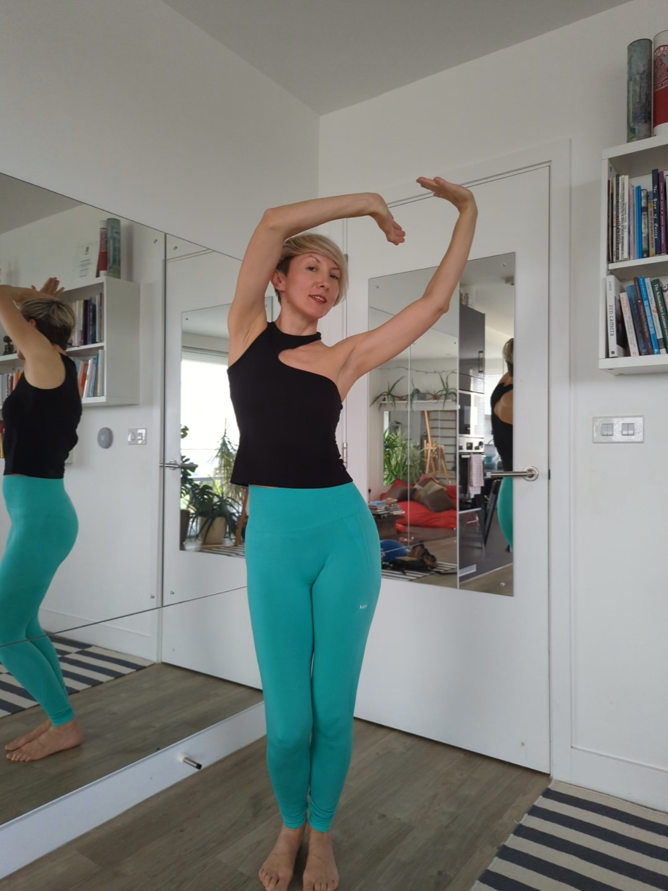

### Did you know that muscle mass helps balance out our hormones?

The more lean muscle we have in our 40s, the easier it is for the body to manage stress, regulate blood sugar levels and handle the changing hormones?

As we approach menopause, the drop in oestrogen makes us *more stress-sensitive, but insulin-insensitive* and prone to blood sugar spikes.

When we are stressed, the body produces cortisol and other stress hormones. Our vision sharpens, the heart quickens, the glucose from the liver is released into the bloodstream to power up the the fight-or-flight.

At the same time, our digestion slows down, this is why cortisol is also known as  *the “belly fat hormone”*.

If the body is stuck in the stress response for a while, high levels of cortisol can lead to overeating and weight gain – in all the wrong places. Hello hormonal belly!

Also, cortisol, when elevated due to stress, can block progesterone receptors and decrease sensitivity to oestrogen, leading to symptoms like hot flushes, mood changes, chaotic periods.

✔️ Strength training and building lean muscle mass can reduce chronic inflammation and stimulate the production of testosterone and growth hormone that can help handle stress hormones.

✔️ The more lean muscle mass we have, the more sensitive our cells become to insulin - and able to more effectively absorb glucose from the bloodstream.

✔️ Also, more muscle mass means that our bodies have a greater capacity to store glucose and use it for energy. This is why people with more lean muscle tend to see more stable blood sugar levels regardless of what they eat.

### So, let's build some muscle!

Are you looking to build up a sustainable exercise routine and get stronger with support of a coach who is passionate about women's health, ageing, pelvic floors and hormones? I am opening 2 new coaching spots this month.

Drop me an email with the word "rePower" in the subject and I'll send you more details.

Ivana xx