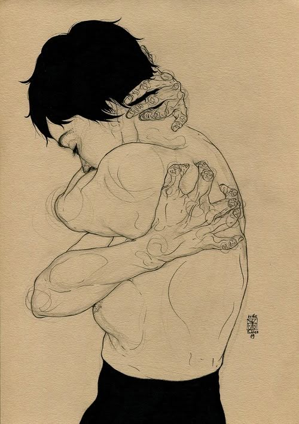

<small> Illustration by Kaethe Butcher https://www.kaethebutcher.com/​ </small>

When I’m stressed out, the first thing I notice in the mirror is rounded shoulders with a forward head. As if my body is trying to curl into itself.

It turns out, this stooped posture is in biomechanics literature called ‘protective posture’ and is the body’s response to fight-or-flight.

### So, how does the body react to stress?

Large muscles of the torso tense up to help the body escape, fight or curl up into a foetal position for defence. Once the danger is over, the muscles release and we go out of the protective posture. But if the sense of danger doesn’t fully go away, the muscles stay contracted on and on, until they can’t let go anymore. They become rigid and shorten in response to sustained stress. The prolonged tension becomes pain.

Did you know that chronic back pain is most likely to be muscular (also called non-specific back pain), without damage to the spinal discs? In fact, spinal degeneration often occurs without symptoms.

For example, in 1997, a team of German scientists travelled to Sierra Leone to study necks of people who carry heavy loads on their heads and matched controls. It turns out people can have severe spinal disk degeneration without pain [(Jäger, 1997)](https://link.springer.com/article/10.1007/s002560050269). A more recent literature review from 2015 looked at data of over three thousand asymptomatic people of different ages. Many of them had some level of spine degeneration without even knowing, especially as people got older, but they were just fine, no pain [(Brinjikji, 2015)](https://doi.org/10.3174/ajnr.A4173).

So, if your back hurts, don’t panic. It’s most likely muscular. Here is a [short post](https://www.instagram.com/p/C6qzFVnIYxX/) where I looked into some tell-tale signs of each muscular and disc-related back pain.

And even if it is disc-related, we can build strong muscles to support the spine and live without pain.

### Getting To Know Your Tension  

When I was a child, my mum used to say ‘I feel like I’m about to get a headache’. I thought that was funny. Was it already a headache or not? How could she know it was coming? But then, building body awareness, I’ve realised that it is possible to spot pain flaring up, almost in slow motion.

It’s interesting to become aware of tension patterns in your body. A client of mine told me the other day how she noticed her lower back starting to flare up while she was having an argument with her children.

We spotted together a pattern where she tightens her hips and lower back when she feels she needs more power (and courage too). Now she is aware of it and she can notice when the tension is just starting and before it turns into pain – like my mum with her headache coming. This way, she can do the [block release](https://www.instagram.com/p/C_-y-vqoZu3/) or [massage her back on a rolled-up towel](https://www.youtube.com/shorts/Pa4kzRTrpeE) to prevent a back pain flare-up.

### My 11-year-old and I invented a game we play together, called soft-sharp.  

Whenever he feels anxious or has a nightmare, he lays in his bed with his eyes closed and I ask him to think of different parts of his body and tell me if they feel soft or sharp. We start with the head: ‘soft or sharp?’, I ask. ‘Soft’, he answers. Then the neck. ‘Soft or sharp?’ - ‘Sharp!’. Continuing with shoulders and so on, all the way to the feet.

And after that, I gently rub the parts of his body that feel sharp. Or we do a squeeze and release exercise - where you tense a body part on purpose with inhalation and release fully at exhale.

But even just thinking about different parts of your body and seeing how they feel can help you become aware of tension, so you can release it. If you are familiar with mindfulness meditation, you probably know this practice as the body scan. If not, try it, it really works!  

### My Tension Toolset  

Last week, after many years, I had an upper back pain.

It had been a couple of really stressful weeks, where we were choosing secondary schools for my son, rushing through the city back and forth to visit schools across three different London boroughs. At some point I visited four schools in 36 hours! I was running around, the shoulders hunched, carrying my shoulder bag with a heavy laptop inside. And I noticed this pain in my shoulders and in between the shoulder blades, an aching, stiffness that would get worse with each breath. It would hurt to inhale!

Once I got home and made myself a cup of tea, I got on the floor to stretch my back though some gentle movements. And this is how I created this short movement sequence that combines lengthening of the spine in multiple directions and pushing against the floor resistance. It was amazing how, even after just 5-10 minutes of doing these stretches, my upper back tension let go and I could breathe fully again. The next day I was back to my usual strength training.

Here is a [2.5-minute audio guided video on YouTube of this sequence](https://youtu.be/XP6qOlDt0yg) you can follow along. The video is in portrait orientation, perfect for viewing on the phone. Try it out, it feels so good after hours in front of the screen, with the forward head.

And here is [another stretch I love](https://www.instagram.com/insights/media/3483784154752014430/) (with added resistance band for strengthening). I use it to gently release my body out of the protective posture and help restore length of the deep muscles of the torso.

Try these, save them for bad days and let me know if you like them.

Until next time,

Ivana xx  

### To dig in deeper, check:

1. Brinjikji, W., Luetmer, P. H., Comstock, B., Bresnahan, B. W., Chen, L. E., Deyo, R. A., Halabi, S., Turner, J. A., Avins, A. L., James, K., Wald, J. T., Kallmes, D. F., & Jarvik, J. G. (2015). Systematic literature review of imaging features of spinal degeneration in asymptomatic populations. AJNR. American journal of neuroradiology, 36(4), 811–816.[https://doi.org/10.3174/ajnr.A4173](https://doi.org/10.3174/ajnr.A4173) (Really interesting look at how our spines change as we age and how it doesn't necessarily need to hurt)  
2. Jäger, H. J., Gordon-Harris, L., Mehring, U. M., Goetz, G. F., & Mathias, K. D. (1997). Degenerative change in the cervical spine and load-carrying on the head. Skeletal radiology, 26(8), 475–481. [https://doi.org/10.1007/s002560050269](https://doi.org/10.1007/s002560050269) (This is the Sierra Leone study I mention in the text above)
3. Mehling, W. E., Daubenmier, J., Price, C. J., Acree, M., Bartmess, E., & Stewart, A. L. (2013). Self-reported interoceptive awareness in primary care patients with past or current low back pain. Journal of pain research, 6, 403–418. [https://doi.org/10.2147/JPR.S42418](https://doi.org/10.2147/JPR.S42418) (This study found that more body awareness meant less pain-related disability in people with chronic lower back pain)
4. Shahidi, B., Haight, A., & Maluf, K. (2013). Differential effects of mental concentration and acute psychosocial stress on cervical muscle activity and posture. Journal of electromyography and kinesiology: official journal of the International Society of Electrophysiological Kinesiology, 23(5), 1082–1089. [https://doi.org/10.1016/j.jelekin.2013.05.009](https://doi.org/10.1016/j.jelekin.2013.05.009) (Explores the link between stress at work and upper back and neck tension)​