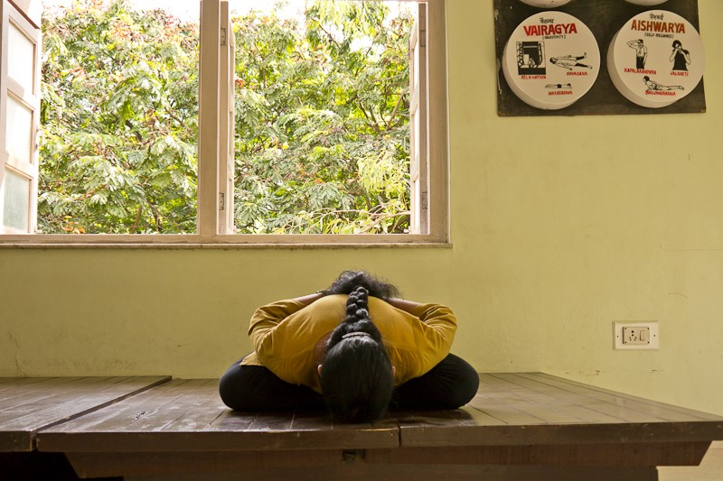
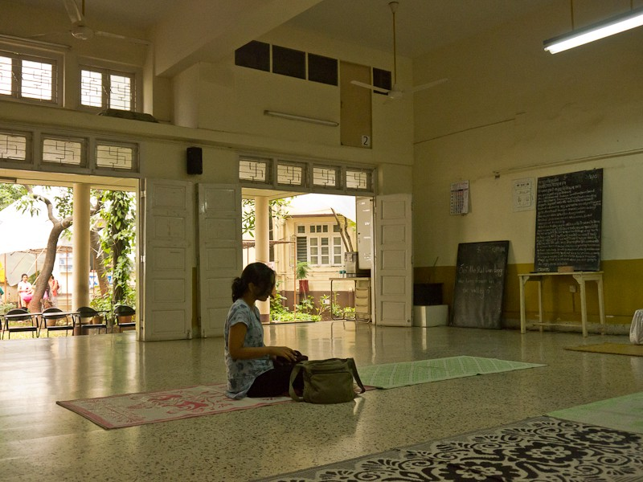
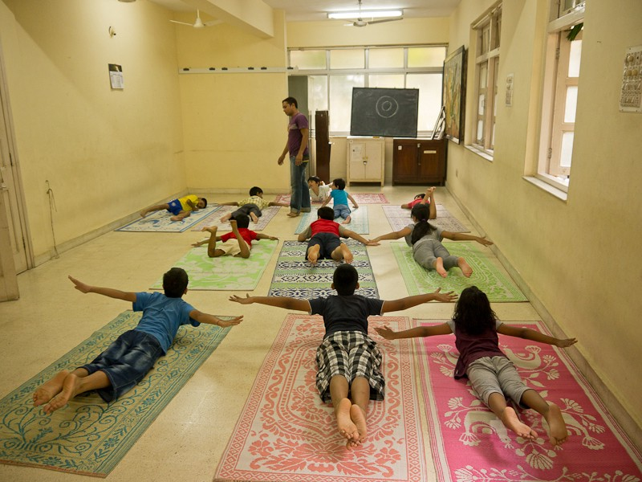

An old friend got in touch the other day asking for my opinion about two different yoga teacher courses in India. Both were obviously targeted at the Western audience, being quite daringly priced for Indian standards. Do you think they are genuine? — he asked. They both seem to be accredited by American Yoga Alliance.

No, I don’t think they are a fraud, I wrote. They do exist, have a website, and probably do train people from all over the world in a set of skills we conventionally expect from a yoga teacher. But the question of authenticity is something different. It all depends on what exactly you are looking for, I guess. Why is that you are going to India in the first place? What is that you are seeking? Is it a specific set of skills, accreditation, an experience or maybe something different?

The two courses he sent seemed to be similar to a number of courses available in the UK, even the prices were pretty much the same. They offer an internationally recognised 200 hour accreditation and a curriculum focussing on asanas and other concrete techniques, even learning how to run your yoga business. They seemed perfect for someone who wants to spend a couple of weeks away, in a warm, tropical setting mastering their headstand and a couple of other advanced postures and come back with a title of a yoga teacher, ready to get their business off the ground.

Please don’t take me wrong, that is a completely viable reason to do a yoga teacher training. We all need to live of something. And it’s definitely nicer if you want to make teaching yoga your profession — making people healthier and happier instead of doing something that supports the system you personally don’t believe in.

Being able to earn more money from teaching yoga is also fine. If that is your aim, that is completely understandable. But do you really need to go to India for that? Maybe you can do it a whole lot cheaper somewhere in Europe? At least the flight wouldn’t be that expensive.

> For me personally, the highest value of studying yoga in India was being pushed out of my comfort zone and getting a chance to take a look at my whole value system afresh.

Maybe we need to leave our cosy world for a moment to be able to truly understand the cultural and religious context in which yoga was born and really experience the modest and disciplined way of life that yoga traditionally meant. And this definitely doesn’t have much in common with detox green juices and perfect bodies in branded yoga pants posing in graceful, breathtaking backbends, which in a way was my perception of yoga-lifestyle before that.

Staying at a modest, traditionally organised ashram without fancy facilities and many foreign students, you might not experience 5 star comfort, but will for sure get exposed to a life different enough to permanently change you. Being immersed into a completely different, sometimes overwhelming world with values often intimidating at first sight, you get a chance to step back from our common self-centred way of seeing the world and take a look at a larger picture for a moment. You are just a tiny wheel in a larger process of life.

> Your diarrhoea, allergy to mosquito bites or the fact that you don’t like okra don’t make any difference. You are small and unimportant… and that is so beautifully empowering.

Now you are probably wondering: what the heck is she talking about? Well, I’ll try to explain, please do read further!

> Some concepts of yogic philosophy are totally alien to our Western logic and using solely your intellect to get around them doesn’t make much sense.

A good example would be the concept of dharma from Bhagavad Gita, often translated to English as duty, which at first sounds like a bold denial of free will. Hm… Coming from the West, freedom is what for most of us yoga is all about and why we are “in the game” to start with. However, diving deeper into the whole value system of Bhagavad Gita you come to experience that this duty is not a chore, not a denial of freedom, but something that comes as a fulfilment, finding your own innate purpose — acting from the full depth of your being.

It’s a similar story with the concept of karma yoga, the term often used in the West to justify teaching yoga for free and other work without remuneration. Karma yoga is not about cutting the goal out of the picture (in this case fair payment for the service), but totally shifting the focus from goal to process itself. We come to experience work as selfless — going beyond yourself through action, transcending the limits of the ego. The process sets itself free from the result and becomes the fulfilment. And work, another concept seen as a chore in our perspective, becomes a path to enlightenment and true liberation.

And there is a whole lot of other examples — like tapa (austerity, discipline), swadhyaya (self-study), Iswara pranidhana (surrendering to the higher Self, in a way), or unconditional love. We do need a cultural shock and a short upside-down of our whole value system to be able to truly experience them. But do you really want that? I guess it all depends again on what you are looking for and how deep into the rabbit hole you are willing to dive. And do you even want to change?

Although India today is largely affected by globalisation and especially richer people have a life quite similar to people of upper middle and high class Westerners, it’s still possible to find hidden pockets of spirituality free of materialism and materialist spiritualism.

If you are after something like this, maybe a good place to check would be modest local yoga institutes with ashrams.

> Traditional yoga institutes are run as non-profit organisations and often kept in the same family for generations, being able to trace their roots back to their original guru.

Their work is aimed mostly at Indian students, trying to preserve yoga as a tradition and a system of values — living, breathing, drinking and eating yoga. They see yoga as a spiritual path and simply a way of being, loving and selflessly serving others.

Trainings they offer are often longer (3 months on) allowing you to get over your initial frustrations of adjusting to the climate and stomach bugs and dive into Indian philosophy — both intellectually and experientially.

Yoga for them is not about physical postures and you probably won’t learn much anatomy there or how to run your yoga business back home. But if you do stay open and allow yourself to experience something new without judgement, you might set a foundation to growing into a completely different you. At least for me, this was the single most valuable thing from studying yoga in India.

I would warmly recommend the institute where I studied — [The Yoga Institute in Santacruz East](http://theyogainstitute.org/), the busy Mumbai neighbourhood with shouting street vendors and shattering noise of planes landing and taking off from the nearby airport.

> They always say the Institute was there before the airport and will stay, as the city around it keeps growing and changing.

And it really does, maintaining an oasis of peace and simple, traditional values in the midst of all the hustle and bustle of Mumbai. The Institute was established in 1918 by their grandfather Shri Yogendra, disciple of Paramahamsa Madhavdasji. Its work is dedicated mainly to “householders”, trying to educate and bring together local community around yogic lifestyle and yoga philosophy applied to everyday life.

Also, another Institute I always recommend is the yogic hospital and research centre [Kaivalyadham](http://kdham.com/) in Lonavla, the mountain area somewhere in between Mumbai and Pune. It’s interesting that they trace their teaching back to the same guru as The Yoga Institute ([Madhavdasji](http://www.yogadhama.com/ecole-yoga/?The-KAIVALYADHAMA-Centre&lang=en)). Kaivalyadham has recently tried to modernise their approach, starting to offer online courses, but I think the greatest value you can get from there would be to go and spend some time living at the Institute, fully immersed into their value system, simple and humble way of life.

There is probably a whole lot more of similar places to discover. Unfortunately some of them offer their courses only in Hindi or only to male Indian residents. Anyway, you should definitely do a nice research before you choose where to go and maybe try to get in touch with at least one person who studied there, just to help you set expectations.

Good luck!

P.S. All the photos here were taken in Mumbai during the summer and autumn 2012 that I spent studying at The Yoga Institute in Santacruz East.
