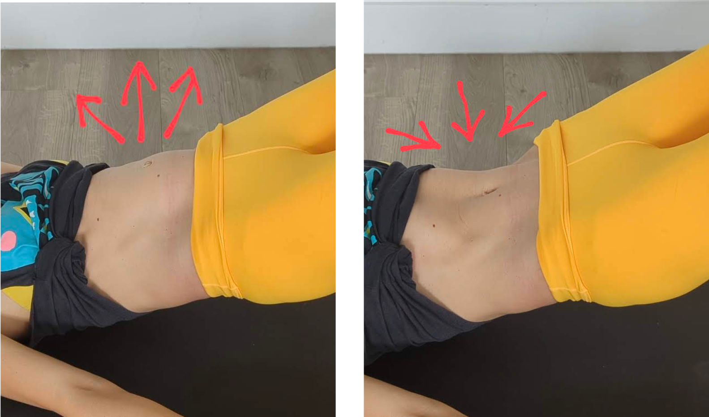

Over the years, I’ve worked with many people with weakened core and recurring back pain. And what I keep seeing over and over is the belly pushing out at effort (left), instead of drawing into the body to protect the spine (right). I call this muscle use pattern the bulging belly. 

*The bulging belly = your core is operating in the emergency mode*. This is a sign that your body still can't manage pressure inside your belly in that movement and only the outer layer of the abdominal muscles is working, but not the deeper layers. 

### But what is the intra-abdominal pressure anyway? 

Imagine someone is trying to poke you with a stick. The otherwise soft belly will tense up the muscles and increase pressure inside, stiffening up to protect the spine and the organs within the abdominal cavity. 

The pressure is useful, we need it to accomplish different movements while preventing the torso from falling apart. But the body needs to be able to manage and direct the pressure rather than let everything collapse.

The problem with the bulging belly is not the way it looks, but the outward and downward pressure on your organs that it creates. Using this muscle activation pattern regularly is not ideal, especially if you are already struggling with prolapse, incontinence, diastasis recti, hernia or haemorrhoids. We want to get stronger without pushing ourorgans down!

The good news is that the bulging belly is more of a coordination than a strength issue and can be retrained. 

### Is my belly pushing out or drawing in and up at effort?

Here is a 50 sec video showing the difference between the bulging belly and the 3D core activation. 

<iframe width="473" height="841" src="https://www.youtube.com/embed/JN-_ak3qH7U" title="How do I know my core is working? #postpartumfitness #core #pelvicfloor #diastasisrecti" frameborder="0" allow="accelerometer; autoplay; clipboard-write; encrypted-media; gyroscope; picture-in-picture; web-share" allowfullscreen></iframe>

Lie on the floor, roll up your top and see what shape your belly makes as you try to raise your head and the shoulders or lift the hips up into a bridge. 

A video showing the difference between the two muscle activation patterns
So, what if your belly bulges out in a certain movement?

The first question is: is it just this movement?

Can you perform the same movement without the belly pushing out? If not, step back and do the most similar movement where your belly is not yet bulging.

But what if your belly bulges out at most movements? 

Here is a 6-min video where I explain how to reconnect the breath and the abdominal muscles and activate your core in 3D - rather than just pull the navel to the spine. 

It could be a good place to get you started.

<iframe width="1905" height="800" src="https://www.youtube.com/embed/hiaG_oTC5jg" title="3D Core Activation #postpartumfitness #core #diastasisrecti #pelvichealth" frameborder="0" allow="accelerometer; autoplay; clipboard-write; encrypted-media; gyroscope; picture-in-picture; web-share" allowfullscreen></iframe>

Let me know if you have any thoughts, questions or need help. I offer online coaching too.

❤️💪

Ivana xx
