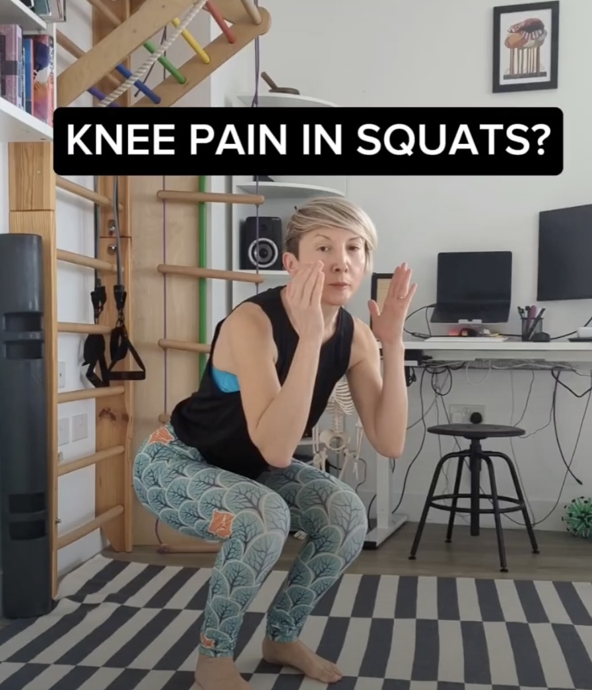
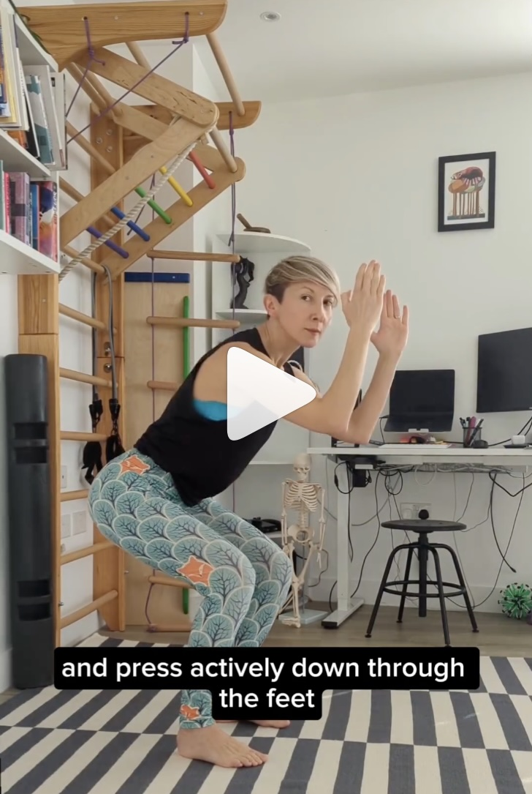

Do squats feel hard on you knees?

Let's see how we can tweak this movement to unload those knees while helping you strengthen your backside. 

The further your knees are forward in relation to the ankles, the more you use the front of the thigh muscles - the quads. As you squat down and come up, your quads, pull onto your kneecaps to extend the knee. The stronger the quads' activation, the more they pull onto your knees.

At the same time, your backside and calf muscles help protect the knees as you bend and extend, pulling back. 

So, to unload your knees, we can move the body into a position where those back of the leg muscles get to do more, and the front of the leg muscles less.

To get your backside on board, we want to

✅ Aim for the vertical shins - so the glutes do more 
✅ Press the feet actively into the ground - to get the feet and calves (soleus) onboard to protect those knees.

 

Do you have little sensation in your feet or find it difficult to press down actively into the feet?

Take off your shoes and try these [foot exercises](https://www.instagram.com/p/Cfd6FtfqasU/) I use with my clients to help improve foot, ankle, knee and hip mechanics and build a foundation of functional strength. 

Just a quick disclaimer here. This is NOT the "correct" way to squat, but just one option, that is knee-friendly. Squats are a whole category of movements (where we have a different degree of flexion at the ankle, knee and hip) and we can use them to target different muscles.

* * *

Do you struggle with recurring knee or back pain? Follow [Movement Kitchen on Instagram](https://www.instagram.com/movementkitchen/) for plenty of tips and exercise modifications to help you build back your strength and break out of the physio-gym loop for good.

We also have Core RePower Back Pain starting from the 19th of February. Email me with the word "rePower" in the subject and I'll send you more info.

❤️💪

Ivana xx 