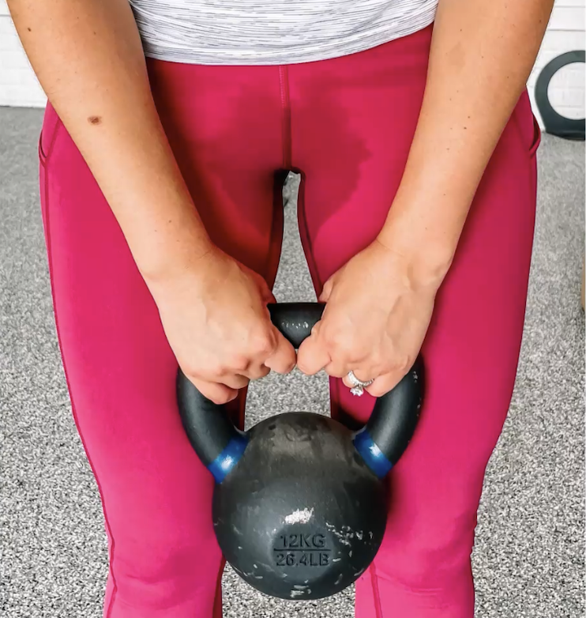
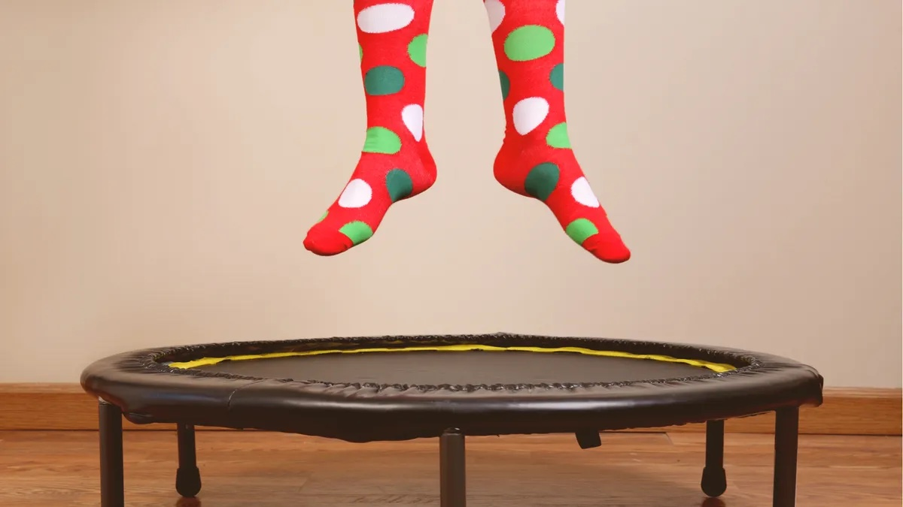
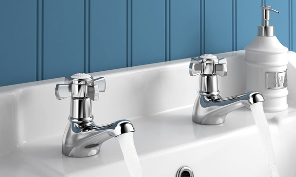

Last week was World Continence Week so I thought I’d dedicate a post to leaking during workouts. 

Bladder leaking is much more common than you’d expect. According to the House of Commons research briefing from a couple of days ago, *14 million people in the UK have some form of urinary incontinence*. 

The most common type is stress incontinence - leaking at coughing, sneezing, laughing, running, jumping or lifting something heavy. 

Stress incontinence mostly affects women. I’ve recently read a shocking statistics that *1 in 3 women in the UK* leaks after having a baby and over three quarters of them still do 12 years after the baby was born.

### So, why does leaking happen?!

Think of jumping on a trampoline. When the trampoline springs you up, you leap into the air and your body is the “lightest” just before you start moving back down. And your body is the “heaviest” at the moment when you land (5-12 times your bodyweight). And whooosh! A good part of that weight smashes down on your bladder and the pelvic floor (the muscles running from your pubis to the tailbone). 

Now, like in one of those books where you choose your own ending, if you are in a rush, scroll all the way down to ‘How to Avoid Leaking while Training?’ or if you would like to dig in deeper, please read on my friend.

______________________________________________________________  
### Why is that some pelvic floors leak and some don’t? 

We rely on 3 things to keep urine in at the trampoline: 

1. Toughness of the connective tissue across the bottom of your torso
2. Sphincters (think: taps) of the bladder and urethra happily working together 
3. Pelvic floor muscles’ strength, suppleness and coordination.  
   
  

If you imagine the *connective tissue* holding the organs in place as a pair of compressive tights, there is some flexibility but also some stiffness in their fabric. And with time they start to get stretched out a bit - more or less, depending on your age, genetics and what your body has gone through (pregnancy, vaginal childbirth, assisted delivery, repeated straining etc). 

In roughly 10% of women who had a vaginal birth, the connective tissue might not be able to support the organs and they drop lower towards the vaginal opening or out through it. Some of the symptoms of the pelvic organ prolapse include a sensation of heaviness, bulging or the organs falling out. If you have any of these, it is important to ask your GP to refer you to a *pelvic health physio* who could prescribe a *pessary* to support the organs in place, so you can exercise without the symptoms of heaviness and leaking and gradually get stronger.  

  

The opening and closing of the *sphincters* depends on the health of the pelvic nerves, the internal muscles’ coordination and many other things that could be explored by a specialist *urologist or a urogynecologist*, again, your GP can refer you to one.

In the context of exercise, we are concerned with the third mechanism - *the strong and supple pelvic floor muscles*. Your pelvic floor is build of striated muscles - the same as the biceps, triceps, glutes and any other muscles that contract to generate force. So we need to train them!  

  

### Let’s Focus on the Muscles!

The evidence from the last couple of years shows that *jumps could possibly replace Kegels*, i.e. whole-body impact training can strengthen the pelvic floor muscles at least as effectively as the isolated pelvic floor exercises. So, if you leak, *it’s not about avoiding the impact, but training for it and learning how to manage it*. Even in post-menopausal women, it’s possible to improve pelvic floor function with impact - they used [mini trampoline jumping](https://journals.lww.com/jwphpt/Abstract/2023/01000/Mini_Trampoline_Jumping_as_an_Exercise.3.aspx) here.

Looking at the pelvic floor muscles, there could be a couple of scenarios where we have leaking at working out:

1. Weak muscles 
2. Overactive muscles
3. Lack of coordination 

____________________________________________________________

### Weakness

Sometimes, the pelvic floor muscles are indeed weak. This is most likely if you are totally sedentary, have had a deep pelvic surgery or a severe childbirth injury. Maybe the nerves got damaged and muscles atrophied with time. You will know that your pelvic floor is weak if you have *trouble feeling the muscles on the bottom of your torso or they don’t quite respond* if you try to squeeze them up intentionally.

If the weakness is severe, you need to work with a medical professional who might use electrical or vibratory stimulation to reconnect those muscles and help them learn how to contract again (some pelvic physios have leather chairs similar to those massage armchairs in shopping malls that train your pelvic floor as you sit and read a book). However, you also want to train the pelvic floor to respond reflexively in whole body movements - hopping, jumping, lunging, running, skipping. 

### Overactive Muscles

In many cases of leaking, the pelvic floor muscles are not weak but *fatigued of being ON all the time*. Imagine if your bicep was constantly contracted holding a dumbbell all day long. By the time you tried to drop the weight, your arm wouldn’t be possible to straighten any more – the bicep would shorten. Or even before it did, the muscle would tire out and you’d not be able to hold that dumbbell any more. 

We want the bicep to work at different lengths, with your arm extended fully, bent a bit or bent completely, not just in one position. And also, we want the bicep to be able to relax when it doesn’t need to be switched on. The same with the pelvic floor muscles. 

How do you know if your pelvic floor is tight/overactive? You might have *pelvic cramping, pain with sex or struggle with starting the flow of urine*. You also might catch yourself clenching your abs, glutes or the pelvic floor during exercise or the activities of daily living. 

If this is the case, *you need to learn how to relax the pelvic floor first and then train it*. A good place to start would could be a gentle abdominal and perineal self-massage or some breathing and relaxation exercises. 

### Coordination

Sometimes the problem is neither the weakness nor the overactivity, but the way your pelvic floor works together with other muscles of the torso.

The pelvic floor is part of the deep core system, together with the diaphragm and the abdominal muscles, and reflexively responds to breathing. On the inhale, we want the whole core system to lengthen/expand and on exhale to shorten/contract. Think of an expanding-shrinking ball (or see the video below). 

If the coordination is off - which sometimes is the case in people with chronic back pain or after having a baby, we need to go back to the breath and make sure your pelvic floor participates in breathing as part of the core system. Once this breath-core synergy works, we can train the pelvic floor dynamically in whole-body movements.

<iframe width="473" height="841" src="https://www.youtube.com/embed/F4aJeHiHwYM" title="Expansion and Contraction in Breathing" frameborder="0" allow="accelerometer; autoplay; clipboard-write; encrypted-media; gyroscope; picture-in-picture; web-share" allowfullscreen></iframe>  

### How to Avoid Leaking while Training?

- Make sure you *don’t clench your abs or hold your breath while exercising* - see if you can keep breathing throughout the movements.

- *Train just below the symptom threshold* - Test how many jumps you can do without leaking. You can decrease intensity and/or number of repetitions until you get into the symptom-free range. Let’s say, if you leak after 10 jumping jacks, see if you can do 7. Or 5 to start with, without leaking? The same with running. See if you can tweak mileage, or allow longer periods of rest between training, while doing more specific core recovery work in between the running days - I’d definitely be happy to help with that one. Gradually, your symptom-free range will expand.

### And What About Long-Term?

- Identify and address your specific reason for leaking (see above) - Are your pelvic floor muscles weak, overactive or uncoordinated? Do you happen to have underlying medical issues that need to be investigated by a urologist, a urogynaecologist or a pelvic floor physio? Ask your GP for a referral and start unraveling the clues. 

- Work with fitness professionals who can tailor your workouts to your pelvic floor and learn how to adapt your training to serve your pelvic health.  

_________________________________________________________  

Huh! This ended up being an epic in length, haha! Hope you will find it useful. 

If you would want me to write about something specific, please give me a shout.

❤️💪

Ivana xx