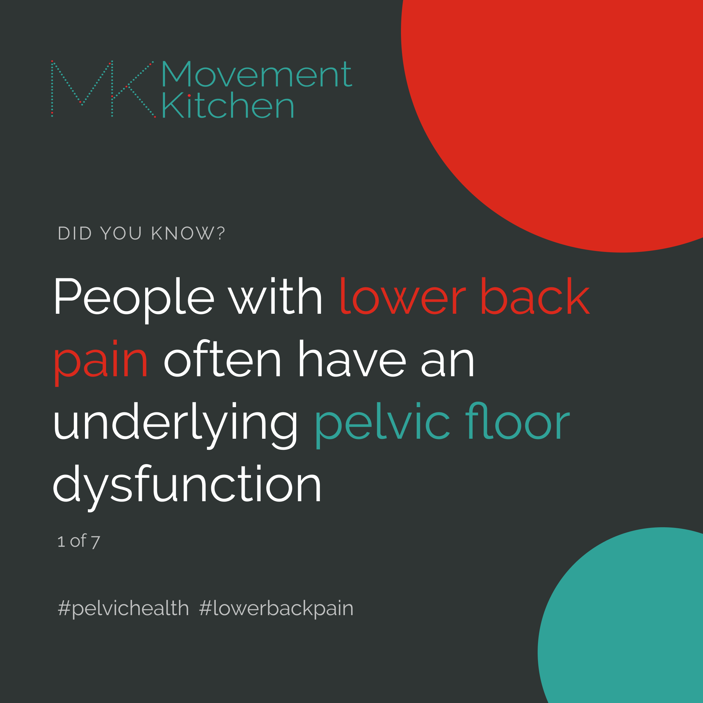
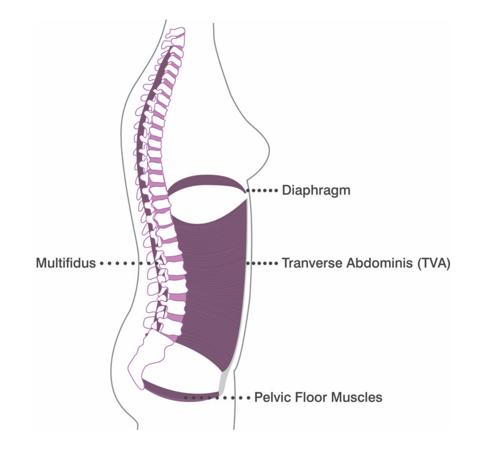
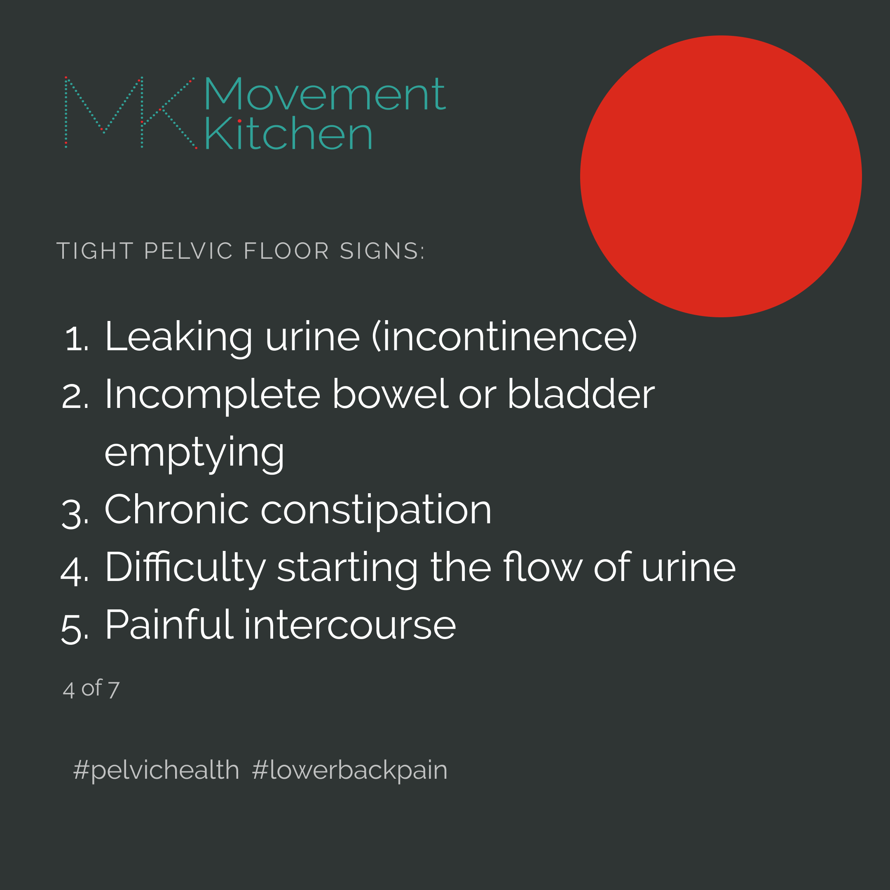
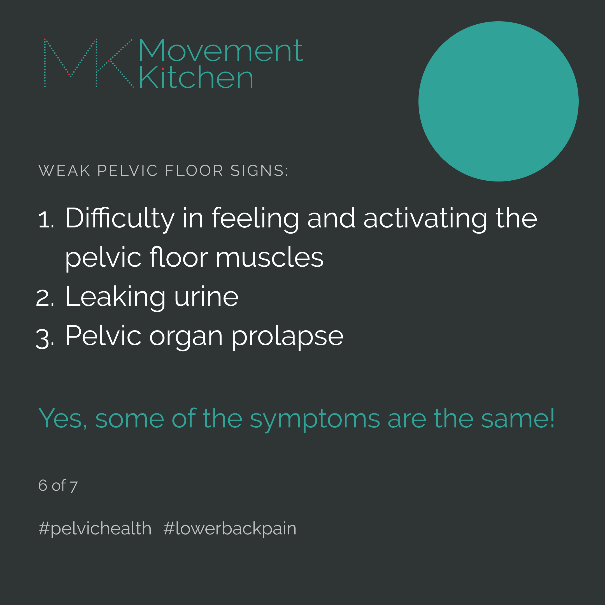

I’ve been reading and writing a lot lately about pelvic health, and I find it fascinating how health of many, seemingly unrelated, parts of the body seems to be linked to the pelvic floor. 

*Yes, we all have pelvic floors! This is a sling of muscles and ligaments connecting your pubis to the tailbone.*

It’s funny that most people, even health professionals, think about pelvic floors only if something goes wrong. If you are pregnant/early postpartum, you might get a sheet of squeezing exercises from your nurse or health visitor and that’s it. 

But the pelvic floor muscles are an important part of your core - the network of stabilising muscles of the torso supporting your organs and the spine as you move, making sure the body doesn’t fall apart. *You want to keep them healthy, rather than wait for your pelvic floor to get broken and then try to fix it*.
__________________________________________________________

__________________________________________________________
### Did you know that lower back pain could be a sign that you need to strengthen your pelvic floor.

There is some evidence on the lower back - pelvic floor link:

Two studies of around 200 women each - where each participant had lower back or pelvic girdle pain, found that 78-96% of them had symptoms related to the pelvic floor - such as pain or incontinence (Eliason, 2008; Dufour, 2018). 

Another study of men with lumbar and pelvic pain found that 36% of them had something going on with the pelvic floor (Van Wingerden, 2013).

### So, what could be the matter with the pelvic floor?

1. Tight pelvic floor muscles
2. Weak muscles
3. Lack of coordination
___________________________________________________________

### How do you know which one you have?

Anything sounds familiar? The interesting thing is that more people have tight than weak pelvic floors. This is why simply squeezing the pelvic floor is not an ideal way to train its muscles. 

### A strong muscle can both fully contract and fully release - and work at different lengths too.

____________________________________________________________

It might be a coordination problem if you find it challenging to coordinate emptying the bladder and the bowels and maybe everything happens at the same time, or maybe your breathing is reversed and your belly inflates as you exhale.

This is called reverse breathing, you can see it in action in the video below:

<video muted loop="true" autoplay="autoplay" width="100%">
    <source src="reverse-breathing.mp4" type="video/mp4">
</video>  

The good news is that this is something that can be retrained, going back to breathing and restoring reflexive activation of the pelvic floor with the breath.

In case of the tight pelvic floor, we need to learn how to relax the muscles first and then strengthen them. 

The weak pelvic floor obviously needs to be strengthened, but only squeezing it in exactly the same way every time won’t cut it. 
_________________________________________________________  

### How do we train the pelvic floor?

The muscles of your pelvic floor are skeletal muscles like any other and if you want them to get stronger, you need to hit them at different lengths and different angles and load them to fatigue. Also, we need to train not just strength but endurance too. 

There is growing evidence that training of the pelvic floor muscles in whole-body movements is at least as effective at strengthening the pelvic floor as the isolated pelvic floor training you do with the pelvic floor physio (for example, Fricke, 2023). 

Here are 5 dynamic exercises that strengthen the pelvic floor together with the whole deep core system. 

<iframe width="473" height="841" src="https://www.youtube.com/embed/AYaCJit6MDs" title="Deep Core and Pelvic Floor Bootcamp #corerehab #abs #pelvichealth #postpartum   #perimenopause" frameborder="0" allow="accelerometer; autoplay; clipboard-write; encrypted-media; gyroscope; picture-in-picture; web-share" allowfullscreen></iframe>  

We challenge the pelvic floor muscles to *work while lengthening, or while maintaining the same length* - so the exercises are suitable for people with both weak and overactive pelvic floor muscles. 

1. Heel marching

2. Heel sliding + arm overhead

3. Supported straight leg raises

4. Resisted leg opening

5. Happy baby - pelvic floor release

We are intentionally using the flexed position of the ankle here, as there is evidence that *ankle dorsiflexion* - the position of the ankle joint opposite of the Barbie feet  - *makes the pelvic floor muscles generate more force* (Kannan, 2019; Chen, 2009).

This is really important for if you have sneeze-pee or any sort of leaking at impact or with lifting heavy. *We want to train the pelvic floor to support you reflexively*, so you don't have to squeeze and tense your pelvic floor in fear of leaking.

So, *make sure to keep the ankle flexed as you do the exercises* - in the first 4, this will mean only the heel touches the ground. 

The happy baby at the end helps the pelvic floor stretch and release as you rock gently from side to side. You can do this one with a strap too, to make it easier to reach the feet. 

_________________________________________________________  

Try the exercises, save them for later and drop me a message if you have questions of need help. I offer online coaching too.

❤️💪

Ivana xx

Find out more: 

1. Chen, H.-L., Lin, Y.-C., Chien, W.-J., Huang, W.-C., Lin, H.-Y. and Chen, P.-L. (2009). The Effect of Ankle Position on Pelvic Floor Muscle Contraction Activity in Women. Journal of Urology, 181(3), pp.1217–1223. doi:https://doi.org/10.1016/j.juro.2008.10.151. 

2. Dufour, S., Vandyken, B., Forget, M. J., & Vandyken, C. (2018). Association between lumbopelvic pain and pelvic floor dysfunction in women: A cross sectional study. Musculoskeletal science & practice, 34, 47–53. https://doi.org/10.1016/j.msksp.2017.12.001 

3. Eliasson, K., Elfving, B., Nordgren, B., & Mattsson, E. (2008). Urinary incontinence in women with low back pain. Manual therapy, 13(3), 206–212. https://doi.org/10.1016/j.math.2006.12.006

4. Fricke, A., Fink, P.W., Rowlands, D., Lark, S.D., Mundel, T. and Shultz, S.P. (2023). Mini-Trampoline Jumping as an Exercise Intervention for Postmenopausal Women. Journal of Women’s Health Physical Therapy, 47(1), pp.19–25. doi:https://doi.org/10.1097/jwh.0000000000000257.

5. Kannan, P., Winser, S., Goonetilleke, R. and Cheing, G. (2018). Ankle positions potentially facilitating greater maximal contraction of pelvic floor muscles: a systematic review and meta-analysis. Disability and Rehabilitation, 41(21), pp.2483–2491. doi:https://doi.org/10.1080/09638288.2018.1468934.

6. Van Wingerden Pelvic Floor Complaints, Gynaecologic Problem, Orthopaedic Problem or Both? Presentation. (2013). Spine & Joint Centre, The Netherlands