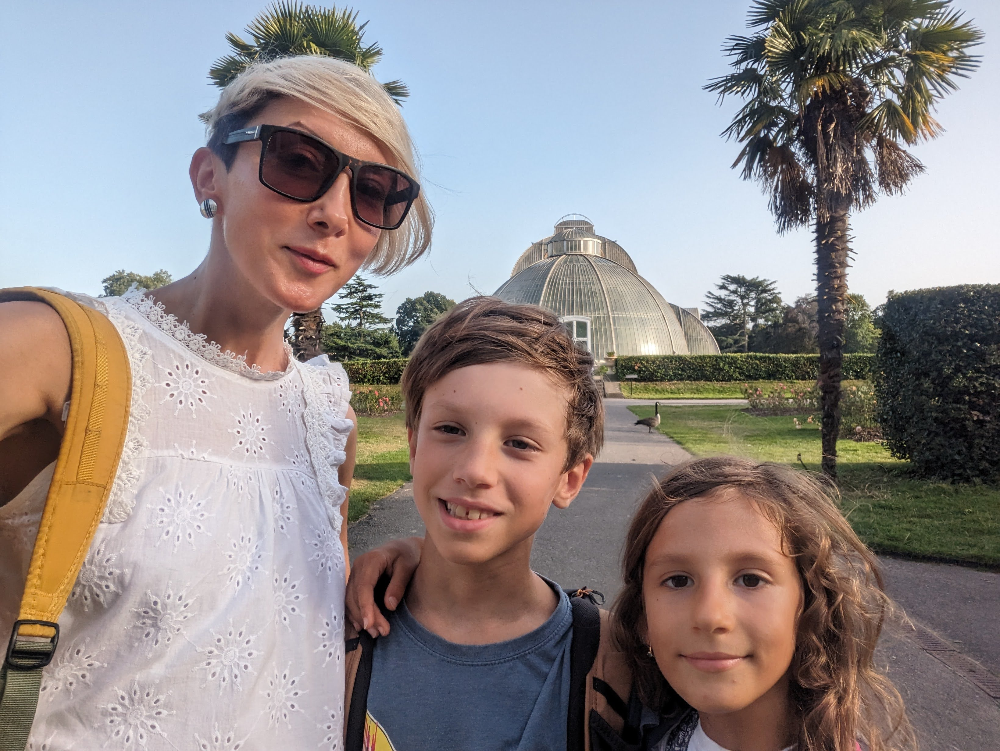

Around this day 10 years ago, I would try sleeping on my side while breastfeeding through the night. I hardly got any sleep, waking up every two hours. I was still recovering from an emergency C-section that left me weak, angry and defeated. I felt that I failed bringing my baby gently into the world, as I had planned.

I tried learning to be the best mum I could, reading a lot about child development, learning about nutrition and how to boost my milk supply. I started making my own cosmetics, to make sure my baby doesn't get exposed to unnecessary chemicals from skin care products.

I tried cooking soup with the baby breastfeeding in a sling. Gentle parenting, co-sleeping, baby carrying, no buggy, no dummies, exclusive breastfeeding. Bicycle child seat, and then a cargo bike to take us up the hill as I became a mum of two.

Becoming a mum... Nothing quite prepares you for what it really takes. So much to learn, so much to grow into. To break your whole life in pieces and rebuild anew. To expand to be able to give more, love more, be there more.

And crazily enough, with the next child, you learn again. Every little human is unique. There are no magic formulas, no tried-and-tested tricks. Once more you start from the beginning.

And in all this, we need to find time to heal our broken bodies, to be strong to adapt and keep growing with our children.

Much love to all mums out there!

Don't forget to look after yourselves!

❤️💪

Ivana xx

