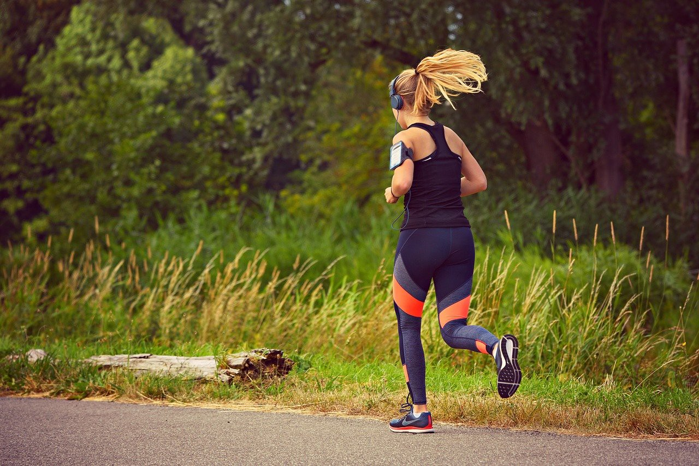

I am fortunate to live next to the Lea river, in one of the greenest pockets of East London, perfect for running. Many of the people who come and see me run regularly and a good part of them are mums. Running is great. It’s empowering, endorphin-boosting, you are in the fresh air, it’s free — there is no membership or subscription involved, you can start or stop anytime and it’s easy, no? Anyone can run. Yes, Running is really cool. However, there are a couple of things you should know if you are starting or continuing to run after becoming a mum.

Research shows that musculoskeletal pain, urinary incontinence, abdominal separation (Blyholder et al., 2016) and pelvic organ prolapse are as a matter of fact common amongst postnatal runners. But *just because something is common, it doesn’t mean that it’s normal* — writes Emma Brockwell, a Women’s Health Physiotherapist. This March, Emma teamed with two more UK based physios to publish [Returning to Running Postnatal — Guidelines for medical, health and fitness professionals](https://www.researchgate.net/publication/335928424_Returning_to_running_postnatal_-_guidelines_for_medical_health_and_fitness_professionals_managing_this_population#fullTextFileContent) who support running mums. This excellent paper comparing current research and clinical practice in the field of the postnatal recovery is looking to revise the currently accepted 6/8 weeks timeframe and the green light by a GP as sufficient for going back to vigorous exercise. In a nutshell, they recommend only low-impact exercise in the first months following the birth and returning to running only after at least 3–6 months.

## So, what is that we need to know about running?

Gravity works on the body quite a bit stronger when you run compared to standing or walking. Even at a moderate speed of 11 km/hour, your body has to handle ground reaction force somewhere between 1.5–2.5 times your body weight (Gottschall & Kram, 2005). And some, if not even all of this is transmitted to the pelvic floor.

A systematic review from last year investigating urinary incontinence in female athletes (de Mattos Lourenco et al., 2018), found that high impact exercise (such as running) has 4.59 fold increased risk of pelvic floor dysfunction compared to low impact exercise.
So how does this affect a body that has recently gone through a challenge of growing and birthing a little human?

Being a high-impact activity, running brings on a sudden rise in intra-abdominal pressure (Leitner et al., 2017). If you imagine your belly as a balloon, running would make it suddenly inflate a fair bit more — which is fine if the balloon is new, elastic and shiny. But if we have a balloon that has just been stretched up to almost bursting and deflated at once — a few times in a row, sudden changes of pressure would weaken it even more. Luckily enough our bodies recover and tissues regain elasticity, unlike overstretched balloons. But it takes time.

> In the first year after having a baby, there is much less support for your organs, so you need gradually build up impact.

In a postnatal body, some things might not yet be back to normal until a year or more after childbirth and some things might never be quite the same.

The opening in-between two sides of the levator ani muscles of the pelvic floor (levator hiatus area) widens during pregnancy and increases significantly after vaginal birth. The opening will return to a similar size by 12-months following the vaginal birth, but never exactly to the prenatal size (Stær-Jensen et al., 2015).

Another thing that is a bit different now is the support for your bladder. Following vaginal birth, bladder neck mobility increases and, even though the support to the bladder neck will improve postnatally, mobility remains higher than when measured at 37 weeks pregnant (Stær-Jensen et al., 2015). This is why it is essential to add impact bit by bit, giving your body time to pick up the pace.

Pelvic floor exercises can be a useful tool in the short-term to help you reconnect with the muscles and help them start responding. However, for the fully functioning pelvic floor in the long-term, we want the pelvic floor muscles to organically activate as and when you need them. As your pelvic floor supports the weight of your organs all day long, it is already loaded. Adding extra loads needs to be gradual, so the soft tissues covering the floor of the pelvic cavity have time to restore integrity and rebuild their functional strength.

## The Running Checklist for (New) Mums

If you are a mum — new or even not so new, who is considering starting to run, you might find it helpful to go through this simple checklist first.

## 1. How long has it been since your baby was born?

Before you start any high impact activity you need to make sure that your soft tissues are in a shape where they can handle the high loads — enough time has passed and the damaged tissues of the pelvic floor and the abdomen have healed.

> Returning to Running Postnatal Guidelines suggest waiting until at least 3–6 months to start running.

And even then, it’s important not to push yourself until the proper support to your organs is re-established.

In the meantime, you can enjoy long nature walks, yoga, pilates, swimming (once lochia stops) or any other gentle, low impact exercise. And you can gradually add in more physically demanding functional movements — squats, lunges, lifting, carrying — in line with the requirements of your everyday life as a mum.

## 2. Can you feel anything unusual for your pre-mum body?

> Leaking or feeling of heaviness in the pelvic area is not something that you should ignore.

Ask your GP to refer you to a women’s health physio and make sure the underlying causes are identified and solved before you add any extra impact. And find a running/movement coach who understands the needs of a woman’s body after having babies. It’s important to make sure there is nothing that might cause you trouble, especially long term.

Make sure you see a women’s health physio if you have one or more of these:

- Sneeze-pee, leaking urine or urgency that is difficult to control
- Pressure/heaviness/dragging sensation in the pelvic area
- Your abdomen feels weak, bulges or domes at some movements
- Persistent pelvic or back pain

## 3. Are you holding your breath?

How is your breathing? After the childbirth, it’s important to make sure to restore a synergy of the breathing and the core function. Your diaphragm, thoracic and abdominal muscles and the pelvic floor co-activate organically as you breathe.

Inefficient breathing patterns will interfere with how your body regulates intra-abdominal pressure and your body’s ability to maintain its integrity while moving. This is definitely something to look into before going back to intense physical activity — especially if you have or have had any of the symptoms of pelvic/abdominal dysfunction.

First of all, before you start running make sure to spot and overcome any habit of breath-holding, tensing or bracing your belly or ribcage at any point during the breathing cycle. Do you tend to hold your breath when you perform certain movements — e.g. lift your arms, or get out of an armchair? Can you do the same movement keeping a slow, steady breath?

> Try to maintain an easy flowing breath at all times. A good thing to check is — can you keep up an easy conversation while doing the movement?

To keep your intra-abdominal pressures in check it’s important not to strain, especially not in combination with holding the breath. In the postnatal period, a good rule is — no straining ever, not even on the toilet. Get a little stool under your feet when sitting on the toilet to decrease the anorectal angle — things go much smoother once the knees are higher than the hips.

## 4. Is your body ready to take the impact?

Before you get into running, it’s important that your body can smoothly regulate the increased intra-abdominal pressure without leaking and that your muscles are strong enough to support you.

For example, can you perform these without any of the symptoms above?

- walk for 30 min
- stand on one leg for at least 10 sec
- run in spot for 1 min
- hop on one leg for 10 sec
- squat down and come up slowly
- come up from a chair using one leg only

If you struggle, it might be a good idea to work with a coach who can support you in developing better control of intra-abdominal pressure and building a robust pelvic musculature to support you while running. Here is a little sequence to help you get started: https://www.instagram.com/p/By3JkklhG7g

## And once you start running:

1. **Start small** — add in 1–2-minute easy-pace runs into your walks. NHS ‘couch to 5km’ programme is a good place to start.
2. **Gradually build duration and intensity before setting targets** — e.g. competing in a marathon — if running a marathon is important to you build your strength and endurance step by step working with a running/movement coach.
3. **Step back if needed** — if at any point you start feeling one or more of the symptoms described above — decrease training distances and intensity, see a women’s health physio if needed and slowly build back your practice.
4. **Running with a buggy** — might be convenient, but adds extra energy cost and is not advisable until at least 6–9 months postpartum (Alcantara & Wall-Scheffer, 2017). If you choose to do it, make sure you strengthen the muscles supporting the spine, pelvis and hips before you add the buggy into your running practice. Also, use two-hands hold and a specialised running buggy.
5. **Running is always more fun with friends.** Join your local running club for support, company and motivation.

The bottom line is, always make sure your running practice really serves your body and can grow and change as you do. Enjoy running!

References:

- Blyholder, L., Chumanov, E., Carr, K., & Heiderscheit, B. (2017). Exercise Behaviors and Health Conditions of Runners After Childbirth. Sports health, 9(1), 45–51. https://doi.org/10.1177/1941738116673605
- Bø, K., Hilde, G., Stær-Jensen, J., Siafarikas, F., Tennfjord, M. K., & Engh, M. E. (2015). Postpartum pelvic floor muscle training and pelvic organ prolapse — a randomized trial of primiparous women. American journal of obstetrics and gynecology, 212(1), 38.e1–38.e387. https://doi.org/10.1016/j.ajog.2014.06.049
- de Mattos Lourenco, T. R., Matsuoka, P. K., Baracat, E. C., & Haddad, J. M. (2018). Urinary incontinence in female athletes: a systematic review. International urogynecology journal, 29(12), 1757–1763. https://doi.org/10.1007/s00192-018-3629-z
- Goom, T., Donnelly, G., & Brockwell, E. (2019). Returning to running postnatal — guideline for medical, health and fitness professionals managing this population. Available at: https://www.researchgate.net/publication/335928424_Returning_to_running_postnatal_-_guidelines_for_medical_health_and_fitness_professionals_managing_this_population
- Gottschall, J. S., & Kram, R. (2005). Ground reaction forces during downhill and uphill running. Journal of biomechanics, 38(3), 445–452. https://doi.org/10.1016/j.jbiomech.2004.04.023
- Leitner, M., Moser, H., Eichelberger, P., Kuhn, A., & Radlinger, L. (2017). Evaluation of pelvic floor muscle activity during running in continent and incontinent women: An exploratory study. Neurourology and urodynamics, 36(6), 1570–1576. https://doi.org/10.1002/nau.23151
- Shek, K. L., & Dietz, H. P. (2009). The effect of childbirth on hiatal dimensions. Obstetrics and gynecology, 113(6), 1272–1278. https://doi.org/10.1097/AOG.0b013e3181a5ef23
- Women’s Health Podcast: 05 Intraabdominal and Intrathoracic Pressure And How It Affects You — Susan Clinton https://www.stitcher.com/podcast/the-womens-health-podcast/e/55842891
- NHS Couch to 5k — week by week guide https://www.nhs.uk/live-well/exercise/couch-to-5k-week-by-week/