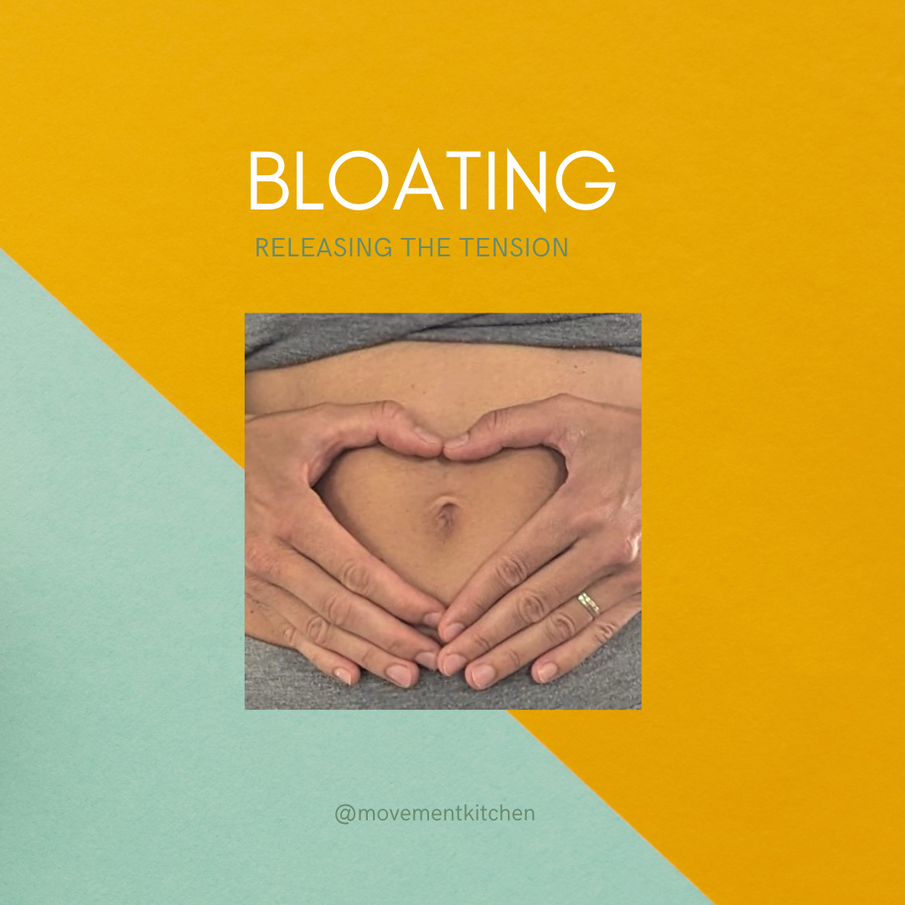

If you read the last two posts, you probably remember my trouble with bloating and the quest to investigate different reasons why our bellies might feel tight and uncomfortably inflated at times.

## Generally, bellies could be bloated due to:

- Gas — In other words, fermentation in the gut. Yes, I’m looking at you, [artificial sweeteners and other FODMAPs](https://www.movementkitchen.co.uk/blog/foods-that-make-our-bellies-rounder/)!
- Water—Water retention issues depend a lot on the hormonal balance in the body. I wrote more [about hormones, bloating and gut health on the Movement Kitchen Blog.](https://www.movementkitchen.co.uk/blog/hormones-and-the-gut/)
- Solid matter — constipation, I’ll share with you today a gentle constipation massage I’ve learnt from a lovely pelvic health physio I know. Scroll all the way down for the video.
- In some cases, this could also be a tissue growing in an unusual place (like in [endometriosis](https://www.endometriosis-uk.org/what-endometriosis)) or the position of our organs (pelvic organ prolapse, retroverted uterus) — if you suspect this could be your case, it might be a good idea to get it medically investigated.
- Pressure/tension inside and around the belly — there is evidence that a [bloated belly changes our viscerosomatic reflexes](https://www.gastrojournal.org/article/S0016-5085(05)02576-X/fulltext) (Tremolaterra, 2006), messing up how breathing and the postural muscles work and how we manage pressure inside the belly.
- If bloating persists for a while, you might end up stuck in less effective breathing patterns such as [reverse breathing](https://youtube.com/shorts/gxlNFxy3WUU?feature=share), where your diaphragm moves down, instead of up at exhalation, pushing the belly outwards and downwards as you exhale. Collapsing instead of toning at exhalation the belly loses tone over time and appears even more swollen.

Bloating can often be explained by a combination of two or more of these reasons. But whatever the reason, an inflated belly always implies more tension in the postural muscles of the torso.

Similar to back pain, bloating creates a state of emergency for the nervous system switching to less effective breathing and muscle activation patterns that could work in the short, but not long term. We don’t want to get stuck there!

> I use these four techniques to relieve abdominal bloating by releasing the tension around and inside the belly.

1. 360-degree breathing  
2. Deep core release  
3. Side torso release on a softball  
4. Rib raking massage

> Click on each image below for a video of the technique with voiceover instructions.

* * *

## 1. 360-degree breathing

Imagine your torso soft, like a jellyfish. As you breathe, imagine this organic movement of the jellyfish in the water — expanding effortlessly in all directions as you breathe in, and shrinking towards the centre as you breathe out.

## 2. Deep core release

Recline on a pile of cushions supporting your upper back and head, from the shoulder blades upwards.

Allow the back of your thighs to stay heavy on the ground. If you want, you can put a weighted blanket or a bolster over your legs.

The back of the ribcage and the waist are suspended above the floor.

Rest in this position for 5–10 minutes and breathe, allowing your torso to grow heavier and heavier with every breath, slowly releasing towards the ground.

## 3. Side torso release on a softball

Deflate a children’s ball so it’s 50–70% full. Lie on your side with the side of your torso gently pressing into the ball. Breathe, expanding the ribcage softly into the ball.

Then move the ball down, against the side of your waist. Expand into the ball as you breathe. Roll your side gently over the ball if it feels nice.

## 4. Rib raking massage

Use your palms to massage the sides of the waist — soft, flowing movements from the spine upwards, wrapping around the waist.

See if you can press your fingers softly into the gaps between ribs tracing their shape.

## 5. I Love You Constipation Massage

And for the end, here is my favourite gentle constipation massage that helps relax the belly and stimulate movement through the bowels. It’s called the I Love You Massage as each of the three techniques follows the shape of a letter I/L/O (the last from yOu) tracing the descending colon.

If you are pregnant or have a pelvic organ prolapse, this massage might not be suitable for you. If in doubt, check with your GP.

I have drawn arrows to direct the movement of the hand.

You can use some light massage oil (almond, coconut or olive oil) on the skin. The movements are very gentle, the hand soft like a pancake with very light pressure.

Click on the image below for the video of the technique with voiceover instructions.

Try these five tricks, save them for later or share them with a friend who might need them.

Ivana x

This post is part 3 of The Bloating Series. Part 1 is [Foods That Make Our Bellies Rounder](/blog/foods-that-make-our-bellies-rounder/) and Part 2 [Hormones and The Gut](/blog/hormones-and-the-gut/).

For more of my writing connecting the fields of exercise science, women’s health and feminism and free workouts, make sure to subscribe to the Movement Kitchen [weekly newsletter](https://movementkitchen.us6.list-manage.com/subscribe?u=6ddb04df8575fd645103fa989&id=2e76a5987e).