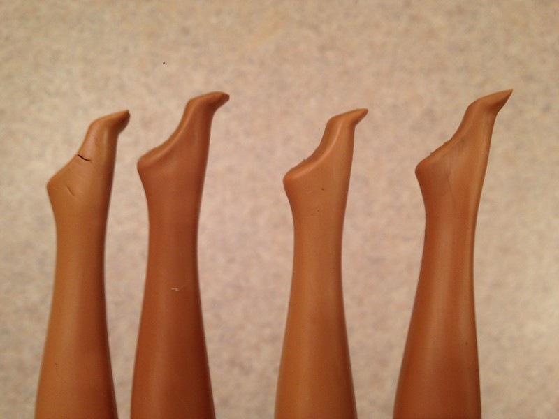
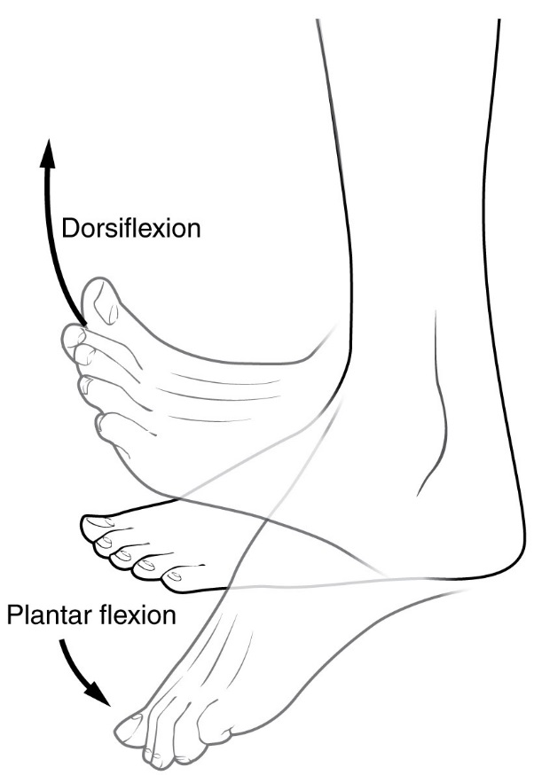

<small> Photo by Jared Cherup </small>

A good part of my job is about helping people discover the spots in their bodies that we need to strengthen in order to make the greatest difference in their symptoms or performance. I like to think of these as "mystery blocks" in Super Mario - the challenges overcoming which rewards you with a pile of gold coins or an extra life. And for most people, we find at least one "mystery block" in their feet.

When I was writing my dissertation, I did a lot of research on how our running and walking changes as we age. And guess where we lose the most power? The ankle joint! This is why I obsess so much about the feet and calves. There are many gold coins to uncover there and invest for the future. 

### What do feet do?  

The foot behaves like a spring and a shock absorber in walking and running. It provides stability and powers the movement from the ground up. The stronger the feet and ankles, the more bouncy and energy efficient is the spring mechanism of the leg in running and more power generated at push-off. So, we can run faster while getting less tired.

The foot is also a sensory organ offering input for the larger stabilising muscles across the torso to support the spine and the organs when and as much as needed. Strengthening the feet is the foundation of building a strong and responsive core.   

<small> photo by [dollyhaul on Flickr](https://www.flickr.com/photos/tinker-tailor/) </small>

### About feet and pelvic floors  

Did you know that foot and ankle mobility can be linked to the pelvic floor function? A couple of studies (see Kannan, 2018 or Chen, 2009) found that pelvic floor muscles can fire easier and generate more force with feet in dorsiflexion (the opposite of the Barbie feet). 

So, make sure to add the this ankle position into your training as much as you can, especially if you have pelvic pain, sneeze-pee, leaking at impact or with lifting heavy. [Here are a couple of ideas](https://www.instagram.com/p/CyMGFCkoEIj/).

Similarly, outside of the exercise time (which is most of our day, to be fair) we need to add some ankle dorsiflexion - other than wearing high heels and heavily padded shoes that shape your feet like Barbie’s (sorry Barbie, nothing personal against you other than your footwear choices!)

<small> Image by Connexions, OpenStax College. Anatomy & Physiology, Connexions Web site. http://cnx.org/content/col11496/1.6/, Jun 19, 2013. </small>

### The ageing ankles  

Since most of the biomechanical studies are on young, athletic people (male sport science students in their early twenties), we know that young and fit people run and walk powering their movements mostly from the ankle joint – the muscles of the calf. 

But then, as people get older, their ankles start to give in and give up some of their power production job to the larger and more stable hip joint. So, in older runners, we usually see this shift from using mostly ankle to using mostly hip in both walking and running (deVita and Hortobagy, 2000, Kulmala et al., 2014). 

This increases the metabolic cost of the movement - it’s much harder to walk and run this way. So with ageing, people tend to walk slower and slower. The slow, clumsy and inefficient walking with less ankle power could also be one of the reasons why older people tend to fall easier and break their hips (Browne & Franz, 2018).

So, let’s rewind back to today. There is still plenty we can do right now to build up strong feet and calves and postpone the ankle to hip power shift for as long as possible.  

### Foot muscles are not just just in the feet

Did you know that the muscles of your calf are in some way your foot muscles? 

We call them extrinsic foot musculature as they control the foot positioning from outside the foot - things like flexing or pointing your toes. They work together with the muscles inside the foot, that help fine-tune the foot movements.

Strengthening both the inside- and the outside-foot muscles is important for 

✔️ foot and ankle health, but also   
✔️ balance  
✔️ core stability  
✔️ pelvic and hip health.    

### Training the muscles inside the foot

Here are [my 3 favourite exercises for the muscles inside the foot](https://www.instagram.com/p/C3QDP2xoGc1/) (the first 3).

1. Lower the big toes against resistance
2. Imagine squashing a berry on the floor with the ball of your foot
3. Shorten the foot by fixing the heel in place and bringing the ball of the foot closer to it.

### Training the foot muscles outside the foot

And here are [2 great moves for those outside the foot muscles](https://www.instagram.com/p/C2QCzm_IrxF/) (and increasing ankle power). You can do them as double-legged at first, and then on one leg only.

1. Heel drops - targeting gastrocnemius - the main calf muscle that shortens with sitting and heel wearing  
2. Bent-knee heel drops - targeting soleus - the muscle deeper in the calf, very important for knee health

A couple of things to focus on here:  
✔️ Can you slow down the heel-lowering part? 🔥  
✔️ How low can you go with the toes relaxed?   

Do these for a week and just compare how your other movements change!

Ivana xx 

### References:

1. Browne, M. G., & Franz, J. R. (2018). More push from your push-off: Joint-level modifications to modulate propulsive forces in old age. PloS one, 13(8), e0201407. https://doi.org/10.1371/journal.pone.0201407
2. Chen, H.-L., Lin, Y.-C., Chien, W.-J., Huang, W.-C., Lin, H.-Y. and Chen, P.-L. (2009). The Effect of Ankle Position on Pelvic Floor Muscle Contraction Activity in Women. Journal of Urology, 181(3), pp.1217–1223. doi:https://doi.org/10.1016/j.juro.2008.10.151.
3. DeVita, P., & Hortobagyi, T. (2000). Age causes a redistribution of joint torques and powers during gait. Journal of applied physiology (Bethesda, Md. : 1985), 88(5), 1804–1811. https://doi.org/10.1152/jappl.2000.88.5.1804 1. 
4. Kannan, P., Winser, S., Goonetilleke, R. and Cheing, G. (2018). Ankle positions potentially facilitating greater maximal contraction of pelvic floor muscles: a systematic review and meta-analysis. Disability and Rehabilitation, 41(21), pp.2483–2491. doi:https://doi.org/10.1080/09638288.2018.1468934.
5. Kulmala, J.-P., Korhonen, M.T., Kuitunen, S., Suominen, H., Heinonen, A., Mikkola, A. and Avela, J. (2014). Which muscles compromise human locomotor performance with age? Journal of The Royal Society Interface, 11(100), p.20140858. https://doi.org/10.1098/rsif.2014.0858

