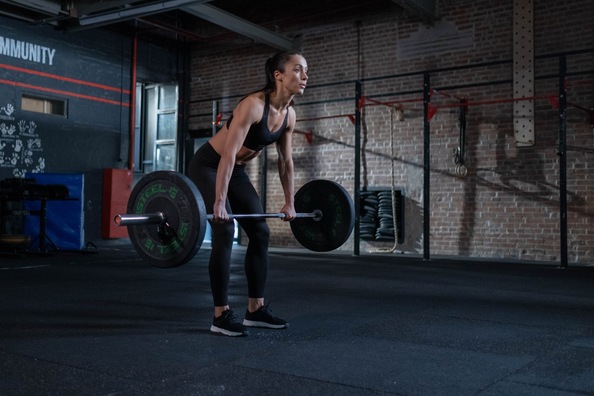

Trying to solve a puzzle of my postnatal re-injuries, I ended up at a master’s degree programme in sports biomechanics. Even after years of working with pregnant and postnatal women, completing numerous courses and learning on my own body, I always thought there was something out there I still didn’t know and if I only understood that one more piece, I’d figure out why my body never felt the same after the babies.  

It was my belly that felt weak and unable to support me in building up my training intensity. Even though I was seemingly recovered from the severe abdominal separation I suffered after the birth of my first child 9 years ago, whenever I lifted something heavy, I still felt like my belly would fall apart. Following any bout of intense exercise that would require my abdominals to do their part I would feel bloated and weak for days, as if I had regressed to being freshly postnatal. I just couldn’t understand why my body struggled with regulating the pressure inside my abdomen – even 7 years after my last pregnancy. I was worried that my lack of abdominal integrity could get worse with ageing and cause other problems, such as pelvic organ prolapse, as there is some evidence that abdominal separation makes you more likely to have a pelvic floor disorder with menopause (Harada, 2020). I had no answers – I felt stuck.

But sport science offered little answers. I had expected that the childbirth, as the most challenging athletic endeavour in a woman’s lifetime, would imply a rehab similar to the ones following sports injuries, but there was hardly any evidence or guidelines for female athletes who wanted to continue to train while pregnant and return to sport after having a baby. 

The sport science seemed barely interested in studying women, even before postnatal injuries. I was shocked to find out that [only 4 - 13% of all sport medicine and science studies had exclusively female participants](https://journals.humankinetics.com/view/journals/ijsnem/32/2/article-p114.xml), even though, roughly half of participants in athletic events nowadays, such as the Tokyo 2020 Olympics, would be women. Traditionally, sport science studies have the “typical 70 kg man” as a reference participant, and the findings are by proxy applied to women. 

So, even though I spent the two years of my part-time master’s using every opportunity to research women in sport and graduated with a distinction, most of what I learnt about postnatal recovery was outside of my master’s programme. 

I was fortunate to discover [Jenny Burrell](https://www.burrelleducation.com/) and her work with active pregnant and postnatal women that focused on core and pelvic floor rehab – starting from breathing and soft tissue releases and building all the way up to strength and plyometrics. Jenny comes from fitness background and her experience of hysterectomy and stress incontinence made her dedicate her entire career to serving women and training fitness professionals in women’s health. What I really appreciate about her is her generalist mind and constant learning (she is just finishing her masters in psychology of mental health). She is brilliant at bringing together great minds across a variety of fields related to women’s health and integrating all these approaches into practical, no-nonsense courses and resources. Check out Burrell Education website and her Vimeo account for a lot of useful and up-to-date content. 

Another great approach I found was [Brianna Battles’](https://www.briannabattles.com/) take on pregnancy and postnatal athleticism, drawing onto her own athletic background, clinical practice and research. Brianna was part of a team that recently published an excellent peer-reviewed article on postpartum return to sport, that included a concrete timeline and a plan for musculoskeletal rehabilitation from week 0 to weeks 13+ postpartum. Her Instagram and the website have an abundance of free resources on weightlifting and CrossFit in pregnancy and after the baby, for both fitness professionals and the mums themselves.

 Then, I was blown away by the work of [Anthony Lo](https://mypteducation.com/), The Physio Detective, with female athletes returning to sport after childbirth, often with severe diastasis recti and prolapse. Antony is known for his sharp clinical reasoning skills and the “do something different” credo. Watching his intriguing case studies of postpartum athletes, I’ve learnt that intra-abdominal pressure management is a motor skill you can learn and you can lift heavy after having babies, even with abdominal separation and prolapse, without making them worse. The trick is to train below the symptom threshold.

Through Antony Lo I discovered [Embodia](https://embodiaapp.com/) physiotherapy training platform and found plenty of great content there on female athletes, pelvic floors and hormones. Highly recommended for any health or fitness professional working with women!

Luckily, the sport medicine and science research is slowly picking up too and there are now multiple teams of (often all female) scientists and clinicians fighting to fill the gap in studying women. In the last 3-4 years, there have been a couple of great studies on postnatal return to sport, and running in particular (check out Donnelly et al., 2020, 2021; Deering et al, 2020; Christopher et al., 2022; Selman et al, 2022…). I will link the studies in the resources below.

All these were pretty revolutionary ideas compared to what was available when I had my babies 9 and 7 years ago and the advice was either ‘don’t lie on your back’, “don’t lift anything heavier than a yoga brick” or ‘look, I can do a handstand with a 35-week bump!’ – extremely confusing and contradictory.

Back to my story: why did I have trouble with regulating my intra-abdominal pressure – years after my second baby was born?

Turns out I was still belly-breathing – inflating the belly at inhalation, even though I thought I didn’t. Huh! I filmed myself and noticed that my ribcage was hardly moving as I breathe in. You can see this pattern on the video below.

<video controls width="100%">
    <source src="belly-breathing-pattern.mp4" type="video/mp4">
</video>

When I tried to “breathe into the side ribs” with my hands on the ribcage or “breathe into the lats” there is some costal movement but not much. My ribs would do with some mobility work it seemed.

Also, as I learnt how to externally palpate the pelvic floor during exercises (I will write a separate blog post about it), I found out about my habit of bearing down when I thought that my pelvic floor was activating concentrically. This means, my perineum, especially the posterior part, was moving down at exhalation instead of drawing up into the body. 

These strategies in combination made it very difficult for my body to heal the midline. Probably with time, my pelvic floor would have started to give in too.

So, what did I do? – went back all the way to breathing and rebuilt from there

1.	Inhalation
I focused on improving my thoracic mobility – releasing the erector spinae on a foam roller or rolling over a pool noodle horizontally placed across my back to fit in between the vertebrae and massage the back of the ribs. Even after minutes of rolling I could already feel more even movement across the torso at inhalation, instead of just my belly inflating. Finally, I could “breathe into the lats”!

2.	Exhalation
I needed to downregulate the external obliques, so they don’t keep driving the exhalation and pushing the abdominal content down.

I practised placing the hands just under the lower ribs and trying to keep this area relaxed while exhaling – using humming sound would help me to reflexively engage the deep abdominal muscles.

Also, I learnt how to spot and avoid bearing down – thinking of lifting up from the base of the torso at exhalation instead (effort 2/10). 

Rebuilding the foundation, I could stop creating the outward and downward pressure. And now I had a much better foundation on which I could build up intensity and impact.

And this made me think: was I asking the right questions in my postnatal return to exercise? 

Did I have the right tools to spot that I was pushing my organs down – especially when I thought that my pelvic floor was contracting?

I realised that, in the 10+ years of my work with pregnant and postnatal women, I asked little about the pelvic floor and I probably often missed what was going on under the surface of my clients’ postnatal recovery stories. 

Many seemingly unrelated postnatal symptoms, like diastasis recti, pelvic girdle pain and back pain have to do with pelvic floor muscle strength and coordination. Yet, women usually don’t talk about pelvic floors unless you ask. Sometimes, it's just too awkward or they just don’t think a musculoskeletal professional is a person who could help them.

But the thing is, we can. The pelvic floor is a sling of muscles, the same as any other striated muscles across the body, meant to generate force. They work together with the rest of the musculoskeletal system and respond to training. And it’s not just the isolated pelvic floor exercises that count. There is evidence that dynamic, whole-body training is equally effective in training the pelvic floor muscles (Luginbuehl, 2022; Fricke; 2023).

We need to build multi-disciplinary support networks for mums returning to exercise, and as musculoskeletal specialists we need to do our part. We need to ask the right questions and make our clients feel safe and heard. Pelvic floor health needs to be out of the taboo domain. Don’t be afraid to ask!

In the next post I will list concrete ways in which we can support our female clients with their pelvic floor health – within the scope of the musculoskeletal approach.

### Resources:

#### Postnatal Return to Sport:

1.	Christopher, S.M., Gallagher, S., Olson, A., Cichowski, S. and Deering, R.E. (2022). Rehabilitation of the Postpartum Runner: A 4-Phase Approach. Journal of Women’s Health Physical Therapy, [online] 46(2), pp.73–86. doi:10.1097/JWH.0000000000000230 
2.	Davenport, M. H., Ray, L., Nesdoly, A., Thornton, J., Khurana, R., & McHugh, T. F. (2023). We're not Superhuman, We're Human: A Qualitative Description of Elite Athletes' Experiences of Return to Sport After Childbirth. Sports medicine (Auckland, N.Z.), 53(1), 269–279. https://doi.org/10.1007/s40279-022-01730-y 
3.	Deering, R. E., Christopher, S. M., & Heiderscheit, B. C. (2020). From Childbirth to the Starting Blocks: Are We Providing the Best Care to Our Postpartum Athletes? The Journal of orthopaedic and sports physical therapy, 50(6), 281–284. https://doi.org/10.2519/jospt.2020.0607
4.	Donnelly, G. M., Rankin, A., Mills, H., DE Vivo, M., Goom, T. S., & Brockwell, E. (2020). Infographic. Guidance for medical, health and fitness professionals to support women in returning to running postnatally. British journal of sports medicine, 54(18), 1114–1115. https://doi.org/10.1136/bjsports-2020-102139 
5.	Donnelly, G.M., James, M.L., Coltman, C.E., Brockwell, E., Perkins, J. and Moore, I.S. (2022) 'Running During Pregnancy and Postpartum Part B: How Does Running-Related Advice and Guidance Received During Pregnancy and Postpartum Affect Women's Running Habits?', Journal of Women’s Health Physical Therapy.
6.	Donnelly, G. M., Moore, I. S., Brockwell, E., Rankin, A., & Cooke, R. (2022). Reframing return-to-sport postpartum: the 6 Rs framework. British journal of sports medicine, 56(5), 244–245. https://doi.org/10.1136/bjsports-2021-104877
7.	Harada, B. S., De Bortolli, T. T., Carnaz, L., De Conti, M. H. S., Hijaz, A., Driusso, P., & Marini, G. (2022). Diastasis recti abdominis and pelvic floor dysfunction in peri- and postmenopausal women: a cross-sectional study. Physiotherapy theory and practice, 38(10), 1538–1544. https://doi.org/10.1080/09593985.2020.1849476
8.	James, M., Moore, I. S., Donnelly, G., Brockwell, E., Perkins, J., & Coltman, C. (2022). Running During Pregnancy and Postpartum, Part A: Why Do Women Stop Running During Pregnancy and Not Return to Running in the Postpartum Period? Journal of Women’s Health Physical Therapy, 1-13. https://doi.org/10.1097/JWH.0000000000000228 
9.	Selman, R., Early, K., Battles, B., Seidenburg, M., Wendel, E., & Westerlund, S. (2022). Maximizing Recovery in the Postpartum Period: A Timeline for Rehabilitation from Pregnancy through Return to Sport. International journal of sports physical therapy, 17(6), 1170–1183. https://doi.org/10.26603/001c.37863
10.	Wieloch, N., Klostermann, A., Kimmich, N., Spörri, J., & Scherr, J. (2022). Sport and exercise recommendations for pregnant athletes: a systematic scoping review. BMJ open sport & exercise medicine, 8(4), e001395. https://doi.org/10.1136/bmjsem-2022-001395 

#### Pelvic Floor Health

1.	Fricke, Anja MSc1; Fink, Philip W. PhD2; Rowlands, David PhD3; Lark, Sally D. PhD1; Mundel, Toby PhD2; Shultz, Sarah P. PhD1,4. Mini-Trampoline Jumping as an Exercise Intervention for Postmenopausal Women. Journal of Women's & Pelvic Health Physical Therapy 47(1):p 19-25, January/March 2023. | DOI: 10.1097/JWH.0000000000000257
2.	Harada, B. S., De Bortolli, T. T., Carnaz, L., De Conti, M. H. S., Hijaz, A., Driusso, P., & Marini, G. (2022). Diastasis recti abdominis and pelvic floor dysfunction in peri- and postmenopausal women: a cross-sectional study. Physiotherapy theory and practice, 38(10), 1538–1544. https://doi.org/10.1080/09593985.2020.1849476
3.	Luginbuehl, H., Radlinger, L., Lehmann, C., Kuhn, A., & Koenig, I. (2022). Intervention effects maintenance: 6-month randomized controlled trial follow-up of standard and reflexive pelvic floor muscle training. AJOG global reports, 2(4), 100089. https://doi.org/10.1016/j.xagr.2022.100089

