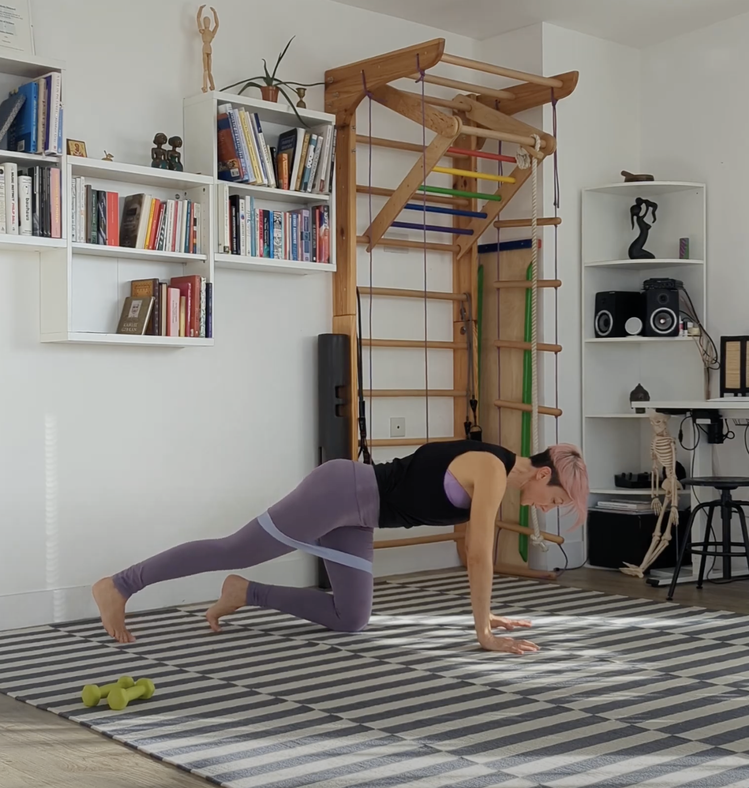
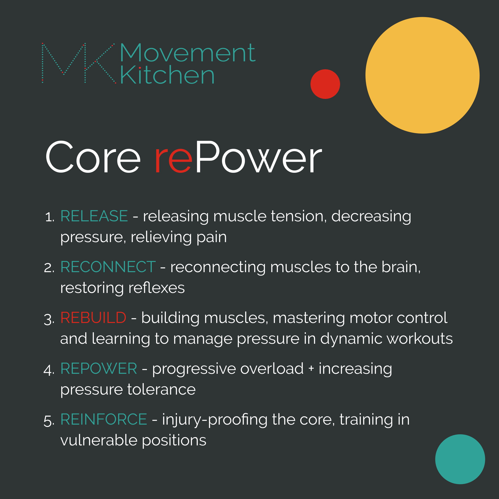
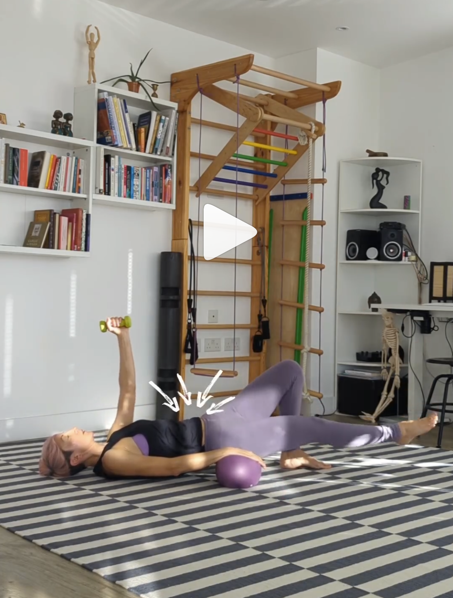
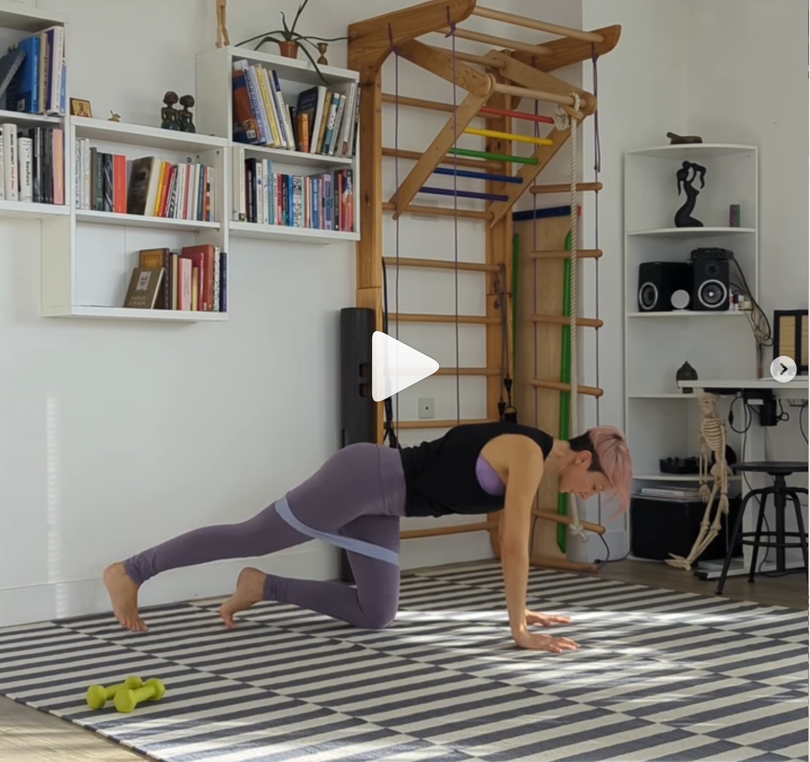
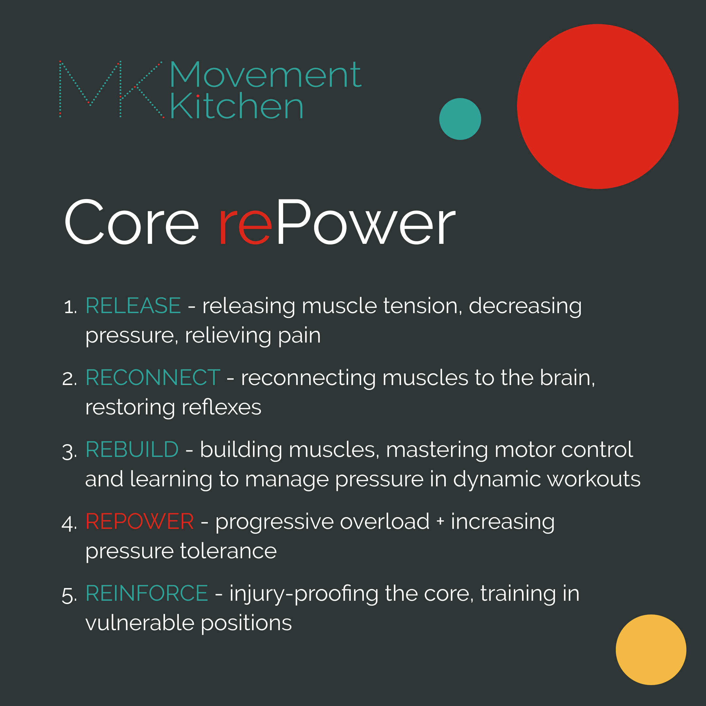
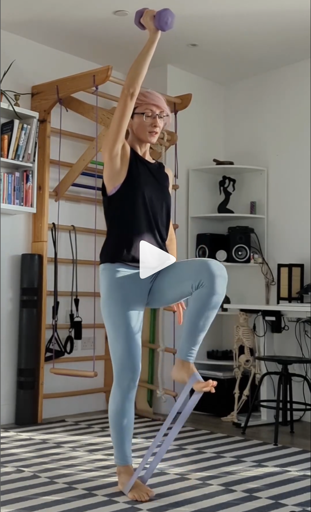
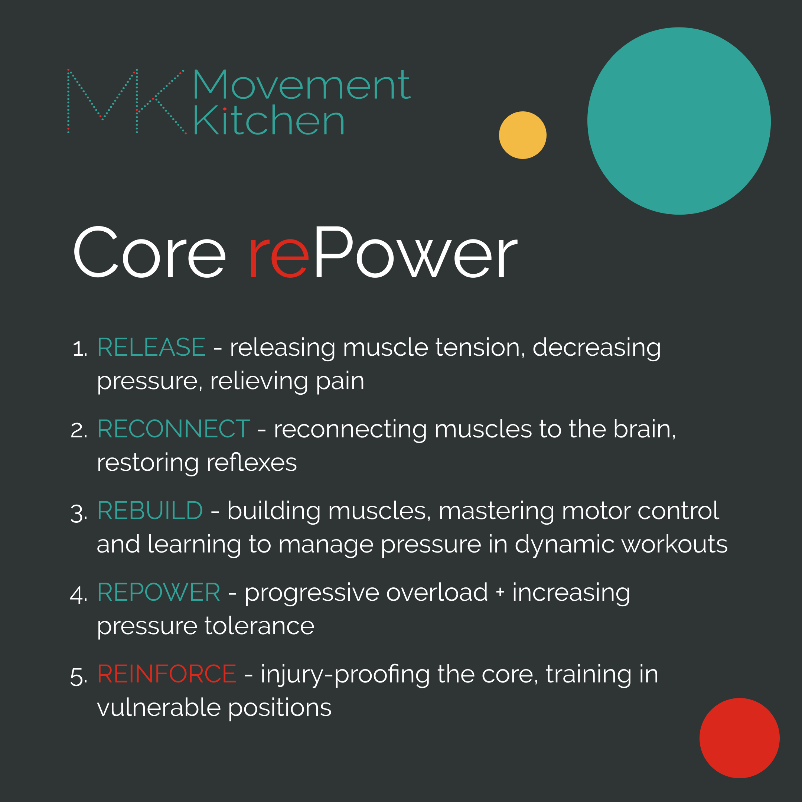
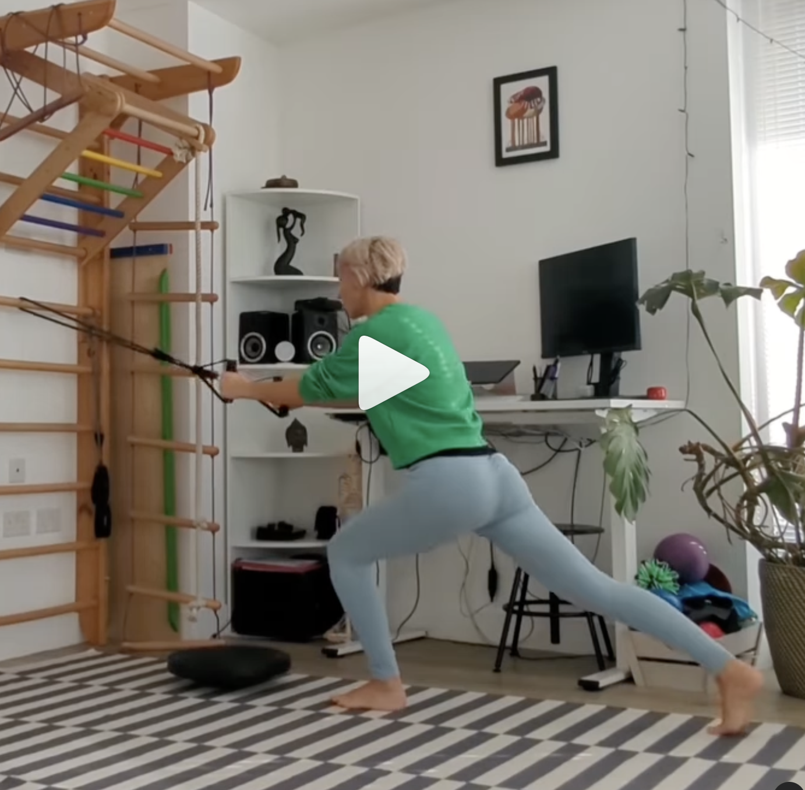

I spent so many years stuck in gentle, restorative exercise. After the births of my two babies straight after each other and a couple of persistent postpartum injuries, my body seemed to be in the recovery phase – forever. I was teaching yoga at the time, so I went back to teaching pregnancy and postnatal yoga only. And that’s what I practised at home too. Then I trained to be a Restorative Exercise Specialist and spent years practising and teaching gentle corrective exercise without attempting to build up intensity. I never thought I could. 

It wasn’t until I did my Masters in Sports Science, and got to research mechanisms of injuries and biomechanics of ageing, that I realised that you need physical challenge to build up capacity to handle challenge. To get out of the pain and weakness loop and get stronger for good, you need to progressively ramp up your training. 

So this is what three out of five stages of my Core rePower Method are about - *Rebuild*, *Repower* and *Reinforce*. 

* * * 

Last time we spoke about the first two stages in core recovery, and this week, we can see how we can move on from there. I’ll give you a couple of ideas what to expect progressing your training, once the foundations are in place.  

### Phase 3: Rebuild

Once the breath-core connection is working, we can begin training the deep core muscles to stabilise us in various positions and movements. So, we have a good foundation of stability on which we can build strength 💪

This is why the phase 3 of the Core rePower method is called Rebuild. We are learning to *move with precision* and *build muscle* while being able to *manage pressure in dynamic, whole-body movements*.

We are building support from the inside out - focusing on the diaphragm, pelvic floor, deep abs and back muscles and restoring reflexes.

Here is an example of a phase-3 abs-focused workout. So gentle and so powerful and can be scaled up and down.

Grab a soft ball or a cushion and an optional small weight and join me.

Exercises:

1️⃣ Balancing Bridges  
2️⃣ Pelvis Up + Straight Leg Lowering  
3️⃣ Straight Leg Up + Pelvis Lowering

  

And here is another, glute-focused workout we would use in the Rebuild phase -  Our aim is to build muscle while managing the pressure inside the belly well.  

 

It's not the choice of exercises that matters, as much as how we do them.

This means:

✅ Maintaining the breath-core connection - no belly bulging 🫁💪

✅ Strong feet, strong hands - pressing the ground away 🦶👐

✅ Keep the torso integrated as the limbs move 🔗 - we want the pelvis and the ribcage to stay on top of each other throughout the movements, so your deep abs would stay at lengths where they can fully fire.

The last exercise in the sequence above, the Bulgarian split-squat, is an optional challenge, and a beginning of the next phase in your core-rebuilding journey - Repower. We are doubling the challenge for your standing leg and gradually increasing pressure tolerance.

* * *

### Phase 4: Repower

So, you can move with the core connected - no bearing down. You can control the movements of your arms and legs, so they don’t pull and yank parts of your torso. And maybe, we have already built a bit of muscle.

Now, where do we go next?

Repower - the fourth phase of Core rePower is all about *progressive overload*.

Let's hit those muscle at different angles and increase the workload!

In this phase, we'll *gradually increase weights the body can handle while managing the pressure inside the belly well, get to move faster and for longer*. 

Here is a workout that you could expect in the Repower phase of your journey of rebuilding the core muscles after an injury, postpartum, or recovering from chronic back pain.

* * * 

### Phase 5: Reinforce

Let’s say, you are already able to use your core to support you, manage the intraabdominal pressure well and have good control over your joints in dynamic movements with added weights. 

So now, we can play with *combining weights/resistance, impact, unstable surfaces, adding multiple planes and explosive strength training*.

Here is a sequence that would fall into the Reinforce phase.

>Our goal is not just to recover the core muscles back to zero but get stronger than before the injury/baby/back pain.

We want to build a robust and resilient core system that will be able to support you in the decades to come.

* * * 

That was all from me for this time. Try the workouts, save them for later and let me know if you need help figuring out where in your core building journey you are and how to progress from there.

❤️💪

Ivana xx 