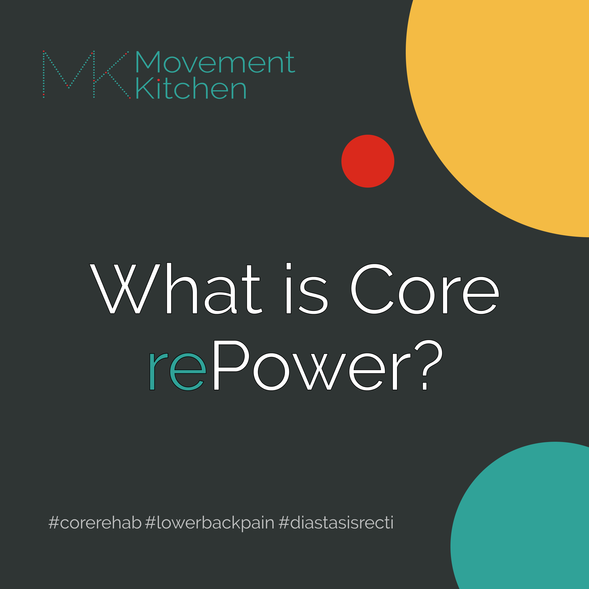
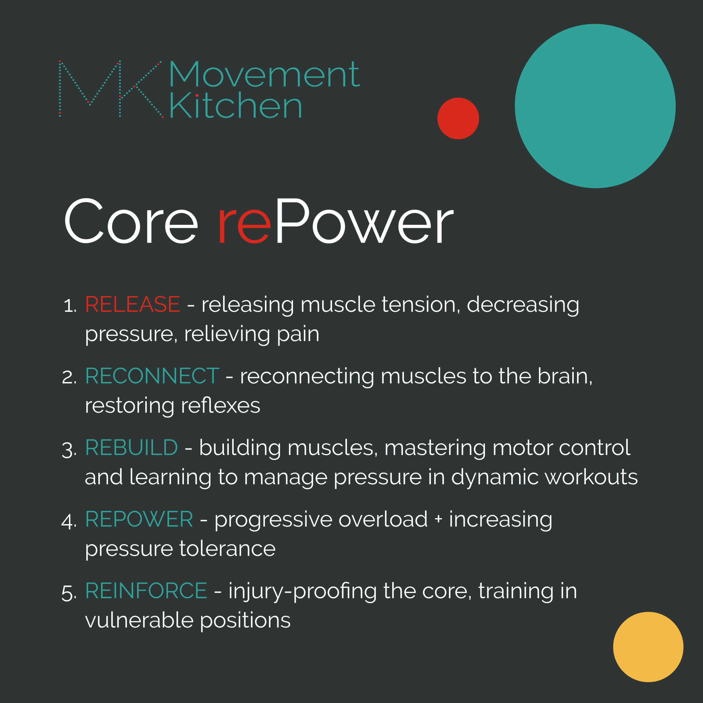
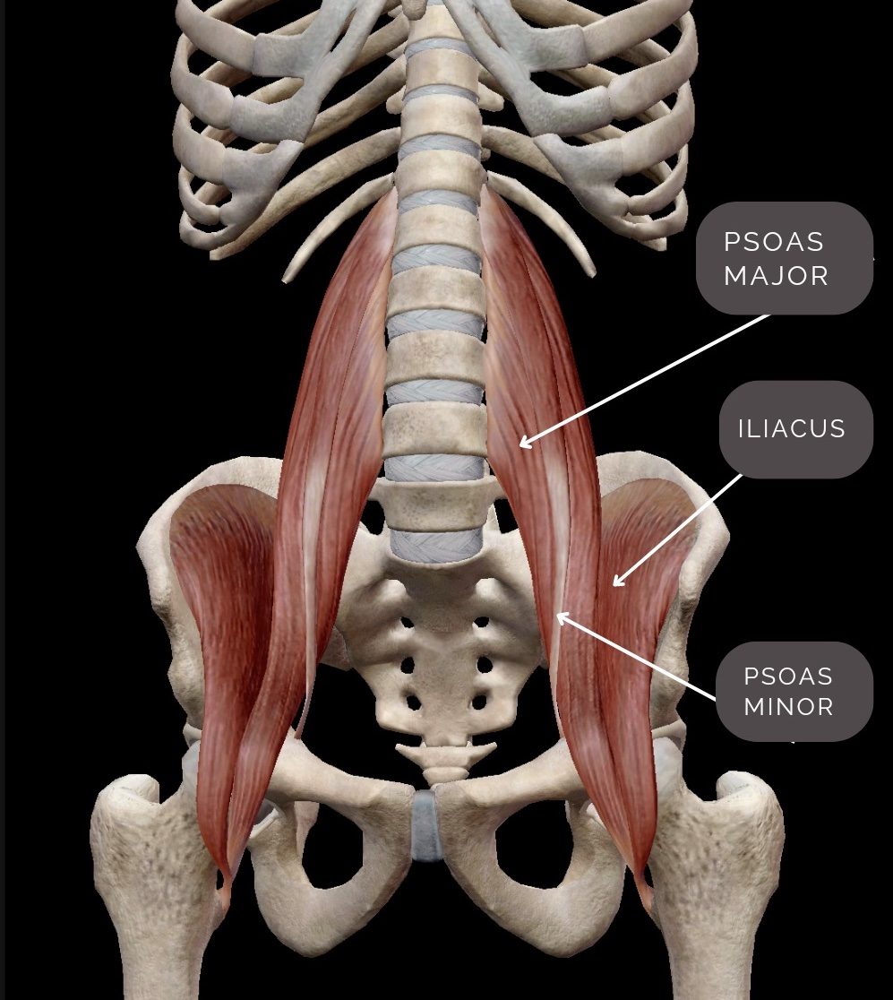
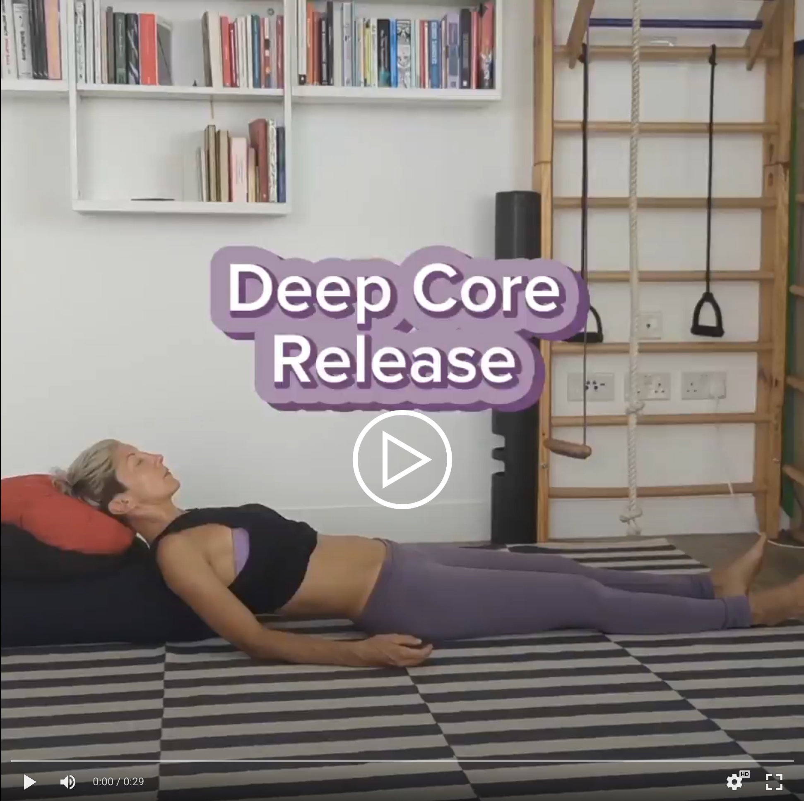
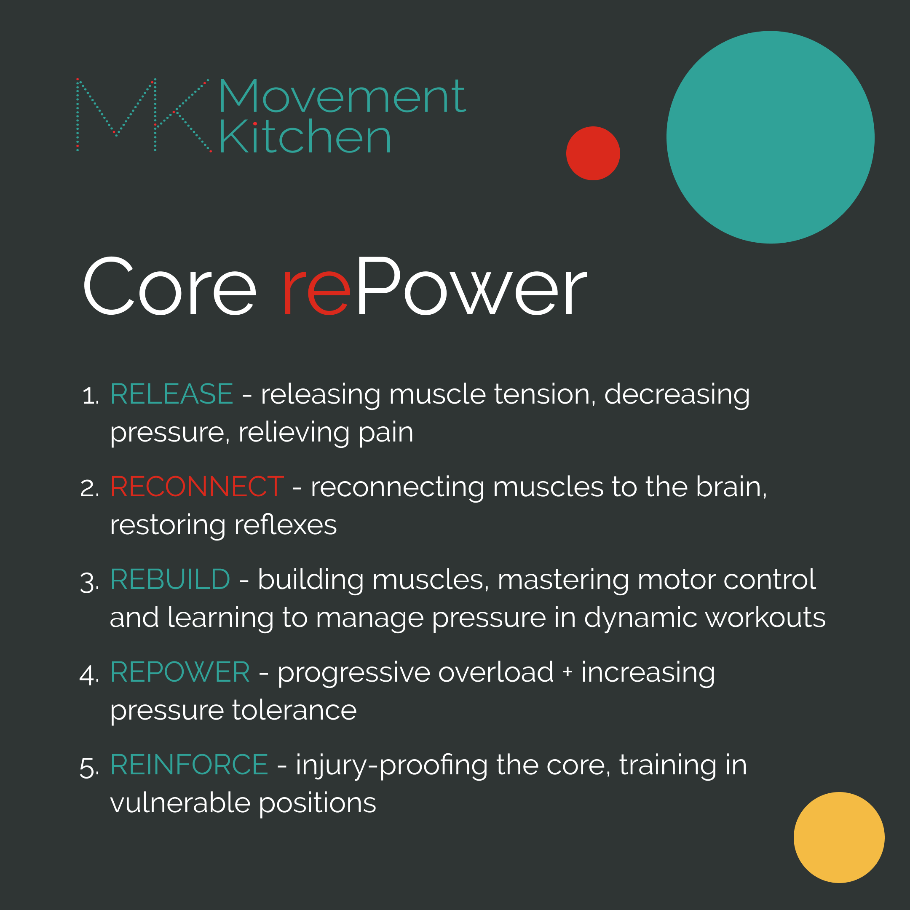
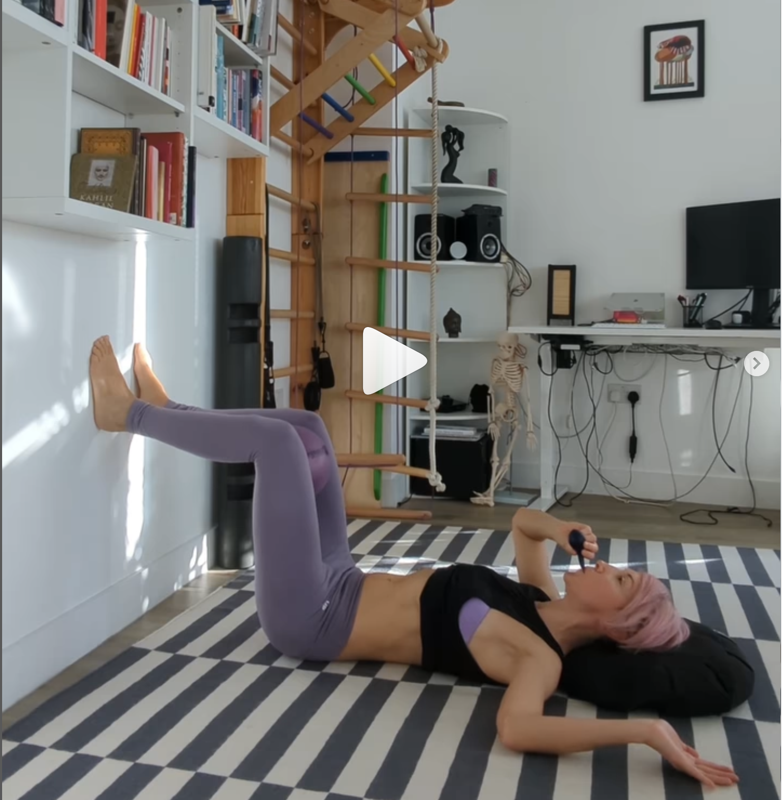

  

Working with many people with weakened core over the years, I've learnt that sometimes we need to start with undoing rather than doing.  

This is why the first stage of rebuilding core strength after injuries/pregnancy or in chronic back pain, is about releasing overworked muscles and resetting the body to zero, so we can build back up from there.

### Phase 1: Release 

When we are battling with back pain, our torso muscles might be operating in an emergency mode. This means the diaphragm (which is usually preoccupied with breathing) needs to jump in to help do the job of the weakened abs.

Similarly, the deep muscles connecting the legs to the torso, now need to do more core work, often way much more than their strength and length can allow them, (especially if you tend to sit a lot, and the deep torso muscles have adapted to sitting). So, they could get stuck in a short position, unable to lengthen, pulling the torso and the leg closer.

Stretching doesn't make much difference here, as the deep torso muscles respond to fight-or-flight and you need to feel safe for them to release. So, we need to start with passive releases - lying in a restorative position and allowing the muscles to release into the pull of gravity.

*Release 1 - Psoas Release:*

One of the first muscle we release is the psoas muscle (take a look at the picture below to see where exactly it is in the body).

The psoas (psoas major + minor) is a large muscle on either side of the torso, with 22-24 fingerlike attachments, connecting the entire lumbar spine to the back of the thigh. It is in charge for both hip flexion and the spinal stability. Tight psoas can also affect breathing, as it's, via connective tissue, linked to the diaphragm.

Ideally, you never feel it or know you have it, as it does its job quietly, deep in the torso. But if you have any lower, mid-back or hip pain, there are good chances that your psoas is at least partially involved.

Grab a bolster or two and a couple of hard cushions and join me. Turn the volume up for audio guidance.

  

Keeping the back of the thighs heavy on the ground, support the head and shoulders with cushions (from the shoulder blades upwards). The back of the ribcage being unsupported by the props, so it can release deeper with each breath out.

Spend 10-15 min resting there, allowing the torso to release with gravity.

Put some relaxing music on and take some time to breathe in the position, with each exhalation giving all your weight away to the ground.  

* * *

*Release 2 - Iliacus Release Sequence:*

Here is another release sequence I love and use with my clients in the early stages of rebuilding the core. This time we combine passive, restorative positions and small movements, targeting the muscles all around the pelvis, especially the muscles connecting the leg to the pelvis on each side - the iliacus muscles.   

The iliacus lines the inside of the pelvic rim, connecting the pelvis to the back of the thigh (see the anatomical illustration above). It's in charge of flexing the hip and shortens with sitting.

Do you tend to have front of the hip or groin pain and tightness? Or maybe your hamstrings always feel tight? These all could mean your iliacus might need extra love, length and strength.

You will need:

- a block or a couple of thick books
- a resistance loop (or a pair of old tights)
- a soft ball (or a cushion).

Make sure you are warm and cosy, if you want you can cover yourself with a blanket. Take some time to breathe in the restorative part of the sequence, with each exhalation relaxing the torso deeper, letting the back of the waist release with gravity.

Click on the image above for a carousel of videos showing the sequence.

*Iliacus Release Sequence Instructions*

1. Release on a block (iliacus release) - Place a block/book under your pelvis, the feet flat on the ground and shins vertical. Experiment with the height of the support. You can start lower and then prop the pelvis higher if it feels nice.

Spend a couple of minutes resting there, allowing the back of the waist to soften.

2. Restorative block release - This is a fancy version of the block release, for when you have more time. We use a thick resistance loop to support the thighs and a soft ball/pillow in between the knees.

You can spend some time in the passive release, then add the small movement (see 3. below).

3. Exhale and gently press the inner thighs into the ball. Inhale and press the outer thighs outwards into the loop.

Can you do it with less effort?

Start with 10/10, then try 5/10 and eventually 3/10.

Try the releases, they are great at whatever stage of your core rebuilding journey you are, to help you rest and get the most of your recovery between workouts.

* * *  

### Phase 2: Reconnect

Once we released the pressure and tension, it's time to reconnect the core with breathing and restoring reflexive core activation.

If you are struggling with back pain, your nervous system might be stuck in emergency mode. The timing and coordination of different torso muscles could be off and your breathing and core muscles might not be working well together at the moment. 

So, a lot of our work is about the brain and motor control. We often need to dedicate time to reconnecting the muscles to the brain and restoring reflexes. 

We need to reestablish an upward and inward movement of the lower belly with exhalation, lifting up from the base of the torso as you exhale. 

We need to train the deep core to respond to breathing and the actions of the feet and hands and eventually, it’s going to respond automatically.

* * *

Here are 3 breathing exercises I use with my clients with a weakened core, diastasis or back pain to help restore movement and tone in the lower belly - which often feels disconnected.

1. *Blowing through a straw*

2. *Blowing into a punctured balloon* - don't let it deflate!

3. *Active exhalation + arms overhead*

Click on the image below for a carousel of videos showing the sequence.

✅ Place the feet flat on the wall, lower legs, thighs and torso at 90-90°.

✅ Exhale slowly - think of lifting up from the base of the torso.

✅ We are looking for this upward and inward movement of the lower belly at exhalation.

* * *

No sensation of lifting?

You can try:

✔️ Pressing the feet down - as if peeling the paint off the wall
✔️ Gently squeezing the cushion between the thighs
✔️ Gently lifting the pelvic floor - effort 3/10 - think of sucking up a grape

If you find it easier to feel the pelvic floor activation that way, you can press the lower back into the floor for the beginning.

* * *

💨 The exhalation is active here - we use the exhalation to support and reintegrate the body.

🫁 Inhalation is passive, everything relaxes and expands effortlessly with the breath in - the ribcage, belly, the pelvic floor.

* * * 

Also, here is the technique I call *the jumping feet* that uses the action of pressing the feet into the ground in anticipation of a jump to help fire up the lower abdominal muscles in any standing movement.

<iframe width="790" height="498" src="https://www.youtube.com/embed/SADD1rVy4hE" title="Switch on Your Lower Abs - &quot;The Jumping Feet&quot;" frameborder="0" allow="accelerometer; autoplay; clipboard-write; encrypted-media; gyroscope; picture-in-picture; web-share" allowfullscreen></iframe>

If you don't have much foot awareness, we might need to start by strengthening the feet.

<iframe width="330" height="586" src="https://www.youtube.com/embed/8nqRhQaNvR0" title="Your Feet Are a Foundation of a Strong Core" frameborder="0" allow="accelerometer; autoplay; clipboard-write; encrypted-media; gyroscope; picture-in-picture; web-share" allowfullscreen></iframe>

That was all from me for this time. Drop me a message if you have any questions or comments.

Next week, I’ll tell you about the phases 3-5 and what you can expect as you progress.

Love and muscles,

Ivana xx
