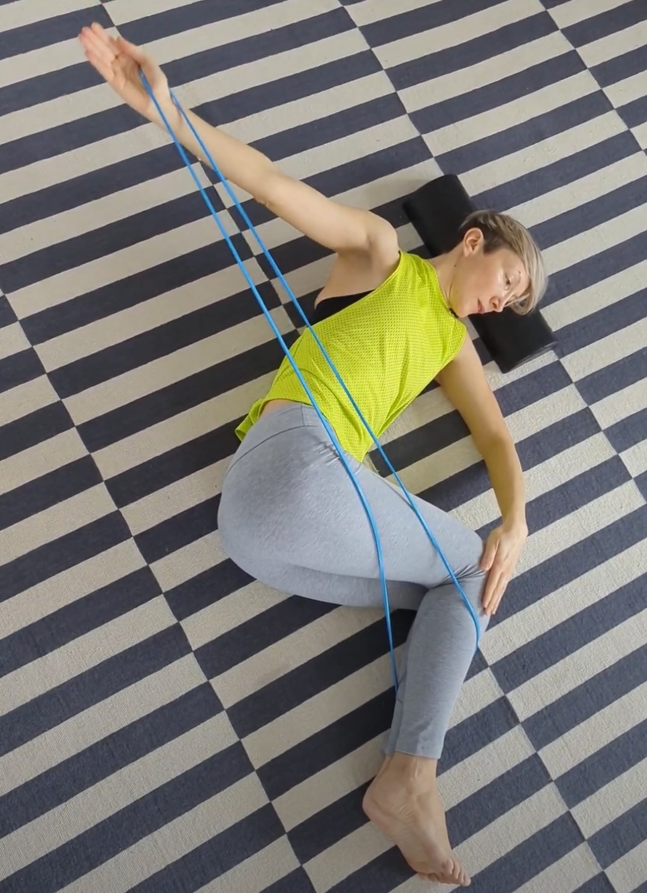
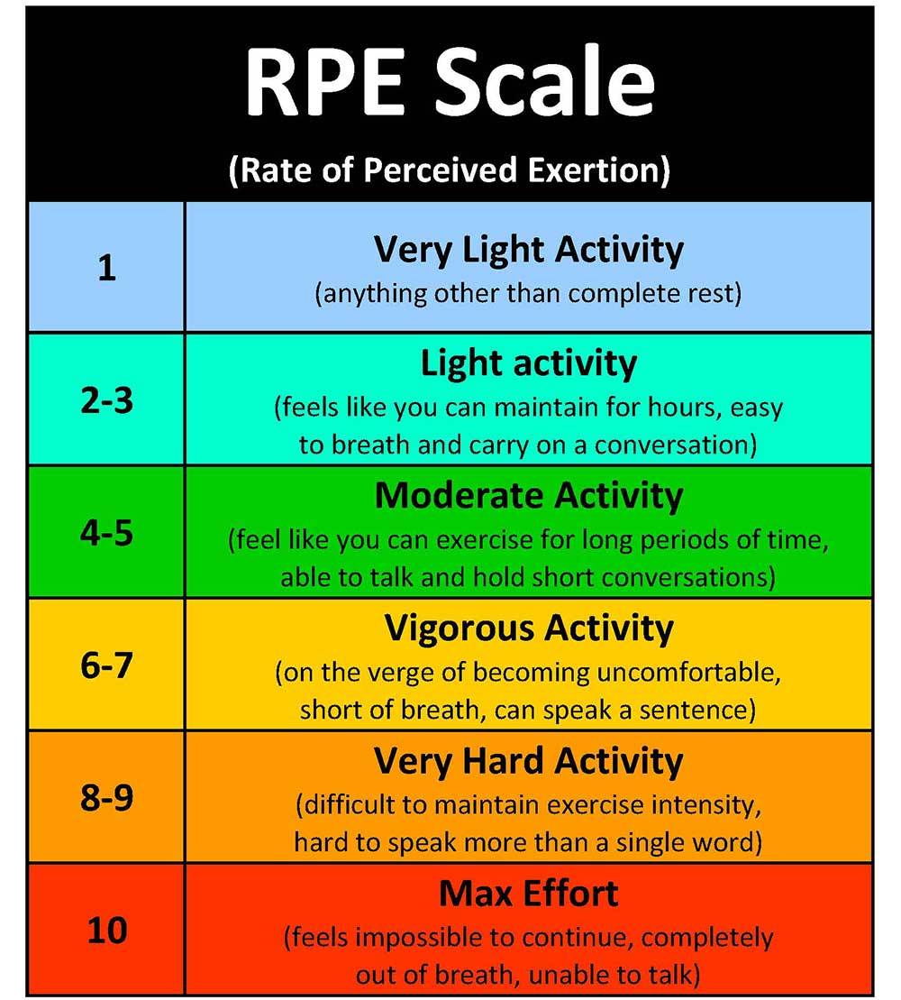

This winter, my family has been struggling with an ongoing flu or Covid (or both?). It took us weeks to fully get over it. So, I lost some muscle and my husband fell behind with his running practice. 

It is so humbling to realise that you need to pick a much smaller weight than your usual. On some days, I would feel so weak and breathless, even after 'easy' exercises.

So, I thought, let’s look into the research behind returning to training after Covid, and viral infections in general, and the current guidelines for athletes and the rest of us.  

> When Do You Start?

Not all viral infections equally affect us. A common cold is a virus, but you get better from it in a day or two, while recovery from Covid-19 could take weeks. Generally, it’s a good idea to wait until the symptoms are fully gone before taking up exercise that requires a bit more exertion.

When it’s about Covid, the current guidelines are a bit more cautious. The British Medical Journal Report from 2021 suggests [waiting until at least 7 days free from symptoms](https://www.bmj.com/content/372/bmj.m4721) to return to any intense exercise. This is because some people could have cardiac complications, even after a mild Covid infection.  

Occasionally, people can develop myocarditis, or an inflammation of the middle layer of the heart muscle wall, as a post-viral complication. Mild myocarditis could resolve on its own, but a serious one could create a heart damage. So, it’s important to get checked.

Some of the symptoms to look for would be: 
 * Chest pain
 * Fast or irregular heart beat
 * Severe breathlessness, at rest or during light activity
 * Light-headedness (feeling like you might faint)

If you have any of these, you might need a bit more caution in returning to exercise. You still can return to lighter activities, but progress very gradually to intense training.  

> What’s the plan?

A useful tool in adjusting and scaling up your exercise after a viral infection could be the RPE (rate of perceived exertion). It is a scale that measures how hard you feel your exercise - looking at breathing, heart rate, fatigue, and muscle pain. 0 is no exertion at all and 10 maximal exertion. 

 

The current guidelines for returning to exercise after Covid suggest starting at exertion levels 1-3 (gentle yoga, walking, mobility, very gentle strengthening) where you can talk comfortably, and even sing during exercises. 

Then, after a week or two, you can build up to 4-5 (moderate intensity) where you can talk, but not sing during exercises. 

Once that feels easy, you can move on to levels 6-7, a week or so later to 8-9 and eventually to 10 RPE, if you wish, where you can only grunt while exercising. 

So, it would take roughly a week to progress, depending on how you feel. 

Recovery from a more severe infection is probably not going to be linear, so it’s important to listen to your body. If you feel things like breathlessness, chest pain, dizziness or severe fatigue, if might be a good idea to step back and stick to a level that feels doable.  

> And what about long Covid?

We know that viral infections change the energy metabolism within our cells. This is one of the reasons why people feel fatigued after even smaller bouts of exercise and it takes time to build back your training intensity. But with long Covid, there seem to be much more going on.

A fresh study, [published in the journal Nature Communications](https://www.nature.com/articles/s41467-023-44432-3) in January 2024, tested the response to exercise over time in 25 previously fit and healthy people with long Covid and 21 who had Covid but fully recovered. They looked into blood samples and muscle structure before and after exercise with maximal exertion. 

As expected, the people with long Covid had a much lower exercise capacity - but interestingly, it was not just the breathing and heart function that limited it. The muscles were behaving differently – generating less power and fatiguing quicker. 

Even before exercise, the structure of the muscle seemed to be different in two groups. The people with long Covid had clumps of protein in the muscle tissue (microclots) and a much greater proportion of white fibres that weren’t as effective at producing power. 

After exercise, the muscles in people with long Covid had more tissue damage and the body was less effective at repairing it. This could explain why people with long Covid have muscle pain for long after exercise. 

* * *  

A couple of other studies on elite athletes with long Covid found that they [did the same activities with much more effort](https://pubmed.ncbi.nlm.nih.gov/37126052/) (higher percentage of their maximum heart rate) and were [5 times more likely to develop a muscle strain](https://pubmed.ncbi.nlm.nih.gov/35487684/). 

Interestingly, the athletes’ [aerobic performance (running) was affected but not anaerobic](https://www.ncbi.nlm.nih.gov/pmc/articles/PMC10134946/) (HIIT, plyometrics, weightlifting and other activities where the body needs energy faster than oxygen can be supplied). This was a small study, on 3 Belgian football players, but if more studies confirm their findings, it would tell us that strength training could be a good way to progress exercise intensity in long Covid. 

* * *  

Here is an example of a [post-viral friendly sequence with dumbbells](https://www.instagram.com/p/C23Af7kop4P/) I used. 

Instead of lifting 2 x 4 kg weights, which would be my usual weight, I would combine and shift 2 x 2 kg weight, adjusting to how I feel. So, I could still load each arm individually with 4 kg, as before, without feeling breathless and exhausted.  

> The takeaway

When returning to exercise after a more serious viral infection, it’s better not to rush, but build intensity gradually.

* Wait for the clearance of symptoms (fever, fatigue etc.) 
* Start at RPE level 1-3 (walking, gentle yoga, mobility) 
* Wait at least 1-2 weeks to progress to the next RPE level 
* If you feel the symptoms returning, step back and stay at the previous level until you feel ready to move on.

This was all from me for this time. Have a great weekend! 

Ivana xx  

* * * 

> References:

- Appelman, B., Charlton, B.T., Goulding, R.P., Kerkhoff, T.J., Breedveld, E.A., Noort, W., Offringa, C., Bloemers, F.W., van Weeghel, M., Schomakers, B.V., Coelho, P., Posthuma, J.J., Aronica, E., Joost Wiersinga, W., van Vugt, M. and Wüst, R.C.I. (2024). Muscle abnormalities worsen after post-exertional malaise in long COVID. Nature Communications, [online] 15(1), p.17. doi:https://doi.org/10.1038/s41467-023-44432-

- Salman, D., Vishnubala, D., Feuvre, P.L., Beaney, T., Korgaonkar, J., Majeed, A. and McGregor, A.H. (2021). Returning to physical activity after covid-19. BMJ, [online] 372. doi:https://doi.org/10.1136/bmj.m4721.

- Wezenbeek, E., Denolf, S., Willems, T. M., Pieters, D., Bourgois, J. G., Philippaerts, R. M., De Winne, B., Wieme, M., Van Hecke, R., Markey, L., Schuermans, J., Witvrouw, E., & Verstockt, S. (2022). Association between SARS-COV-2 infection and muscle strain injury occurrence in elite male football players: a prospective study of 29 weeks including three teams from the Belgian professional football league. British journal of sports medicine, bjsports-2021-104595. Advance online publication. https://doi.org/10.1136/bjsports-2021-104595

- Wezenbeek, E., Denolf, S., Bourgois, J. G., Philippaerts, R. M., De Winne, B., Willems, T. M., Witvrouw, E., Verstockt, S., & Schuermans, J. (2023). Impact of (long) COVID on athletes' performance: a prospective study in elite football players. Annals of medicine, 55(1), 2198776. https://doi.org/10.1080/07853890.2023.2198776 