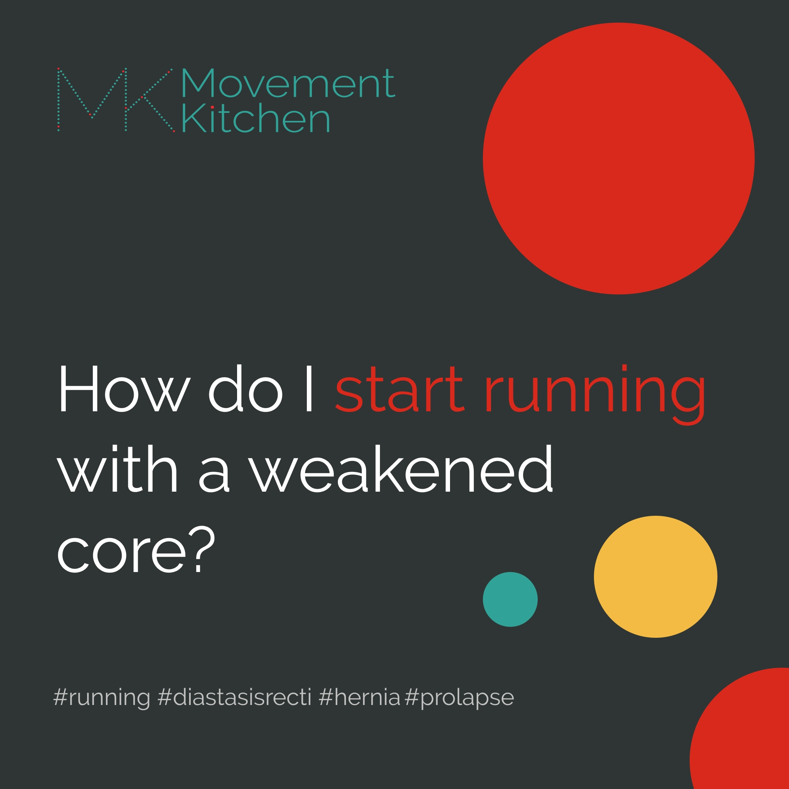

I had a conversation with a really sweet client of mine yesterday on the topic of taking up running while working on rebuilding her core with diastasis recti and a hernia.

Now, depending on where in your core rebuilding journey you are, your body might be able to handle more or less impact. If you are still in the early stages of reconnecting the brain to the muscles and restoring reflexes, your deep abs and the pelvic floor might not be switching on automatically just yet to support you while you run.

So, this would be the first thing on our to-do list to get your running-ready.

> 1. We want to have your lower belly and the pelvic floor fire without you having to think about it. 
 
We need to have a working breath-core connection and an [reflexive upward and inward movement of the pelvic floor and the lower abs at exhalation](https://www.youtube.com/shorts/e4IxFIb0Qy8) – so your core is with you and supporting your spine and the organs at every step.

Some of the things to keep in mind would be:

✅ Can you run while breathing smoothly - no breath-holding, straining or bearing down at any point?  

✅ If you feel any pressure in your pelvis or any sort of pain or discomfort anywhere in the body, step back. Do more walking, less running.

The second on our to-do list is pelvic stability. 

> 1. We want you to be able to keep your pelvis stable as the legs move, without effort.

You can see what I mean in the video below.  

<iframe width="329" height="584" src="https://www.youtube.com/embed/aIR5nsfYnQ4" title="What is pelvic stability?" frameborder="0" allow="accelerometer; autoplay; clipboard-write; encrypted-media; gyroscope; picture-in-picture; web-share" allowfullscreen></iframe>

If you can't stabilise the pelvis at each step, the pressure inside the belly will be out of control. This might slow down your diastasis recovery, worsen the hernia and bring on new symptoms e.g. pelvic floor.

So, how do I know that my pelvis is stable?

✅ Is your body able to hold its full weight on one leg, while adding impact?  

✅ Is the pelvis dropping, tilting or rotating as the legs move?
Is your body able to hold its full weight on one leg, while adding impact? Is the pelvis dropping, tilting or rotating as the legs move?

Running is a high-impact activity with repetitive loading and gravity hitting your body at 2-3 body weights. If you aren't able to stabilise the pelvis at each step, the pressure inside the belly will be higher than normal. This might slow down your diastasis recovery, worsen the hernia and bring on new symptoms e.g. pelvic floor or knee issues. 

Pelvic stability is really important if you have lower back pain too. We want to be able to move the legs independently from the pelvis, otherwise, each movement of the leg can pull and destabilise the sacroiliac joint.

> If you are taking up running for the first time, you can check your readiness with the test below.

Can you perform each of these movements without pain or discomfort in any part of your body?

- Walk for 30 min  
- Stand on one leg without losing balance for at least 10 sec  
- Run in the spot for 1 min  
- Hop on one leg for 10 sec  
- Squat down and come up slowly  
- Come up from a chair using one leg only  

You can begin with short, easy runs (NHS ‘couch to 5k’ programme is a good place to start), while doing a lot of pelvic stability, foot and core work alongside your running practice. Check out my [Instagram feed](https://www.instagram.com/movementkitchen/) for plenty of ideas on hip strength and pelvic stability training.

And then gradually we can scale up the duration, intensity and frequency of your runs as you build motor control and get stronger.

You've got this! ❤️💪

Ivana xx