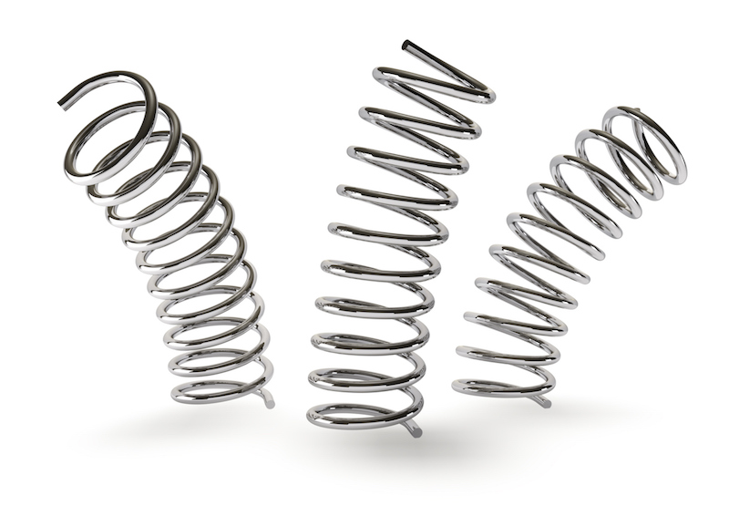

Last week we spoke about the brain’s role in movement and injuries and how sometimes there is a gap between the brain's estimation of the demands of a movement and reality. Remember the Cirque du Soleil acrobats who kept injuring their Achilles tendons landing on the concrete beams while expecting the soft, bouncy floor of the stage?

And you probably saw that all of the resources I linked last week were from the research on running. So, I thought, let's talk a bit more about the brain and movement in the context of running, especially since a few people on this mailing list are running regularly.

* * * 

> Will running on softer ground prevent injuries?

If you are a runner, you might have heard that running on soft surfaces, like grass, or sand, helps prevent injuries. But interestingly, a different surface softness/hardness just means different tissues will bear the brunt of running. 

As you remember from last week, as we run, before touching the ground, our brain pre-activates muscles in anticipation of the ground contact and adjusts the stiffness of the leg to match the stiffness of the ground. The stiffness here refers to keeping the leg together, so it doesn’t fall apart as it hits the ground. 

As we run, each leg behaves like a spring - stirring and releasing elastic energy, which we then use together with the muscle power to propel us forward. The stiffer the leg, the faster we can run.  

  

* * * 

> Now, what is the brain's part here?

If you expect a soft surface, your brain will stiffen the leg more so the soft tissues vibrate less, for more economical movement. On a hard surface, the brain tunes the leg stiffness down for a softer landing.

> So, the softer the surface, the stiffer the leg.   
> The harder the surface, the softer the leg. 

To make sure we run fast enough but also avoid injuries, the leg stiffness needs to be in the Goldilocks range. 

We don’t want our legs to fall apart, we want them to stiffen at impact, but then, too much stiffness means excessive loading of the hard structures of the body, i.e. bones. So, if you’ve had bone injuries in the past (shin splints, lower leg fractures), soft running surfaces could be tricky for you. 

And the other way around, a harder running surface, like asphalt or concrete, means a softer leg. Too little leg stiffness means more soft tissue vibration, less joint stability and more exertion on the soft tissues. So the soft running surface advice would make sense if you’ve had muscle or tendon injuries in the past (Achilles tendon issues, plantar fasciitis, but also pelvic floor issues or diastasis recti). 

But, if you’ve had a tibial stress fracture, you’d want to run on a harder surface instead.

> In a nutshell:  
> Soft tissue injuries => run on softer surfaces  
> Bone injuries => run on harder surfaces  

If you had no injuries, can you vary your running surface? This way you can add variability to your training and build more resilience.

References:

- Butler, R. J., Crowell, H. P., & Davis, I. M. (2003). Lower extremity stiffness: implications for performance and injury. Clinical Biomechanics, 18(6), 511–517. doi:10.1016/s0268-0033(03)00071-8 
- Ferris, D. P., Louie, M., & Farley, C. T. (1998). Running in the real world: adjusting leg stiffness for different surfaces. Proceedings. Biological sciences, 265(1400), 989–994. https://doi.org/10.1098/rspb.1998.0388.