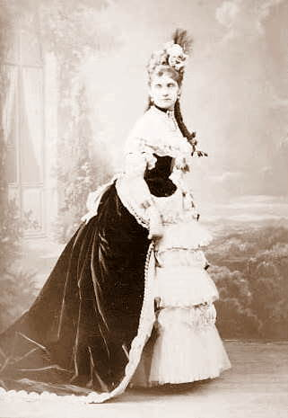
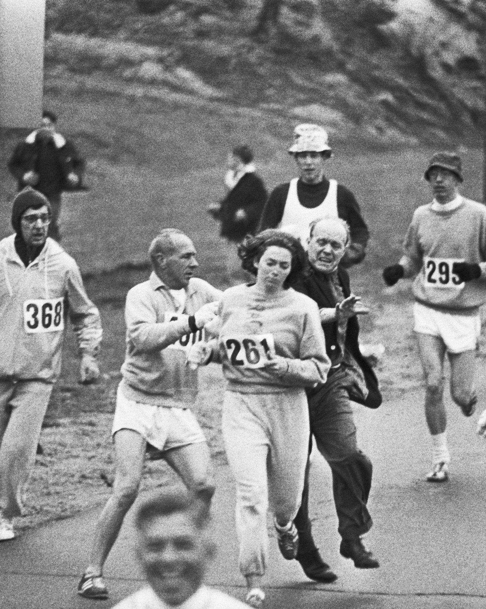
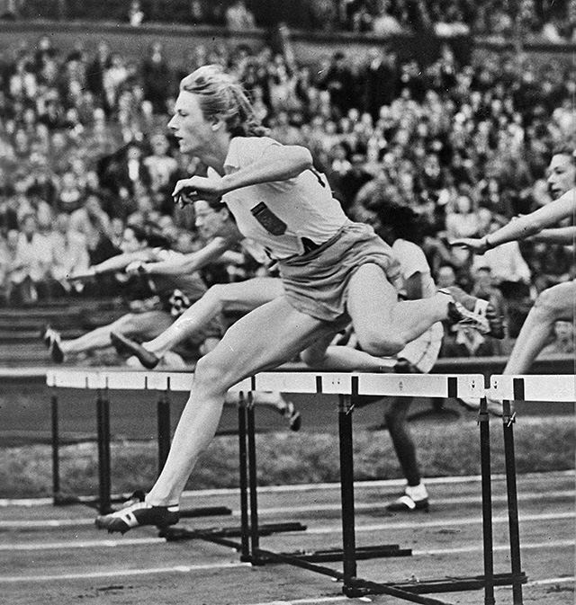
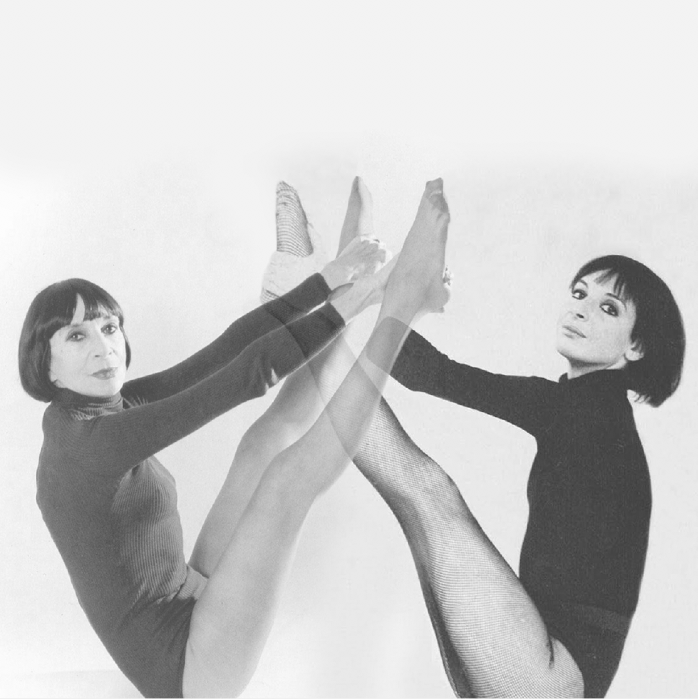

Recently, I spent some time digging into the beginnings of women’s participation in sport and physical activity. Turns out it’s not a very long history indeed. The first sports event that recorded female participation was the Paris Summer Olympics in 1900. Amongst nearly 1000 of the participants, there were also 22 women.

The first known female athlete of the world was a Swiss countess Hélène de Pourtalès who was, together with her husband, part of a sailing crew that won a gold and a silver at the 1900 Olympics. 32 years old at the time, Hélène was the first woman to compete at the Olympics and the First female Olympic medalist. You can see her on the picture below wearing a crinoline and a corset. I hope she wasn’t sailing in them!

  

### A “Weaker Sex”?

At the 1900 Olympics, the girls were allowed to participate in very few categories, such as sailing, golf and tennis. And in the decades that followed, there were still cultural barriers to women embracing sport and being seen as physiologically suitable to compete in athletic events. 

In her book [Let’s Get Physical - How Women Discovered Exercise and Reshaped The World](https://www.goodreads.com/en/book/show/57699965), Danielle Friedman explains how throughout the first half of the twentieth century, women and physical activity seemed impossible to connect. Sweating was seen as “unladylike”. Even the medical professionals advocated against vigorous physical activity in women, as it could lead to exhaustion or make their uteruses “fall out”. 

Until the beginning of the 1970s, it was still a common belief that it was dangerous for the fragile women’s bodies to run for longer than a mile of two at a time. On the image below you can see Katherine Switzer, a journalism and English literature student at Syracuse University, being pulled by her sweatshirt and nearly thrown out of the race by one of the Boston Marathon’s organisers as she tried to run the 1967 Boston Marathon amongst men, undetected.

  

“Hey, it’s a girl! It’s a GIRL!” - the guys shouted.  
“What are you trying to prove?” - one yelled.   
“Nothing” - Kathrine thought - “I just want to run.”   

And she is [running, still at the age 77](https://www.instagram.com/p/C4Qko8dLgnU/), with no plans to retire from the sport.

But then, as the science fiction writer William Gibson once said “the future is already here, it’s just not evenly distributed”. The Dutch had women’s track and field competitions decades before the Boston Marathon incident.

At the London 1948 Summer Olympics, the world heard about Fanny Blankers-Koen, a 30-year old Dutch mother of a 7- and a 2-year-old, who won four gold medals and set the world record in the 200m category that still stands today. According to the [Journal of the Olympic History](https://isoh.org/wp-content/uploads/JOH-Archives/johv12n2r.pdf) “She ran at such a pace, that it looked as if all the others were standing still.” The craziest of all was that she was nearly 3 months pregnant with her third child! 

This was 71 years before the first official [guidelines for returning to running postpartum](https://www.researchgate.net/publication/335928424_Returning_to_running_postnatal_-_guidelines_for_medical_health_and_fitness_professionals_managing_this_population) were published in 2018. 

The research on training while pregnant and returning to training postpartum is still lagging behind. Any research on women in sport really. During writing my dissertation, I was shocked to discover that [only 4-13% of sport medicine and science studies were focused on women](https://journals.humankinetics.com/view/journals/ijsnem/32/2/article-p114.xml). I wrote more about that [here](https://www.movementkitchen.co.uk/blog/postnatal-return-to-exercise/).

### Inventing Exercise

Reading Let’s Get Physical, I’ve learnt about women pioneers of fitness. Did you know who invented barre workouts? I didn't know either. In late 1950s, Lotte Berk, a London-based German-Jewish dancer came up with the brilliant idea of opening dance studios for women who weren't ballerinas but would like to look like one. Drawing from ballet and modern dance, she imagined barre to be a sex-enhancing workout for women, with the primary movement being hip thrust - tucking your pelvis under dynamically. Starting her teachng career in her mid-fourties, Lotte continued teaching classes well into her eighties. You could see her with her signature whip standing in the midst of a room of Bond girls and fashionable upper-class mums looking to sculpt their bodies to perfection.

Around the similar time accross the Atlantic Ocean, a PE teacher Bonnie Prudden started an exercise revolution. Originally passionate about improving fitness in American school children, Bonnie lobbied for more physical activity for the whole family and eventually got the 1950-es suburban housewives to exercise along their TV-sets. In the beginning, Bonnie Bonnie needed to improvise with the outfits, as fitness clothing for women simply didn't exist. So, she teamed up with clothing manufacturers to design sexy but comfortable outfits for exercise. Hello lycra and leotards!

In 1961, Bonnie wrote a book that she planned to name 'How to Keep Slender and Fit After Forty' - but after persuasion from her publisher the title was changed to 'How to Keep Slender and Fit After Thirty'. In the early 1960, thirty was not considered young at all. Most women had multiple children by this age and were expected to retire from public-facing professions. But Bonnie’s prime started way beyond her thirties. She was famous for wearing hand-cut crop tops showing her beautifully tonned mid riff in her mid-fourties. She would say “yes, you can’t run back the clock, but you can wind it up again” - and she did, staying active and strong until 97.

I hope these stories have inspired you. There is no such thing as a "weaker sex". Maybe we could talk about a less trained one. But that is changing as we speak!

Ivana xx
