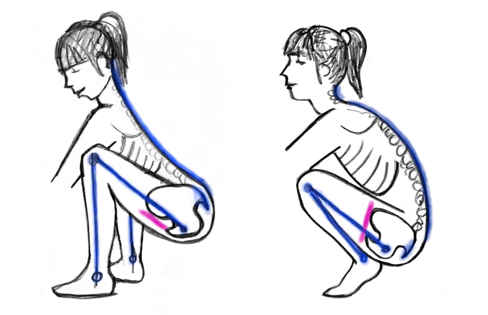

<figcaption>Illustration by Jillian Nicol at www.livealigned.ca</figcaption>

I’ve been spending most of my time lately learning about biomechanics, healthy alignment and how movement affects our bodies on cellular level. The research from the last few years shows that the way we move affect us not only mechanically, as it was previously thought, but also causes biochemical changes in our cells, changing us from inside out. This process of the body adapting to and being shaped by movement is called mechanotransduction.

> We seem to be living in the world that encourages sitting with the tail tucked under.

The furniture we use sitting all day is optimised for comfort and convenience, but usually not ergonomically adapted for pelvic floor health. Who would even think about that?

There is a well spread myth in our society that pelvic floor issues are a normal consequence of ageing or child birth. But we would rarely think of looking for a cause a bit deeper, in the way we have been living and moving before that.

Did you know that the anatomic function of our remnant of a tail is, amongst others, to control opening and closing of the pelvic outlet? If you look at a dog or a another tailed animal you can see that they keep their tail up happily wagging when they are in a good mood. And this is the default. When you see a dog wearing his tail down between his back legs, it’s usually a sign that the dog is on the fight or flight mode and his pelvic floor is tense as a part of his whole body reacting to danger.

Even though we now have only a tiny part of what was once a real mammalian tail, it behaves the same. Untucking the tailbone opens the pelvic outlet, tucking it closes it — tightening the pelvic floor. The dog with his tail down between his legs is an equivalent of you sitting on your sacrum, the back supported by a chair or a couch. If you spend multiple hours a day in this position, your pelvic floor doesn’t really have a chance to release and allow the muscle fibres to regain their natural length at resting state. So gradually it shortens.

In his book Pelvic Power, dance educator Eric Franklin compares natural movement of the pelvic floor to a kite. As you stand up the pelvic floor slightly lifts and narrows, similarly to a kite picking the wind and taking off. Reversely, as you sit down (with untucked tail, using your sit bones) the pelvic floor widens and releases to its full length, like a kite descending down, opening and landing. But what if we never allow it to release?

> Tight muscle does NOT equal a strong muscle.

Biomechanist Katy Bowman compares an optimally functioning pelvic floor to a trampoline. It supports the weight of all our pelvic organs and allows any extra load to just bounce off its healthy, elastic fibres, tensing and releasing naturally. Keeping the muscles in the shortened position all the time doesn’t let them perform their function optimally. And further on, as our bodies adapt to the way we use them, we gradually end up with shortened muscles.

This is why pelvic floor exercises (Kegels) can only be a short term fix. Practising contractions of a muscle isolated from the rest of the body and without allowing it to ever fully release you get a muscle that is tight and locked short. A tight muscle does NOT equal a strong muscle. A strong muscle is able to both fully contract and fully release.

So why am I telling you all this now? Reading Katy Bowman’s last book — Move Your DNA, I’ve started to incorporate more variety movement into my life other than and independently from exercising. And especially, I’ve started to squat more, when playing with my toddler, picking things off the floor and going to the toilet.

Learning how to untuck my tail has made me finally realise why I still had to push my baby out and not bear it gently down, letting the gravity do the job, in spite of all the birth preparations and beautiful relaxation techniques I mastered beforehand.

> To “breathe the baby out” you have to first untuck your tail.

Anatomically, in order for the baby to come out the pelvic floor has to release, but you can’t possibly release the pelvic floor with the tailbone tucked under. You can only use the strength of your muscles (transverse abdominals and diaphragm as they instruct you to hold your breath and “puuuuussssh!”) against your pelvic floor. And that’s a sure way to end up with a nice tear and possibly a pelvic floor disfunction. I was lucky that this mad pushing in my case ended without any serious damage. The body just took over at the last moment and jumped on a dining chair in a strange half-squat with untucked pelvis, fully opening the pelvic outlet. The tucked squats and kneeling with rounded back would have probably taken me to an assisted delivery.

“Modern birthing science has placed a large burden on secreted hormones (like relaxin) to prepare the body for needed mobility.” Katy Bowman says. Yes, relaxin is useful in letting the body open up for the birth, but it’s not enough, unless we have strong, yielding muscles that can fully contract, but also fully release.

And there is one more thing that we might be missing nowadays.

> In order to have bodies able to smoothly perform all their biological functions, we need to build a whole-body endurance.

A great way to develop endurance as well as a strong pelvic musculature and a responsive pelvic floor is to walk a lot. You can gradually build up the mileage and frequency of walking in the day. Up the hill, down the hill. Not just on flat pavements but on a variety of terrains and ideally in a shoe that allows your feet to experience and respond to them.

It’s about building up towards more movement, but also more variety of movement. Gradually adding more and more little movements into your life will allow the body to adapt to them, building capacity to make them easy.

So, the bottom line is: we really need to get off our tails and sit on the sit bones instead and walk more, squat more, move more. It’s all about really using the body. Reintroducing a frequent and varied movement in our day-to-day life we can gradually reclaim the lost ranges of movement and functional strength.

Reference list:

- Donald E. Ingber, MD, PhD — Tensegrity and Mechanotransduction, Journal of Bodywork and Movement Therapies Volume 12, Issue 3, July 2008, Pages 198–200
- Katy Bowman, MA — Move Your DNA: Restore Your Health Through Natural Movement, Propriometrics Press, September 2014
- Katy Bowman — Natural Mama, blog post from 3 January 2012 http://nutritiousmovement.com/natural-mama/
- Eric Franklin — Pelvic Power: Mind/Body Exercises for Strength, Flexibility, Posture, and Balance for Men and Women, Elysian Editions, November 2003
- Doug Keller — Yoga as Therapy Ground breaking insights into the use of yoga as therapy (Volume One: Foundations), Do Yoga Productions, 2008
- Katy Bowman, MA — Alignment Matters: The First Five Years of Katy Says, Propriometrics Press, 2013