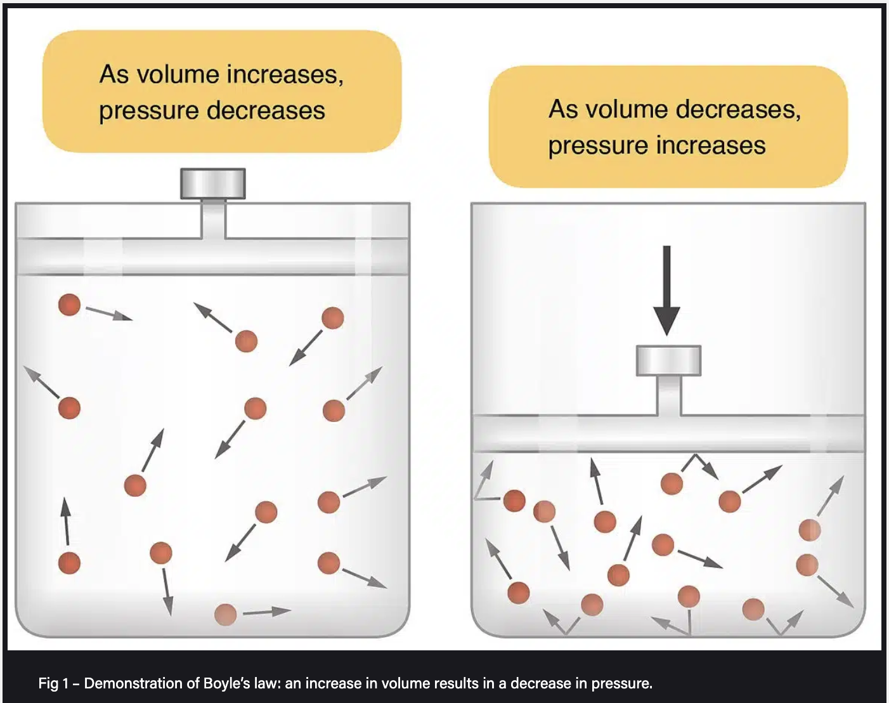

<small> Image by [BMJ Learning](https://www.youtube.com/@bmjlearning) </small>

The other day, a young woman explained in her initial consultation that she would want to learn how to breathe correctly. And this made me think. It’s been a while since I stopped trying to teach people the right way to breathe. This might sound strange. Now, let me explain.

There are two questions here. First, is there such a thing as breathing correctly? And then, even if there is, can we override incorrect breathing at will?  

> Is there correct breathing?

Breathing is a reflexive action, so, it’s in the domain of the autonomic nervous system - our bodies breathe without us having to think about it. Physiological breathing is a result of the nervous, respiratory and musculoskeletal systems working in harmony.

There is more than one correct way to breathe. Our bodies optimise breathing for how much oxygen you need for an activity – if you run, you will breathe deeper than when you are lying down and reading a book. Our breathing speeds up when we are excited or slows down just before falling asleep.   

 <small> Click on the image to watch Basics of ventilation: Mechanics of breathing, video by BMJ Learning </small>

> Can we override breathing patterns at will?

We can consciously control breathing for shorter periods of time, like during swimming or singing, but after a while the autonomous nervous system will take over again. 

For example, if you try to hold your breath, either you want it or not, after a while, your body will override your action and force you to start breathing again. Or, if you try to breathe deeply, after some minutes you might get preoccupied with thoughts about that unfinished work project or what you are cooking for dinner and luckily, the autonomous nervous system will take care of breathing for you again, so you don’t suffocate.

* * * 

In medical papers, healthy physiological breathing is described as “tidal breathing” - the breathing where there is roughly the same change of lung volume at inhalation and exhalation. But how much is that? 

Now, an average lung volume of an adult male is around 6 litres, and around 4.8 litres for females. Interestingly, your lung capacity depends on your height (the higher the person the higher their lung volume) and altitude at which you were born and live. So, people born at sea level have lower lung capacity than people who live in the mountains. 

But lung capacity can increase with physical activity. For example, US swimmer Michael Phelps has lung capacity of around 12 litres - double the average!

<small> Photo by Fernando Frazão/Agência Brasil 
Copyright: EBC-EMPRESA BRASIL DE COMUNICAÇÃO/Agência Brasil </small>

Many popular (ancient and contemporary) breath-training techniques include strict breath-counting. But then how do you adjust the count for a short man who spends summer by the sea and winters in the mountains, or for a tall, non-binary swimmer from the Netherlands (below the sea level)? Can there ever be one size fits all?

* * *  

> How does breathing work?

Healthy breathing mechanics looks something like this. The chest cavity expands to get the breath in. Increasing the volume of the cavity drops the pressure inside it below the atmospheric pressure, so the air gets sucked into the lungs.

<small> Image from Anatomy & Physiology, Connexions Web site. http://cnx.org/content/col11496/1.6/, Jun 19, 2013. Author: OpenStax College </small>

At inhalation, the diaphragm contracts and moves down, enlarging the chest cavity and pressing down on the viscera and the organs, so both the chest and the belly expand and the pelvic floor gently lowers. 

And at exhalation, the whole process repeats in reverse. The pelvic floor bounces back up, the abdominal muscles and muscles in-between the ribs contract to expel the breath and the diaphragm relaxes back up to the starting position.  

  

* * *  

> Is diaphragmatic breathing the best?

In some way, every breathing is diaphragmatic. Looking at the muscles, most of the job is done by the diaphragm, a large umbrella-shaped muscle separating the chest and the abdomen. 

But if your body needs more oxygen, let’s say, you are doing intense exercise or you are anxious or stressed-out and your brain perceives your need for oxygen differently, besides the diaphragm, you’ll get to use some more muscles to breathe in – like neck and chest muscles. 

This is not incorrect breathing that you need to override, but the body’s strategy to improve oxygenation. And for short time it’s OK. But if you get stuck in this pattern, it might be a good idea to explore what is limiting the diaphragm in doing its job properly.

* * *  

  

> Why does breathing change?

We have evidence that (otherwise healthy) people breathe differently if they suffer from back pain or ongoing abdominal bloating. In these cases, the viscero-somatic reflexes might be off. This means the way your brain perceives breathing might change. So, sometimes, we have the reverse breathing pattern – where the belly inflates at exhalation, instead of drawing in and up to help expel the air from the lungs. 

If the reflexes are off, we can’t just tell the person to reverse the breathing back to the “correct breathing”. In my experience, telling people there is something wrong with their breathing makes them anxious. The more you think about it and try to control your breathing, the more it gets difficult to overcome a less efficient breathing pattern. So, I prefer to skip the “correct”-“incorrect” terminology and instead try to target the breathing indirectly – through use of relaxation, visualisations and muscle training.

Also, as we saw above, when you live with chronic stress and/or have a lot of tension in the deep muscles of the torso over time, your diaphragm might not be able to move through its full range of motion. This might feel like not being able to get a full, satisfying breath. 

But this is not a faulty breathing pattern that we need to correct. A better question would be: Why is the diaphragm restricted and how we can restore its full range of movement? And once we do, we can train its strength and endurance - the diaphragm is a muscle after all.

* * *  

> So, how can we improve breathing?

Here are some things I use with my clients:

Release the deep torso tension - Remember the [psoas release](https://www.youtube.com/shorts/sjdByL2SKCo)? The psoas and the diaphragm share attachments (linking walking and breathing). So, through releasing the psoas we can target the diaphragm too.

Use guided meditation/relaxation and calming visualisations to help restore healthy breathing mechanics and the breath-core connection – You can slow down the breathing and visualise a jellyfish or an expanding sphere in your favourite colour - growing effortlessly in all directions, as you inhale, and drawing back towards the centre and becoming smaller, as you exhale. 

Improve the [rib mobility](https://www.youtube.com/shorts/p7HTVqoVUV8) - so we can get a smoother ribcage expansion and  contraction and more movement for the diaphragm.

Train the diaphragm and the deep abdominal muscles by [blowing a ballon or a punctured balloon](https://www.instagram.com/p/C0Py_kaog9k/) (for the beginning) – this is a great exercise to both coordinate and strengthen the deepest abs and the diaphragm and help the diaphragm restore its optimal position.

<small> Image from Boyle, K. L., Olinick, J., & Lewis, C. (2010). The value of blowing up a balloon. North American journal of sports physical therapy : NAJSPT, 5(3), 179–188., Copyright© Postural Restoration Institute TM </small>

Until next time, 

Ivana xx 

* * *  

> References:

1. Boyle, K. L., Olinick, J., & Lewis, C. (2010). The value of blowing up a balloon. North American journal of sports physical therapy : NAJSPT, 5(3), 179–188.

2. Hodges PW, Gandevia SC. Activation of the human diaphragm during a repetitive postural task. J Physiol. 2000 Jan 1;522 Pt 1(Pt 1):165-75. doi: 10.1111/j.1469-7793.2000.t01-1-00165.xm. PMID: 10618161; PMCID: PMC2269747.   
   
3. Russo, M. A., Santarelli, D. M., & O'Rourke, D. (2017). The physiological effects of slow breathing in the healthy human. Breathe (Sheffield, England), 13(4), 298–309. https://doi.org/10.1183/20734735.009817  

4. Vostatek P, Novák D, Rychnovský T, Rychnovská S. Diaphragm postural function analysis using magnetic resonance imaging. PLoS One. 2013;8(3):e56724. doi: 10.1371/journal.pone.0056724. Epub 2013 Mar 14. PMID: 23516397; PMCID: PMC3597716.