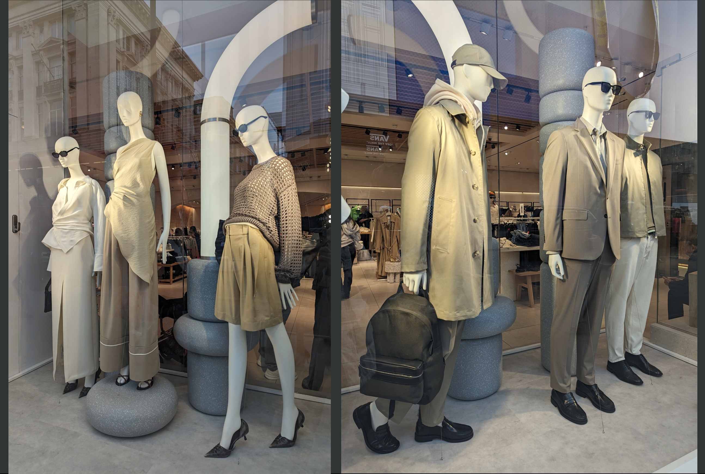
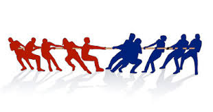
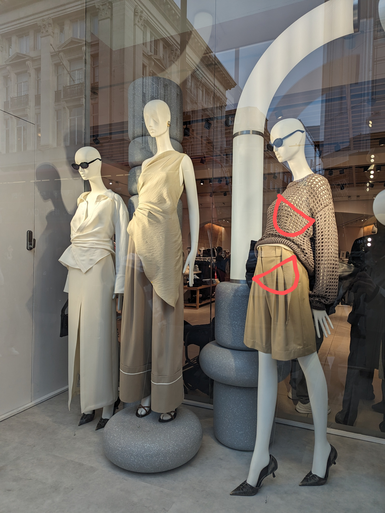

I caught myself staring at the shop window on Oxford Street the other day, but not at the clothes. There was a striking difference in posture between the female and male mannequins.

Now, I don't obsess with a "perfect" or "correct" posture, but as a biomechanist, I know that the positioning of body segments matters for how the muscles attached to them work. By the way, I'm talking about positioning in use. So, let's imagine these mannequins finishing their shift and walking down the road to grab a cup of coffee.

Muscles can contract at different lengths - which is great because I can have my arm muscles firing when I hold a grocery bag/child/pot just above the floor, but close to my face too. But to work the most effectively, the muscles' length needs to be in an optimal range. 

* * *

###So, how do muscles generate force?

If we zoom in to the microscopic level, muscles are made of myofibrils, tiny threads containing two types of protein - thicker (let's imagine them as red) and thinner (they can be blue). Reds and Blues play tug-of-war and Reds are winning, as they have tiny hooks that help them grab and pull onto Blues making the whole thread shorter. This overlapping is how muscles fire.

The Reds' and Blues' tug-of-war game works at different muscle lengths as we need to accomplish different movements. But, if a muscle is too stretched (its attachments are too far apart), Reds' hooks can't grab onto the Blues. Similarly, if the muscle is too shortened (its attachments are too close), the hooks are cramped together and again can't grab onto Blues as effectively. 

* * *

###Our muscles have a Goldilocks range of lengths, where they can work the best. 

The further you move from this range in each direction, shortening or lengthening excessively, the fewer protein overlaps we have and the less force can be produced. 

Now, if you have an injury, chronic pain or some of the muscles are weakened - you are already in a place where some muscles don't work well alone and together with the rest of the body. If you struggle with back pain, hernia or abdominal separation, these are your abdominal muscles. The positioning of your pelvis and the ribcage means your abs will be able to contract more or less effectively. So we need to make sure to have them in a place where they can work as well as possible and it's the least challenging to manage the pressure inside the belly.

This is why in Core rePower we always talk about stacking the ribcage and the pelvis over each other. If you <a href="https://www.youtube.com/shorts/DUDWQaMhrw0">imagine your pelvis and the ribcage as two bowls of soup</a>, or two Tupperware boxes, we want their lids, i.e. liquids inside them, to stay parallel, no matter how you move. 

This way, the muscle fibres of both the abdominal and back muscles stay at the lengths where they can support us. The diaphragm and pelvic floor stay on top of each other, so we can breathe well, manage the pressure inside the belly and keep the spine and the organs safe. 

* * *

###But where are the bowls of the female mannequins? 

All over the place! Soup spilling all over their legs! 

It wouldn't be easy to heal your belly and the lower back and keep your pelvis healthy if you walked like this all day, that's for sure. 

Does this reflect the cultural expectations of our times towards women? Maybe. Luckily, the male mannequins didn't model such a distorted body shape.

My stomach is rolling, imagining teenage girls, one of them my now 8-year-old daughter, twisting, arching and zig-zagging their ribcage and pelvis to fit into the current expectation of "beautiful". 

And how in the world would you "bounce back" after having a baby into this shape? And would you want to? 

We still have a long way to go to gender equality... 

Happy late International Women's Day and the Women's History Month! 

To dig deeper into muscle physiology, you can check out 

Squire J. (2019). Special Issue: The Actin-Myosin Interaction in Muscle: Background and Overview. International journal of molecular sciences, 20(22), 5715. https://doi.org/10.3390/ijms20225715.

* * *

Ivana xx