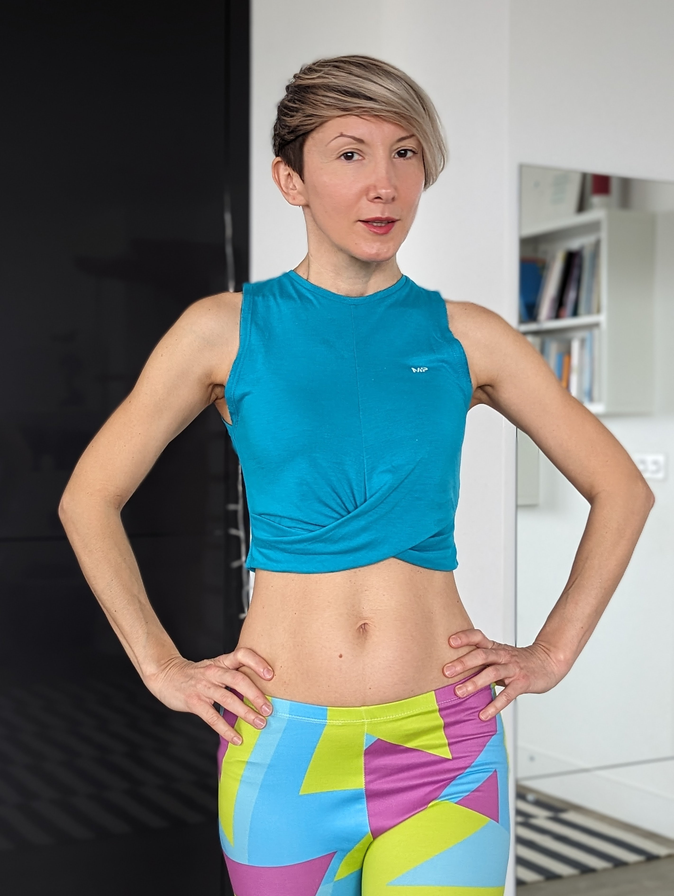

Hi there! I'm Ivana, a sports biomechanics scientist and holistic strength coach with 13 years of experience working in health and fitness. I am passionate about women's athletic and biological performance - read: how to make our bodies function at their best through different stages of our lives. I love researching, writing and geeking out about healthy backs, pelvises, bellies and pressure inside them.   

Another half of my passion is longevity. I published research on [elite master endurance runners](https://commons.nmu.edu/isbs/vol40/iss1/36/) who practically slowed down ageing with high levels of training. Yes, a good part of what we think of as 'ageing' is detraining and an adaptation to inactivity - so, totally avoidable! 

 

I value evidence-based solutions and precise, focused training where everything has its ‘why’. My coaching style is grounded in empathy and non-violence – challenging the body with kindness.

### I never though I would be the strongest and fittest in my life at the age of 45!

The rePower Method developed over the 13 years of my personal struggle with lower back pain and a difficult postpartum recovery.

Solving a puzzle of my pain and the weak, unresponsive belly, I spent years learning everything I could across the fields of movement, physiotherapy, sports and exercise science, and women's health. I was lucky to learn from and coach many incredible people along the way. I got fascinated with biological and athletic performance, which brought me to my second master's degree, in sports and exercise biomechanics. 

Eventually, my approach crystallised into my signature method rePower, seamlessly connecting physiotherapy with strength & conditioning training.

Each rePower journey includes three stages:

1. *RESTORE* - managing pain flare-ups, building core stability foundations
2. *REBUILD* - increasing muscle mass, core stability in dynamic workouts with added weights/resistance, progressive overload
3. *REINFORCE* - performance-based, sport-specific training, pushing your boundaries, injury-proofing the body

### Why Movement Kitchen?

I see kitchen as a nurturing environment, a space for creating, playing and experimenting. My studio really is a kitchen – with large mirrors, a climbing frame and a variety of exercise props. I aim to recreate the safe and nourishing atmosphere of the kitchen in my sessions too, offering a supportive space for you to get to know your body and get stronger on your own terms.

### My Qualifications

- MSc in Biomechanics / Sport and Exercise Science, University of Roehampton, London, UK, 2019-2021, with distinction
- Advanced CPD in Modern Post Natal Assessment, Core Restore & Functional Exercise Programming, Burrell Education, 2023
- CPT-RES Certified Personal Trainer, Restorative Exercise Specialist, Nutritious Movement Center Northwest, Sequim, WA, USA, 2015-2017
- Yoga Therapy 900 Hrs Residential Course, The Yoga Institute Santacruz Mumbai, India, 2012
- Yoga Teacher Training 200 Hrs, The Yoga Federation of Serbia, 2011
- LLM in International Business Law, Vrije Universiteit Amsterdam, The Netherlands, 2009
- LLB (Hons) in International Law, University of Belgrade, Serbia, 2006

### Additional Training

- A-Z of Program Design Strength Training - Online workshop with FitPro CIMSPA, November 2024
- Pelvic Floor Dysfunction - The Missing Link in Persistent Lower Back Pain? - Online Workshop with Carolyn Vandyken, Embodia Academy, April 2023
- Hormones Matter: Considerations for Treating Women with Musculoskeletal Problems - Online Workshop with Susan Clinton and Carolyn Vandyken, Embodia Academy, April 2023
- Intraabdominal Pressure and Strength Training - Online Workshop with Antony Lo, Embodia Academy, March 2023
- Stop Hurting Women with Exercise - 5 Key Concepts to Help Female Athletes - Online Workshop with Antony Lo, The Physio Detective, Embodia Academy, March 2023
- 'Go-To' Physio Clinical Reasoning Challenge - Online Workshop with Dave O’Sullivan, The ProSport Academy, January 2023
- Pelvis Pro Miniseries - Online Workshop with Sarah Ellis Duvall, Core Exercise Solutions, November 2022
- Move Your DNA + Fundamentals of Natural Movement Immersion with Katy Bowman,
  Cambridge, UK, - 8 Hours, Aug 2019 
- Boomerang Pilates, MoveSMART Weekend Immersion with Alison Crouch, London, UK - 12 Hours, 7-8 June 2019
- Womb Care Massage Course with Barbara Loomis, 8-Module Online Course - April - June 2019
- Pilates for Modern Bodies - Fundamentals of Flexion - 6-Week Online Course with Alison Crouch, London, UK, March - Apr 2019
- Abdominal Adhesions Massage Course with Barbara Loomis, 9-Module Online Course - Winter 2018/2019
  2018
- Move Your DNA: Going Beyond The Points with Katy Bowman, Online Course, 8 Hours, Oct 2017
- Advanced Biomechanics 27-hour Online Course with Katy Bowman, Aug-Oct 2017
- Franklin Method Shoulders and Neck Workshop with Mollie McClelland Morris,
  London, UK, 3 Hours, July 2017
- Restorative Exercise Specialist Certification Week with Katy Bowman,
  Castricum, The Netherlands, 48 Hours, July 2017
- Move Your DNA Weekend with Hilary McKown, Milan, June 2017 - 16 Hours
- Balinese Massage Course with Rahasia Nyaman - Ubud, Bali, 30 Hours, Apr 2017
- 6 Weeks Mindfulness Online Course with the University of Leiden (equivalent of
  MBSR) - Mar - Apr 2017
- Yoga, Qigong and Mindfulness Immersion with Mimi Kuo Deemer, London, UK, 7 Hours, Aug
  2016
- 52 Weeks of EveryBody Biomechanics with Katy Bowman, online, Jan 2016 - Jan
  2017
- Anatomy Trains BodyReading 101: Visual Assessment with Tom Myers, Online
  course, Nov-Dec 2015
- Total Yoga Nidra Foundation Course with Uma Dinsmore Tuli, Yogacampus, London,
  UK, 10 Hours, June 2015
- Yoga Therapy: Practical Philosophy Of Healing with Mark Beuvain, Yogacampus,
  London, UK, 12 Hours, Jan 2015
- Firing Order In Sequencing and Resetting The Body’s Internal GPS with Doug
  Keller, Yogacampus, London, UK, 32 Hours, Oct 2014
- Assisting and Adjusting yoga workshop with Emma Henry, London, UK, 3 Hours, July 2014
- Buggy Fit and Postnatal Exercise with GLL Better, London, UK, 4 Hours, July 2014