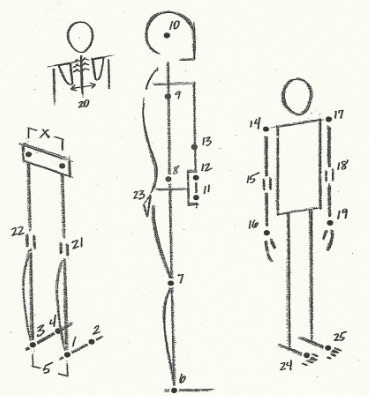

### Movement coaching one-to-one

You can chose to have a session in my home studio in Hackney or at your home. I
currently offer classes in North, Central and East London, with travel expenses
added to the price.

Price: £50 for 1 hour session.

All sessions need to be paid in advance and can be moved or canceled up to 24
hours before the appointment.

Book a [free telephone consultation][1]!

### What is movement coaching?

I use Restorative Exercise / Nutritious Movement™ approach as a starting point
in my work - looking for biomechanical roots of your injuries and how to work
with your body towards a more sustainable alignment - one that would not be
creating forces that have caused the injury in the first place. You can find out
more about this approach on nutritiousmovement.com.

Even though largely relying on mechanics and geometry in my work, I don't see
the body as a machine that needs to be ''fixed'' but rather a complex expression
of our emotions, habits and cultural conditioning, of the way we see ourselves
and experience the world around us. So, a good part of what I do is aimed at the
nervous system and interoception (sense of psychological condition of the body).
I like using mindfulness, body awareness and somatic imagery to help you explore
your movement and tension patterns and aid in removing old muscular habits.

Most of my work focuses on proprioception and motor programming - helping you
learn how to isolate and control small movements. The practices are performed
slowly and with as little effort as possible, giving a lot of attention to body
awareness.

The aim of the exercises is not to challenge your abilities, but build new
neural pathways - innervating underused areas of the body so they would
gradually restore their function in your day-to-day life.

Improving how parts of your body work together and in relation to each other
will bring different outcomes on cellular level, such as less wear and tear on
the joints, better bone density and generally a more robust strength with less
likelihood for injury.

[1]: mailto:ivana.demmel@gmail.com?subject=Free%20Telephone%20Consultation
