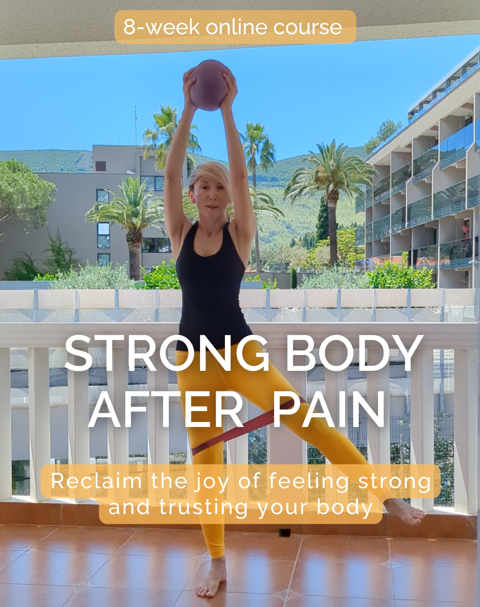
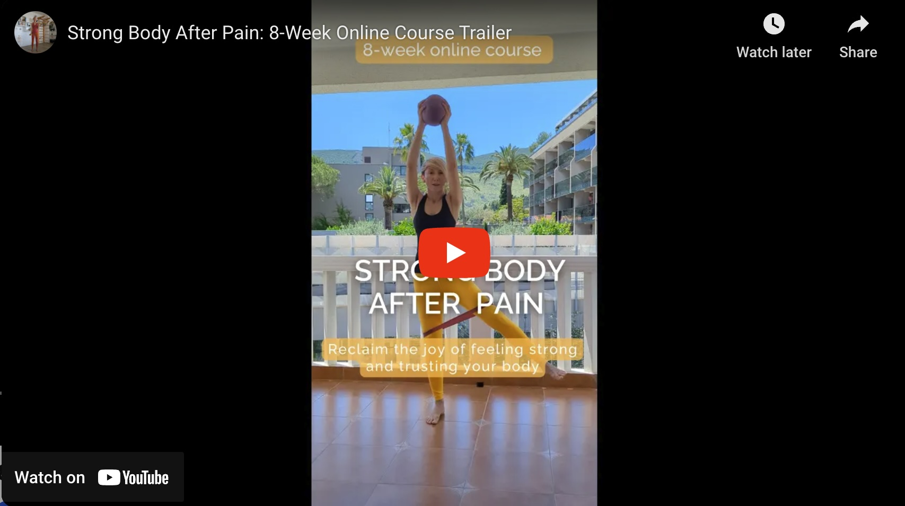

### Strong Body After Pain: Reclaim Your Strength, Confidence, and Freedom

Introducing Strong Body After Pain: an 8-week transformative online course designed for women who are ready to move from pain and fear of movement to strength and confidence in their bodies.  

  

*This course is for you if you:*
- Feel that the exercise strategies you used in your 20s don’t serve you any more – your lower belly doesn’t seem to get toned with exercise any more, your lower back aches if you push yourself too far?
- You have this back/hip/pelvic pain that keeps coming back no matter what you do?
- You feel like your body never fully got back to "normal" after having babies?
- Or maybe you have never been pregnant, but you struggle with your pelvic health - things like pelvic pain, painful periods, endometriosis, sensitive bladder, incontinence, or pelvic organ prolapse?  
- You used to love being active, but now you are unsure how to exercise safely, without going too far – group exercise classes or training at the gym leaves you aching for days?

  

*After 8 weeks, you will:*
1. Have your core muscles switched on and supporting you so you can get stronger  
2. Know how to progress you training without bringing on your symptoms  
3. Know how to manage any future back/hip/pelvic pain flare-ups and build back up quickly  
4. Be able to confidently go to the gym or take up any exercise class or train independently without a fear of being injured.  

Our step-by-step roadmap takes you from pain management to empowered strength building. Each week features:
- Back-friendly and pelvic floor-safe workouts
- Progressive challenges that respect your body's limits
- Expert guidance on form and technique  
  
*This is NOT:*  
❌ A one-size-fits-all, appearance-focused programme  
❌ About skimming little off different parts of our bodies   
❌ About hard pushing or 'no-pain-no-gain'  

*Instead, Strong Body After Pain embraces:*  
✅ Exercise as an act of self-care and investment in the future  
✅ Challenging our bodies with kindness, always!  
✅ Building strength that translates to real-life confidence and capabilities  

### Be the First to Know

Join our exclusive waitlist to receive priority notification when enrollment opens. Enter your email below to secure your spot and take the first step towards feeling stronger and more confident in your body.