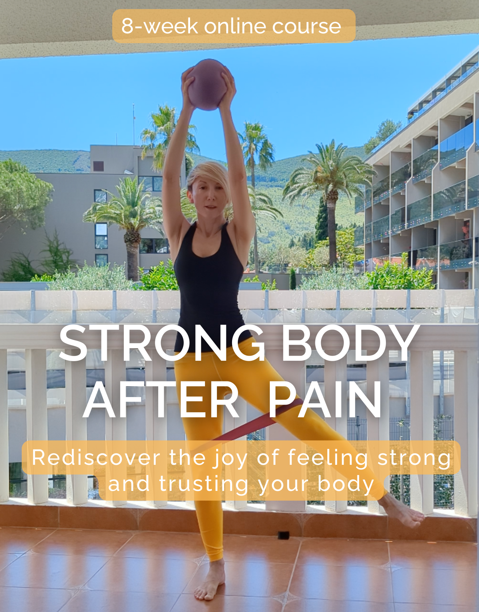

## Strong Body After Pain

Strong Body After Pain is an 8-week self-paced online course for people who don’t feel comfortable doing traditional abdominal exercises (crunches, sit-ups, straight leg lifts, yoga boats, Pilates hundreds), people who hurt after exercise, or people with recurring pain or old injuries that keep coming back whenever they try being active.

This programme is designed as an 8-week transformation from being scared to move to feeling strong and confident in your body and its abilities. 

At the end of the course, you will be able to 
1.	Go to the gym without worrying about pulling your back out
2.	Take up any exercise class knowing how to make it work for your body so you aren’t in pain afterwards
3.	Train independently without a fear of being injured.

The course is designed as step-by-step roadmap. Week by week, we build up from managing pain and flare-ups to challenging the body and getting stronger. Lower back and pelvic-floor-friendly workouts, always.

This is NOT a looks-oriented, self-punishing programme. 
It is NOT about skimming little off different parts of our bodies. 
NO hard pushing. NO no-pain-no-gain. 

Our starting point is seeing exercise as self-care – an expression of self-love and care for the body and it’s needs and investing in the future. Yes, expect a challenge – but with kindness towards the body, always!

### Join the waitlist

To be the first to get notified when the course opens for enrolment, please leave your email below to sign up to our email list.
